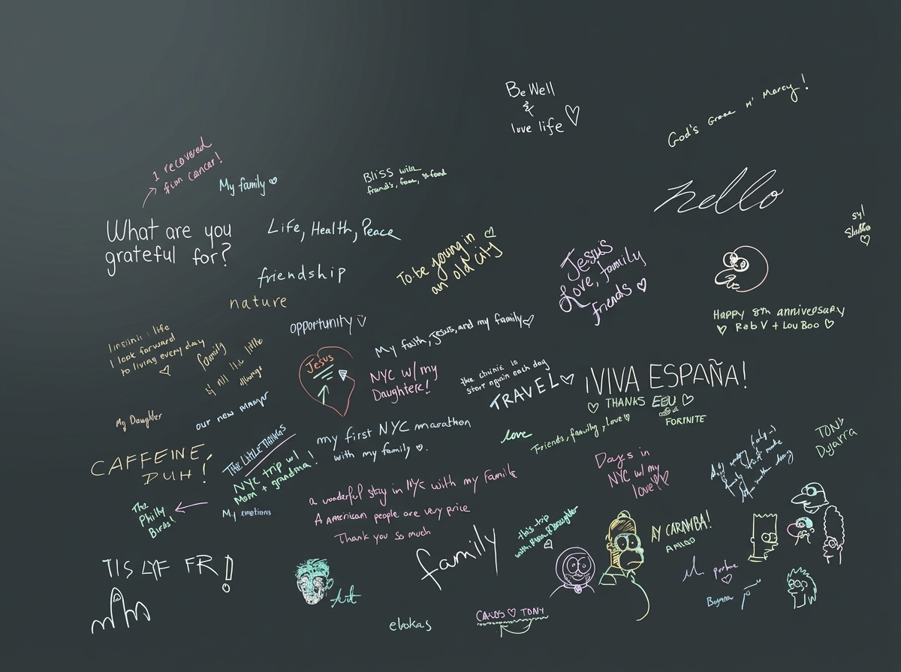
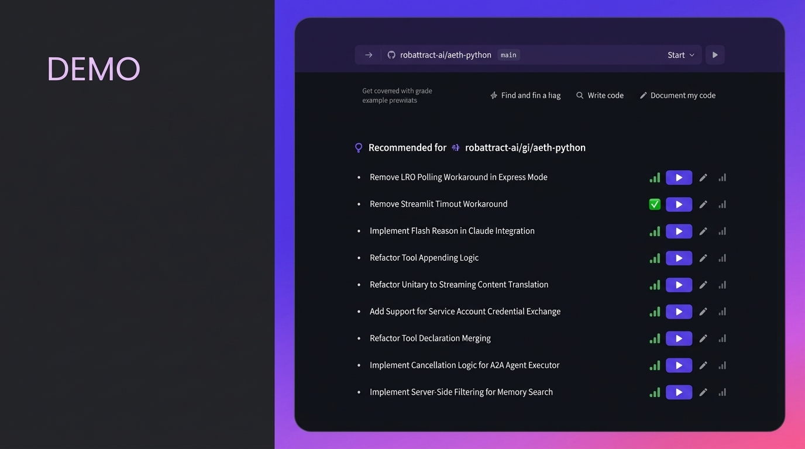

# Kath Korevec (Google Labs) - Proactive Agents

**Time:** 1:45 PM

**Speaker Bio:** Director of Product at Google Labs. Previously VP of Product at Vercel, Senior Director at GitHub. Deep DevEx expertise.

**Company:** Google Labs AIDA (AI Developer Assistants) team. Building Jules (autonomous coding agent) and Stitch.

**Focus:** Moving beyond chat-based interaction. The vision is for agents to be proactive, ambient, integrated tools rather than reactive chat interfaces.

## Slides

## Notes

* Needed to remind the husband to do the dishes -- Jules is about the mental load
	* That's where we are with async agents today
	* We are serial processors not multiple ones
	* "Humans are unitaskers"
* Trust
	* Know when to step in
	* To know what's missing
* Most tools are fundamentally reactive
* "Imagine when compute isn't a limiting agent at all"
* 4 things
	* Observation
	* Timely action
	* Personalization
		* Learn how you work, what you tend to ignore
	* Seamless integrations
* Proactive system like Nest learning, like a good collaborator
* Jules is focused on the code awareness now, but moving to system awareness
	* Memory -- how to write its own memory
* Demo gods didn't work
* Tasks
	* Suggested tasks
	* Recommended tags
	* It comes up with the prompts!
	* Gives context of the code and also rationale on what to do
* A giant case study
	* Where do they get these doom style graphics
	* Built a 6 foot animatronic head that sits in the window
	* For Halloween
	* Pee-wee Big Adventure
	* Built the firmware and stepper motors to control the sensors with Jules
	* Prompt -> ten minutes -> repeat -- a tedious process
	* Wanted to focus on the creative parts
* The patterns of how we use an IDE right now might not exist at all next year
* "Don't be afraid to question the new ways of building software"
