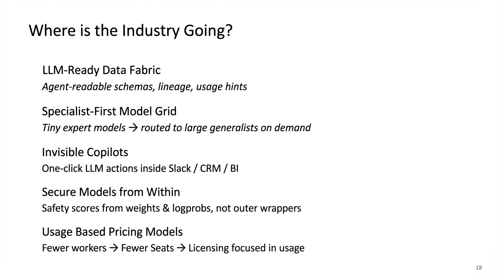
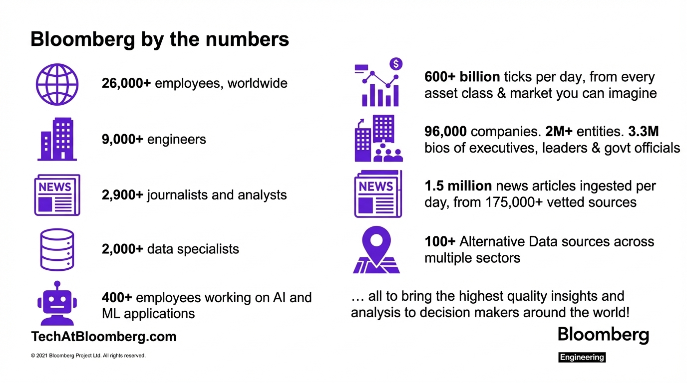

# Lei Zhang (Bloomberg) - What We Learned Deploying AI within Bloomberg's Engineering Organization

**Time:** 2:25 PM

**Speaker Bio:** Head of Technology Infrastructure at Bloomberg Engineering.

**Company:** Bloomberg is a major financial data and media company deploying AI at enterprise scale.

**Focus:** Lessons from deploying AI tools across a large engineering org. Practical insights from a mature tech company.

**Reference:** [LinkedIn Profile](https://www.linkedin.com/in/lei-zhang-51b2686)

## Slides

## Notes

* Lead of AI infrastructure
* 9,000+ engineers, 2000 data specialists, 400 ML/AI people
* Internal stack
	* Largest private network
	* Huge JavaScript framework (tens of millions LoC)
	* Lots of internal libraries being used
* What is AI for coding
	* Usage dropped really quickly once we moved back greenfield
	* "Vibe coding, where 2 engineers can create the tech debt of 50 engineers"
	* What work do our developers not want to do
* Example 1: Uplift agents
	* The patch
	* The rationale
	* Why we'd do it
	* Determine verifiability
* Example 2: Incident response agents
	* Overwhelming number of alerts
	* Hard to find context info
	* Understand contributing factors
* Changing people
	* 20+ training program -- well-established training problem
	* Change agent
	* Show how to use it with Bloomberg's technical
* Individual contributors use it more than leadership
* **Changes the cost function of engineering**
