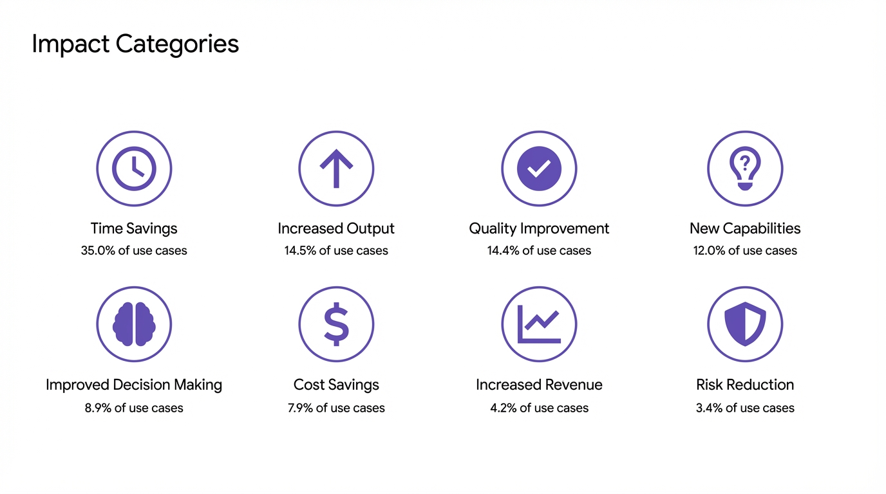
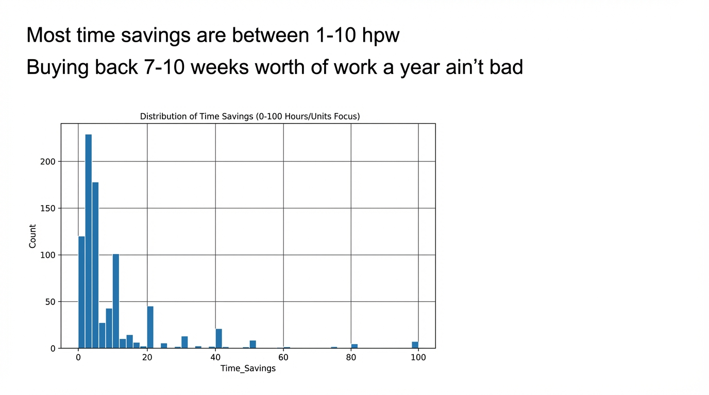

# NLW (Super.ai/Superintelligent) - AI Consulting in Practice

**Time:** 4:00 PM

**Speaker Bio:** Nathaniel Whittemore (NLW). Host of "The AI Daily Brief" podcast. Founder of Superintelligent (AI education platform).

**Company:** Super.ai provides intelligent document processing and workflow automation. Superintelligent teaches practical AI skills.

**Focus:** Real-world AI consulting patterns and best practices. How businesses are actually adopting AI beyond the hype.

**References:**
- [YouTube Link](https://www.youtube.com/watch?v=DuNEyKayvvI)
- [Apple Podcast](https://podcasts.apple.com/us/podcast/the-ai-daily-brief-artificial-intelligence-news/id1680633614)
- https://roisurvey.ai/

## Slides

## Notes

* Dubious MIT report about how things are working
* Enterprise adoption status
* ROI -> where we are seeing it
* From KPMG agent use survey
	* 11% from Q1 to 42% to Q3
* Decrease to the resistance of agents
* Many orgs are stuck inside of pilots and experimental studies
	* Only 7% believe that they are fully at scale
	* Jagged patterns of adoption
		* IT and ops jumping ahead of other use cases
* Big differences between leaders and laggers
* Spends is going to do nothing but increase on this
* Increase of optimism of the deployment of AI over the course of the year
* ROI report from NLW study
	* 3500 use cases
	* 8 impact categories
	* Couple hours a week is multiple work weeks a year
* Different company sizes and different roles are using things differently and there is different impact
* Coding is further ahead
