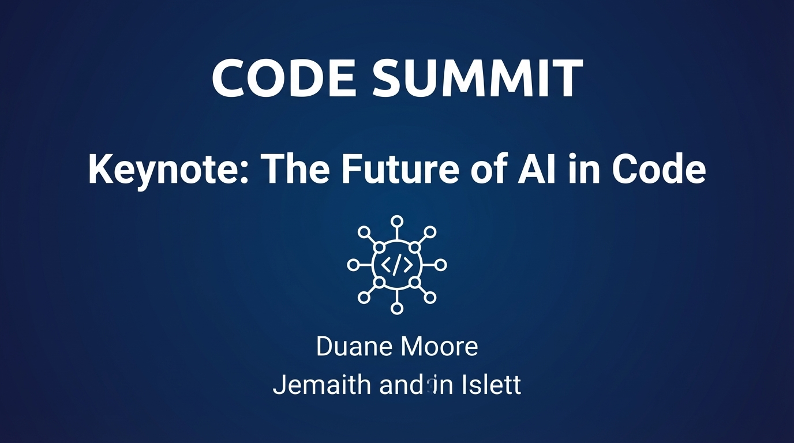
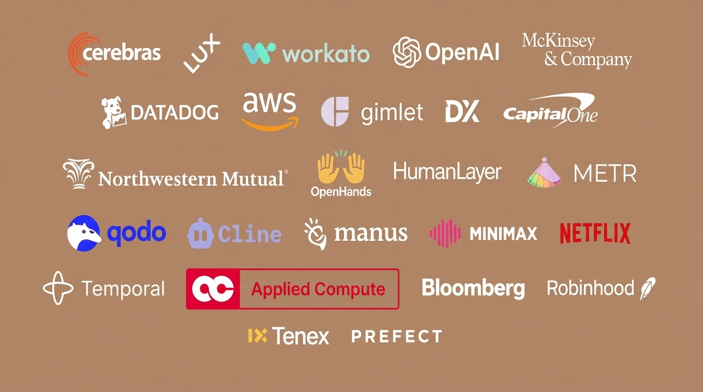
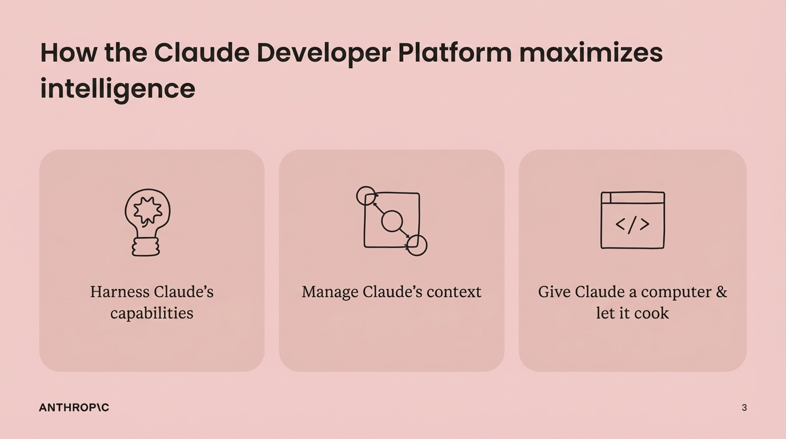
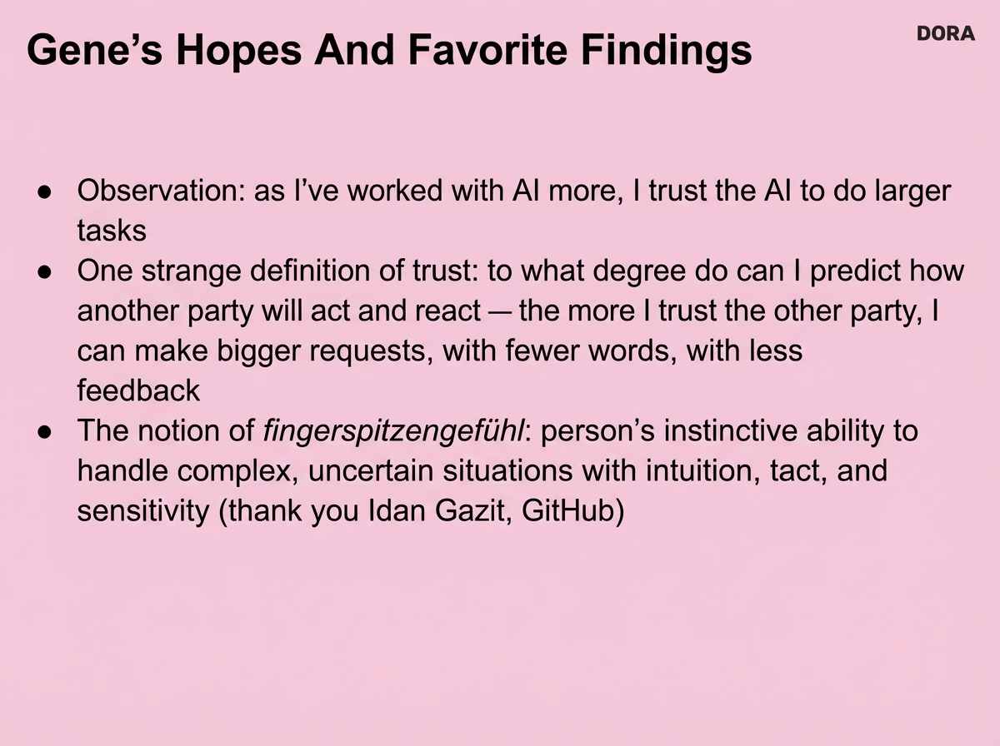
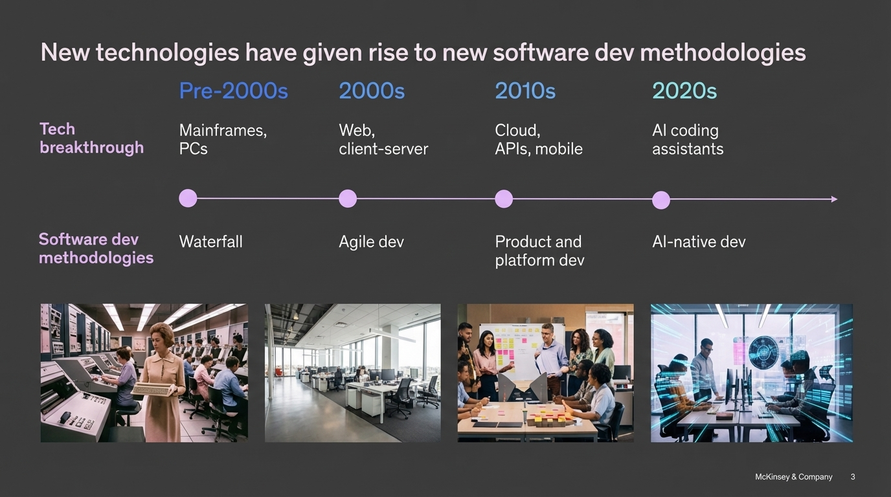
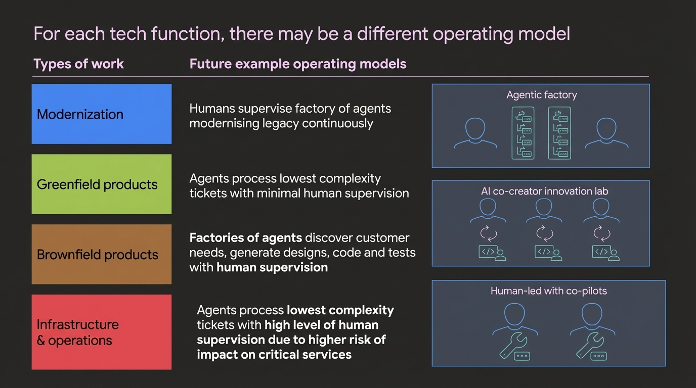
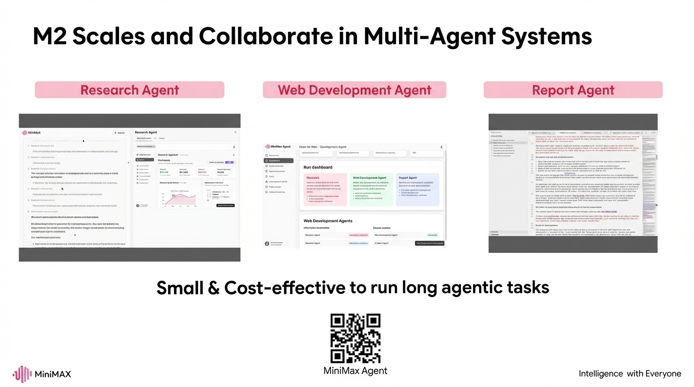
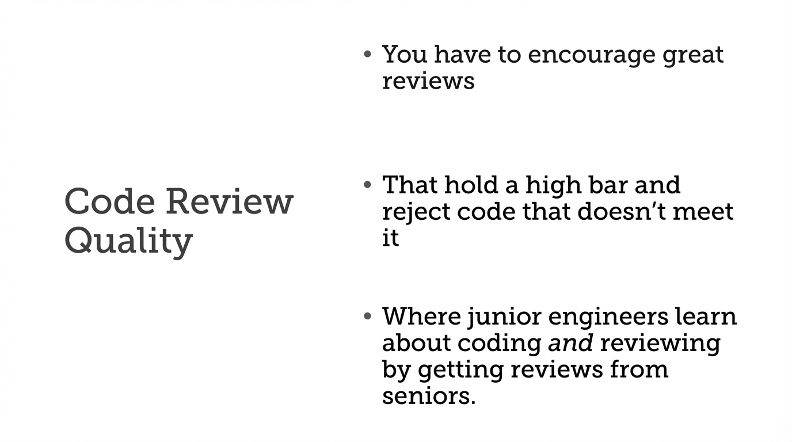
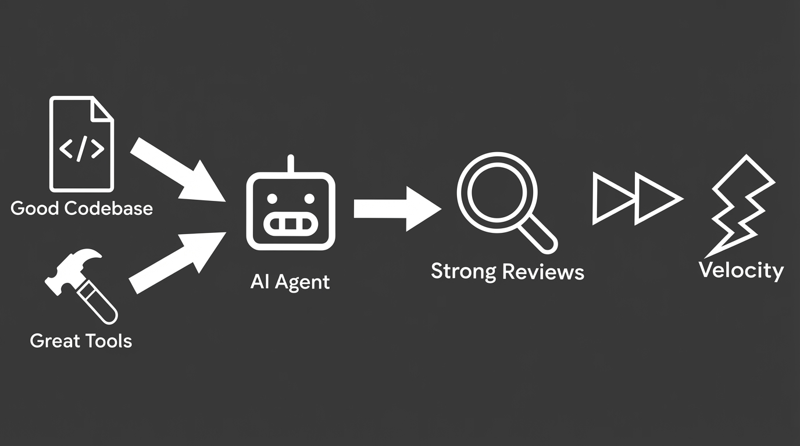
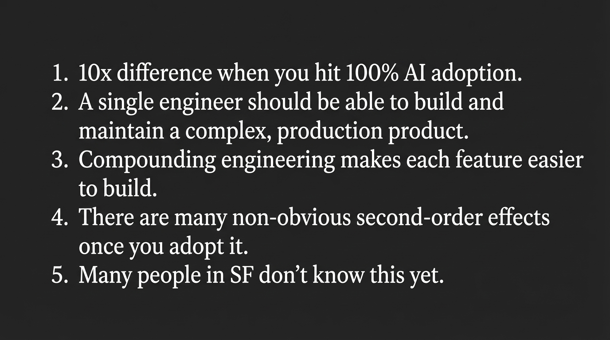

#aiengineer

tubopuffer is a great name for a company

Alex from Tenex

## Recurring
- Context Management
	- many agents coorinating
	- context is very important, driver of quality
- Code Quality/Hygene even more important
	- Testing
	- autonoumess testing seems to be a unclock
	- replet, stadford study, capital one
	- Code cleanliness score
	- better structured code bases, good naming, good testing
- Giving the agent data access to the remote systems
- More people pushing code into production
	- bottleneck is around assignment
	- code review pipeline
	- code review quality
- codex/claude code does more than just coding
- "harness"
	- guiding the agents, invest on quality loop, agents need to keep learning
	- qdodo, stanford, codex, claude code, skills
- Orgs, senior engineers specifically, resist the change, and there are new systems in place needed to make it work, but there is a lot of resistance
- "a person with a problem mixed with a person with a solution"
- Trust (look up examples)
	- devx also
- **changes the cost structure of engineering**

## Thoughts

## Claude

**Katelyn Lesse (Anthropic) - Evolving Claude APIs for Agents**​

- **Speaker Bio:** Head of API Engineering at Anthropic. Previously worked at Stripe and Betterment. Leading the Claude Developer Platform.

- **Company:** Anthropic develops Claude, with capabilities including parallel tool execution, Model Context Protocol (MCP), and extended thinking with tool use.

- **Focus:** Understand how Anthropic's latest Claude APIs enable developers to build "unhobbled" autonomous agents that can work for hours on complex tasks. Pay attention to MCP and context management features.

* building powerful agentic systems using claude
* "give claude a computer"
* claude running tools
	* how does this fit in with skills
* managing context window
* MCP as a way to interact with external systems
* memory tool as a way to bring back info into the context when you need it
	* first version is the file system
	* https://code.claude.com/docs/en/memory
* Context editing
	* helps you clear things out that shouldn't be in the window
	* clearing out tool results
* memory tool with context editing -> the way to go
* code exection tool
	* Can we do this with dagger

Anthropic is hiring

### Key Points Summary

**Core Thesis:** Building powerful agentic systems by giving Claude computer access and the right tools

**Main Components:**

1. **Tool Integration** - Claude running tools directly, with Skills as a framework for specialized capabilities
2. **MCP (Model Context Protocol)** - Standard way to connect Claude to external systems and data sources
3. **Memory System** - Retrieves relevant context when needed (file system-based initially)
4. **Context Editing** - Manually clear unnecessary content (especially old tool results) from the window
5. **Best Practice:** Memory tool + context editing together = optimal context management
6. **Code Execution** - Native tool (question: Can Dagger be used here?)

**Bottom Line:** Effective agentic systems require both expanding capabilities (tools, MCP) and managing constraints (memory, context editing)

---

### Tweet Options

**Concise version:** Building powerful agentic systems with Claude: Give it computer access, connect external systems via MCP, manage context with memory + editing, and let it execute code. The key is balancing capability expansion with smart context management.

**Technical version:** Claude agentic system stack: • Tools + Skills for capabilities • MCP for external integrations
• Memory tool for context retrieval • Context editing to clear bloat Combo of memory + editing = the way to manage your context window effectively

**Punchy version:** Want powerful Claude agents? Give Claude a computer, connect it to your systems (MCP), manage the context window smartly (memory + editing), and let it execute code. Context management is just as critical as capability expansion.

Which style fits your audience best?

---

## **9:25 AM — Michele Catasta (Replit) - Autonomy Is All You Need**​

- **Speaker Bio:** VP of AI at Replit. Previously Head of Applied Research at Google Labs and Google X. Ph.D. in Computer Science, former Stanford instructor.

- **Company:** Replit is a web-based development platform with 22M+ creators. Replit Agent lets users create and deploy fully functional applications in minutes.

- **Focus:** The paradigm shift from AI copilots to autonomous agents. Catasta has been emphasizing how AI must move beyond support roles to truly autonomous task completion.
*

- building semo-async valley of dealth
- how do we build agents for non technical users
	- surpvied vs authonmous agents
- it's not about how long they run
- the autonomoy given to Agents can be given a very specific scope
	- agents makes all technical decisions
	- only if the scope you are giving ht etask is very broken
- the user maintains control over aspects of the project that they care about
- task have a natiral complexity
	- plan -> implemnt -> test -> loop
	- goal: maximine the irredcucible runtime of the agent
- building a lot of "painted doors" -- funny way to describe wirefore
	- more than 30% of features are broken
	- users don't want to spend time doing testing
- autonomous testing!
	- break the feedback bottlenec
	- prevent the accumlations of small errors
	- overcomes of lazines of fronteirs ("accumlations of whatevers")
* context managenent
	* persis on the file sstem
	* use the code ase
	* dump the memory in the filesystem
* subagent involved by the core loop with a tast and fresh context
	* protects the main agents working memory
	* avoiding "context pollution"
* parrellel agents presented as a way to stay in the zone, the long run times is not a satifying user experience for productive people
	* replit users would have no idea what a merge conflict is
* core loop as the orchistrator of the subagents
	* parallelism is decide on the fly

Phrases:
* Painted doors
* accumulations of whatevers
* "time worked 282 minutes"

---

## **9:45 AM — Lisa Orr (Zapier) - Your Support Team Should Ship Code**​

- **Speaker Bio:** Lead Product Manager at Zapier. Former senior PM at Human API and Airship.

- **Company:** Zapier automates workflows across apps. Recently launched Custom Actions that use AI to enhance automation capabilities.

- **Focus:** How support teams can leverage AI and automation to ship code. This is about enabling non-engineers to build.

* parrels because grand canyon and zapier: eroision
* good story about how ai agents are in the system
* true value comes with tiring the tools together
* conbine them to orchastrat them
* key point is that support is doing the "coding" directory
* ton of dogfooding at zapier
	* diagnose
	* figure out if its fixable
	* then
		* plan exectue, validate
	* scout mcp and cursor mcp
* couple of evals
	* ~70% for accuagle
	* ~ fixigiblity
* impact app ersotion
	* 40% of support teams vides done by scout - doubling support velocity, 3-4 fix/week with scoup
* puts potential fixable solutions on the backlog - the analystis is helpful in triagle
* support + code gen = magic
	* theya re closest to customer pain
	* real-time troubleshooting
	* best a validation
* *support team membrs who are part of this experiment are moving into the engineering team"

---
## **10:05 AM — Steve Yegge (Sourcegraph/Amp) & Gene Kim (IT Revolution) - 2026: The Year the IDE Died**​

- **Speaker Bio (Yegge):** 40+ years in tech industry. Now at Sourcegraph building AI developer tools (Amp). Writing "Vibe Coding: Building Production-Grade Software With GenAI."

- **Speaker Bio (Gene Kim):** Thought leader from IT Revolution. Known for leadership and operations expertise.

- **Companies:** Sourcegraph/Amp builds enterprise coding agents. IT Revolution focuses on tech leadership and DevOps culture.

- **Focus:** Yegge's influential vision on how coding agents will fundamentally change developer tools. He advocates for "vibe coding" — letting agents handle the work while developers focus on high-level goals.

### Steve Yegge

* "claude code" aint it -- i use it 14 hours a day
* coding agents are tool hard -- cognitive overhead
* claude code are power tools -- what damanage can we do with untrained people
	* you can cut your foot off
* moving from saws to drills to CNC machines
* "models are smart enough"
	* strictly
* all coding will be written by giant grinding machines over seen by engineers
* codex users vs cursors
	* 10x productie by any measure
* like what happened with swiss watch makers
	* craftsman are doing the same thing what swe are doings
* its going to be a new IDE
	* replit is the furthest along with it
* code agets should be more like ants
* "diver window"
	* context window is like an oxygen tanks
	* one diver -- and give him a bigger tank?
	* ants & divers
* built with lots and lots of agents
* "if you are still using an ide by jan 1st you are a bad enginner"

### Gene Kim
* "Bezos doesn't care if you have a bad day or note"
* NoOps > NoDEvs "not so funny now"
* designs and ui is shipping
* vibe coding defintions
	* "when the are ai writes the code, and the humabn supervices"
	* "anything besides wrigin code by hand"
	* the interation conversations that results in the ai making a workable peice of code -- anthopics
* "we are going to the last generation of developers to write cod eby hand, so lets have fun do it"
* working with system
	* $100/s day
	* same amount of tokens per day on my salary
* FAAFO
	* Faster
	* Ambitious -- be more ambitiojs , impossible becomes passive, annoying thing becomes free
	* Alone - build them alone and more autonmously
	* Fun -- have so much more fun doing it
	* Options -- have more swings at bad
* Andy Glover -> director of AI Productivity
* enterprise tech leadhership summit
	* Booking.com -- elevaent developer produtivity
	* Travelopopia -- replace a legacy application in 4-6 weeks.  12 people -> 6 enginers
	* "A person with a problem, and a person who can solve it", go further and faster
	* DevOps movemtna at capital one, and now at Fidely
		* senior devs didn't want to do it
	* cisco
		* every senior deve needs to vibe code and application to production
		* get the study
* fingrerspitzengefuhl
* trust: to what dgree can i predict how another part will act
* AI trust increates with experience
* what happens when support ships
* what happens when leadership ships
* "they all looked at my as if they wished i was dead"

---

## **10:40 AM — Mike Lacsamana (Stigg) - Building Credit Systems for AI Products** [Stigg AIE Expo]

- **Company:** Stigg provides flexible usage-based billing and credit management systems for AI products.

- **Focus:** Financial architecture for AI products at scale.

missed this

---

## **11:00 AM — Bill Chen & Brian Fioca (OpenAI) - Future-Proof Coding Agents: Building Reliable Systems That Outlast Model Cycles**​

- **Speaker Bios:** Bill Chen is Product Manager at OpenAI. Brian Fioca works in Engineering at OpenAI.

- **Company:** OpenAI creates GPT models and coding assistants, including advanced reasoning capabilities.

- **Focus:** How to build coding agents that remain reliable as models evolve. Critical for understanding production-grade agent architecture.

- ground is shifting so fast
- agents
	- agantes
	- harnesses
	- agents and subagents
- talking about codex specfiically
- 3 parts
	- interface
	- models
	- harness (focus on today)
		- prompts
		- agent loop
		- tools + tools descriptoins
			- semantic search
			- websearch
			- patch / edit
			- browser
- "hard to track the modeals and we aren't making the problem easier for anybody" people need to adapt to the new models
- harness
	- the surface area that the model users to talk to the user and code and interact with tools
	- for some the hardness might be the special sauce of the product
	- challenegs
		- custome tools be out of distructyur (dpesnt know how to user it)
		- propmpt engineering needs to fit in with how to use the tool
		- poor portability of prompts acess models
		- latency -> context managemtn -> api
			- **codex map should do that for you**
			- https://openai.com/index/gpt-5-1-codex-max/
		- steerability = intelligence + habit
			- training has side effects
			- e.g. apply patch quicks
			- prompts aren't interchangeable
			- harndess driving steering > prompt microturning
-  "i like the solution that you came up with but it took to long to come up with, what can i do to make it better"
- harness + model combined
	- many things under the hood
	- parallel tools
	- secuity and sandboxing
	- context compaction
	- mcp support
	- images and screenshots
- examples
	- user codex to organize photos into a folder
	- analsys a huge amount of csv files in the terminal
- use codex the agent inside of your own agent
	- durable playform that rides the wave instead of drowning it it
- can be called through the SDK, agents SDK +. MCP + Zed ACP
	- can build out software that it needs that it doesn't happen
	- Zed wraps codex into a layer
- you can custimze the coding agent
	- align the tools to be in ditrubution of how it was gtrained
- **dozen of trillions of token per week**
- build where the models are going
- new models will raise the trust ceiling

---

## **11:20 AM — Martin Harrysson & Natasha Maniar (McKinsey) - Moving away from Agile: What's Next?**​

- **Speaker Bios:** Martin Harrysson is a Partner at McKinsey. Natasha Maniar is a Consultant/Analyst at McKinsey.

- **Company:** McKinsey is a global management consulting firm studying AI's impact on software development (120k dev study).

- **Focus:** Post-Agile methodologies in the age of AI agents. McKinsey is actively researching how teams should reorganize around AI.

- "software X" - moving beyond agile
- 10x enginer to 10x team
- new paradihm, new type of building software
- the whole software development framework is wrong
- bottleneck aroun task allocation
	- zapier did a great job with that
- need to rewrte the PDLC to work around this
- ai native roles
	- spec driving developent instead of story devein
	- code base protoys from long PRDs
	- agents managers instad of speciailized practiciounes
- **how does cursor operate interall**
- 
- on their study the roles haven't changed at it
- changment is an ullisive term for a lto of things
	- getting a lot of small things right
- they wre doig a lot of change cycles
- get a lot of little things right, the small interventions made a difference
- increase of investment in greenfield and brownfield development
- shorter sprints, smaller sized teams, many more teams
- start now, its a human change, and it iwll take a lot of time

---

## **11:40 AM — Yegor Denisov-Blanch (Stanford) - How to Quantify AI ROI in Software Engineering (120k Devs Study)**​​

- **Speaker Bio:** Researcher with Stanford's Software Engineering Productivity Research Group. Background in business/MBA. Calibrated productivity models.

- **Company:** Stanford's research covers over 100,000 engineers across hundreds of companies, analyzing private code commits.

- **Focus:** Data-backed findings on where AI actually helps (greenfield/low complexity: 35-40% gains) vs. where it struggles (brownfield/high complexity: 0-10% gains). This is the definitive productivity study.

https://softwareengineeringproductivity.stanford.edu/

* starts fast and strong
	* researching the impact of ai
	* timeseries, git hub across time
* ML model that replications a panel of experts
* what is driving prodivity gans in software
* ai engeering practies benchmark
* measruing roi
* gap between the top and the bottom performers
	* "rich gets richer effect"
* what are the factosr that make these teams perfom better
	* token users per usage per model -- not great productive
	* "ai usage quality means more than quantity"
	* environment cleaness index
		* some sort of corrilation
		* LOOK that up
		* softwareengiinerprodct.st
	* invest in software cleaniness to get the gains
		* so the agent should be cleaning thingsup
		* clean code amplifies at gains
		* fight the entropy
* AI engineering practices benchmark
	* scan the codebase to identify ai benchmarks
	* L0 - L4
		* no ai use
		* opporutnist prompt
		* systematic prompting
		* agent back development
		* orchestrated agentic workflows
* uses telementr from the coding systems, can't really get the data
* both this an mck
* code quality went down for a specific team and went all over the page
* rework/refactor changes
* measurements was very key, some werent good
* cursor enterprise

---

## **12:00 PM — Itamar Friedman (Qodo) - The State of AI Code Quality: Hype vs. Reality**​

- **Speaker Bio:** Co-founder of Qodo. Background in ML and software engineering. AI code quality expert.

- **Company:** Qodo provides AI-powered code review, testing, and quality assurance. Reports that 76% of developers don't fully trust AI-generated code.

- **Focus:** The gap between hype and reality in AI code quality. Qodo's 2025 report found 82% of developers use AI assistants, but code integrity remains a critical concern.

- are the outages are related to moving to more AI stuff?
- using vibe security review
	- is it because it says "exclude DDoS" in the specific claude
	- thing
- what is your experience with cursor tools
- he asusmes we are all using cursor
- levels
	- learning system focused on quality
	- with agenty quality
	- agent code gen
	- code gen
- standord and mckinsky says that it's not happening yet
- 20% manage six or more AI tools regularly
- 50% of the use is froms with less that 10 developers
- what is quality
	- the crisis is you are getting more tasks being done, its taking more time to view prs
	- you hve more bugs because there are more quanity of PR, not because the PRs themselves are more buggy
- **testing quality, autonmous testing**
- code level problems
	- functional
	- non-functional
- process level channenges
	- learning
	- verification
	- guardrails
	- standards
- code review improveds
	- "don't accept this PR unless there is a mminim of testing"
	- AI Code Review does 2x productive game
- "they don't trust the context that the LLM has"
- QBOO Context Engine
- Invest in the context
	- https://www.qodo.ai/features/qodo-context-engine/
	- logs, history, pr comments
- next
	- automated auality gates
	- ai-generate tests
	- intelligent code review
	- living documentation
- quality is your competitive edge
- qdoo can create a pr checking code checking agent to make sure that things get cleaned up
	- can do that with an agent

---

## **12:20 PM — Olive Song (MiniMax) - Minimax M2**​​

- **Speaker Bio:** Represents MiniMax, a Chinese AI company.

- **Company:** MiniMax develops efficient AI models. M2 is claimed to run 2x faster than Claude Sonnet at 8% of the cost. Recently achieved top agentic evaluation scores.

- **Focus:** New frontier models emphasizing efficiency. M2 is particularly focused on agentic workloads.

* first chinese model
	* many modalities, and also applcations, 150m users
* research and deveopers sittig side by side working on things
* lot of post training on MiniMax
* how does this square with prompts across hardnesses
* training shapes m2 behavor
	* coding experience
		* scaled environemtns and scaled experts
		* pulled down the data from github/internet
		* scaled expert development as a feedback training
	* interleaving thinking
		* in the real work the environment is often noisy and dynamic
		* mutliple rounds of toolcalled and reacts to the environment
	* Agent Generaliztion
		* tool scaling?
		* does't scale if we change an tool scaffold
		* adapt to pertibuarions across the entire model operational space
		* apply pertibulation piplines
	* Mutli-agent scalbility
		* small and cost effective
* better models for the community to use

---

## **1:45 PM — Kath Korevec (Google Labs) - Proactive Agents**​

- **Speaker Bio:** Director of Product at Google Labs. Previously VP of Product at Vercel, Senior Director at GitHub. Deep DevEx expertise.

- **Company:** Google Labs AIDA (AI Developer Assistants) team. Building Jules (autonomous coding agent) and Stitch.

- **Focus:** Moving beyond chat-based interaction. The vision is for agents to be proactive, ambient, integrated tools rather than reactive chat interfaces.

* Needed to remind the husband to do the dishes -- Jules is about the mental load
	* that's where we are with async agents today
	* we are serial processes not multiple ones
	* "humans are unitaskers"
* trust
	* know when to step in
	* to know what's missing
* most tools are fundementally reactive
* "imagine when compute isn't a limiting agent at all"
* 4 things
	* obervation
	* timely action
	* personalization
		* learn how you work, what you tend to ignore
	* seamless integrations
* proactive system like nest learning, like a good collaborate
* jules is focus on the code awareness now, but moving to system awareness
	* memory -- how to write its own memory
* demo gods didn't work
* tasks
	* suggested tasks
	* recommended tags
	* it comes up with the prompts!
	* gives context of the code and also rationale on what to do
* a giant case study
	* where do they get these doom style graphics
	* built a 6 foot anamitronic head that sitsin the window
	* for halloween
	* peewee big adventure
	* built the firmware and stepper motors to control the sensors with jules
	* prompt -> ten minutes -> repeat -- a tedius process
	* wanted to focus on the creative parts
* the patterns of how we use a IDE right now might not exist at all next year
* "dont be afraid to question the new ways of building software"

---

## **2:05 PM — Asaf Bord (Northwestern Mutual) - Small Bets, Big Impact: Building GenBI at a Fortune 100**​

- **Speaker Bio:** GenAI Products Leader at Northwestern Mutual. Experience leading high-impact teams.

- **Company:** Northwestern Mutual is a Fortune 100 financial company. GenBI combines Generative AI with Business Intelligence.

- **Focus:** Enterprise AI strategy: crawl → walk → run. Incremental ROI delivery. Building trust step-by-step in conservative environments.

* northest mutual
	* They ahve a lot of money and a lot of data
	* risk adverse
	* "buy life insurance now, stay with up 40-50 years down the load"
	* how do we balanace that with innovation
* "GenBI"
* 4 barriers
	1. unknown tech
	2. messy real data
	3. blind-trust bias
	4. budget & impact
* Using actual data instead of synthetic to really understand the mess
	* "the gap between demo and production is so broad"
	* got to work with the people who uses the data in and out
	* what people are actually asking in the enviroment "basically the evals"
	* brought the busienss as part of the research project itself
* Building trust
* building incremental deliveries into the process ROI step by step
* schema dump not scalable
	* lookup for
* business question -> orchastrator -> metadata agents (understandin the context)
* then to rag agent that tries to go to the exist report -> certified reports
* tangible data to enriching metadata
* how do we price software in this new era
* usage price vs seats price

---

## **2:25 PM — Lei Zhang (Bloomberg) - What We Learned Deploying AI within Bloomberg's Engineering Organization**​

- **Speaker Bio:** Head of Technology Infrastructure at Bloomberg Engineering.

- **Company:** Bloomberg is a major financial data and media company deploying AI at enterprise scale.

- **Focus:** Lessons from deploying AI tools across a large engineering org. Practical insights from a mature tech company.

* lead of ai infrastructure
* 9,000+ engineers, 2000 dataspecialiscs, 400 ML/AI people
* internal stack
	* largest private network
	* huge javascript frame work (tens of millions LoC)
	* lots of internal libraries being use
* what is ai for coding
	* usage dropeed really quickly once we moved back greenfield
	* "vide coding, whre 2 engineers can create the tech dept of 50 engineers"
	* what work do our developers not want to do
* exaple 1 uplift agents
	* the patch
	* the rationale
	* why we'd do it
	* determin verifiability
	*
* example 2 incdenct response agents
	* overwheling number of lerts
	* hard to find contect info
	* understand contributing factors
* changing people
	* 20+ training program -- well-estlished train problem
	* change egent
	* show how to use it with bloombergs tehcnical
* individual contributors use it more than leadership
* **changes the cost function of engineering**

---

## **2:45 PM — Samir Mody (The Browser Company) - From Arc to Dia: Lessons Learned in Building AI Browser**​

- **Speaker Bio:** Head of Engineering, AI at The Browser Company. Previously senior engineer at Instagram/Facebook (6 years).

- **Company:** The Browser Company is being acquired by Atlassian ($610M). Developing Arc and Dia browsers with AI integration.

- **Focus:** UX/engineering lessons from rebuilding a beloved product (Arc) with AI. Understanding how AI agents integrate with user interfaces.

* what we learned going from arc to dia around AI
* shipped a few ideas in arc with ai stuff
	* put out app 2
* built a new one
	* with speed and secutiy in mind
	* it gets to know you
	* on the way to achiving the vision
* what did we learn along the way
	* optinimze your tools and process for fast iteration
		* prooyype for ai productionfeatures
		* building and running evals
		* collection data for trains and evails
		* and automation for hill climbin
* Tools
	* prompt editor in dev builds
	* moved all these prompts into the tools itself
		* 10x the speed of ideating and iterating
		* "ideating"
		* all with their full context
		* super fun for eerything to do it
	* GEPA as a way to refine the prompt
		* seed them
		* exec and score
		* choose top prompts
		* reflect and generate new prompts

* "genereate a skill based on the user input" -> multipage prompt
* GEPA hill climbing is really exciting
* Treating model behavior as a craft
	* behavior design
	* measuringment and traingin
	* model steering
	* product design and the craft of theinternet moved over time
		* functional -> agentic behavior
		* what might the futurehold?
	* we are in the early days of model behavor
	* the best people it might surprise you
		* formation of a small behavior team
* Prompt Injections
	* exfratating the data somehow i missed the explaination
	* leathal trifecta
	* wrapping untrsuted cntext in tags
	* "while this can help, there are no guarentees"
	* its on us to design our product with this in mind
	* **read and confirm the data shared with the form as part of the tool call**
		* human confirmation step

1. tools
2. treatin model behavior and craft and discbin
3. ai security as an emergment property of building products

* technoilgoyu shift -> Product Company -> Evoluation Company
* when you recognize that it tech shifts, you have to imbrace it with conviction

---

## **3:05 PM — Max Kanat-Alexander (Capital One) - Developer Experience in the Age of AI Coding Agents**​

- **Speaker Bio:** Executive Distinguished Engineer for Developer Experience at Capital One. Author of "Code Simplicity." Previously Technical Lead for Code Health at Google, on DevEx at LinkedIn.

- **Company:** Capital One uses OPA (Open Policy Agent) to bake compliance into deployment pipelines. Real-world enterprise DevEx challenges.

- **Focus:** How to create DX that supports agents while maintaining compliance, security, and developer autonomy. 20+ years in the field.

* since we are adopting the new shiney really fast now, different then we used to do, the future is really hard to predict
* use tools in the same way that the outside world does develeopment so that you can use agent tools
* even more important to have
* better tooling, better testig, better messags
	* all that is old is new again, good software practices matter
* designing coding with testing in mind -- much more effective
* a lot of talk about documentation, the value of it is debated,  but not the agents needs written words
	* if the code structure is good, maybe we don't need docs on that
* it did not attend your verbal meeting that has no transcript
	* there are orgs right now thatuse that tribal knowledge
	* telling the agent the context around it
	* this sort of documentation is even more important
* we spend more time reading code than writing it, and even more so now
	* every software developer becomes a code reviewer
	* we need to speed up code review velocoity
	* make each individual response fast
* figuring out how to assign work, who'se turn it is to take action (simlar to the mckinsy thing)
* software quality: "not prefection, good enough, and better than it was before"
	* the people the best at code reviews aren't doing code reviews
* stadnardize envoironment
	* dev environemnts
	* clis and api needed a dev time
	* improve determinist validation
	* refactir for testivility and avility to reason aboutcode base
	* write now ecteral contextn and inentsions
	* **Whats good for humans is good for AI *applause***
	* When we invest in this we ill help the humans no matter what

---

## **4:00 PM — NLW (Super.ai/Superintelligent) - AI Consulting in Practice**​​

- **Speaker Bio:** Nathaniel Whittemore (NLW). Host of "The AI Daily Brief" podcast. Founder of Superintelligent (AI education platform).

- **Company:** Super.ai provides intelligent document processing and workflow automation. Superintelligent teaches practical AI skills.

- **Focus:** Real-world AI consulting patterns and best practices. How businesses are actually adopting AI beyond the hype.

https://roisurvey.ai/

* dubious MIT report about how things are working
* enterprise adoption status
* roi -> where we are seeing it
* from KMPG agent use survey
	* 11% from Q1 to 42% to Q3
* decress to the resistnace of agents
* many orgs are stuck inside of pilots and experimental studies
	* only 7% believe that they are fully at scale
	* jagged patterns of adoption
		* IT and ops jumping ahead of other usecases
* big differences between leaders and laggers
* spends is going to do nothing but increase on this
* increase of optimism of the deployment of AI over the course of the year
* ROI report from NLW study
	* 3500 usecases
	* 8 impact categories
	* couple hours a week is mutliple workweeks a year
* different company sizes and different roles are using things difference and there is different impact
* coding is further ahead

---

## **4:20 PM — Arman Hezarkhani (Tenex) - Paying Engineers like Salespeople: How Tenex Rebuilt the Incentive Stack for Modern Engineering**​​

- **Speaker Bio:** Managing Partner of Tenex. Previously founded multiple venture-backed AI companies, scaled Google Cloud AI to millions of developers, adjunct professor at Carnegie Mellon.

- **Company:** Tenex compensates engineers based on "story points" (completed output) rather than hours. Anticipates multiple engineers earning $1M+ annually.

- **Focus:** Revolutionary compensation model for the AI era. How output-based compensation directly incentivizes AI tool adoption and maximizes throughput.

https://tenex.co

https://x.com/ArmanHezarkhani

* pay engineers like sales guys
* we pay engineerings based upon the story points they they complete
* paid on output
* uncapped update
* incentivied to work smarter faster harder
* history of compensation
	* hourly labor
	* project based
	* salary
	* salary + bonus
	* salary + bonus + equity
* two products
	* product reqs -> strategy (external facing)
	* outputs a roadmap
	* arch design -> ai engiiner (external facing)
	* a lot of what we do is customer builds, that where story point modiles
* most of our time goes in architect design documnt
	* graded on some number of story points
	* when that story point is accepted the engineer gets paid based upon story points
* client story:
	* billboard company
		* 2 weeks of build to automate the moderator
	* retail technilogy
		* can run a model on device which does heat mapping
* risks
	* inflate story points -> strategies defines code
	* rushes and quality drops -> 3 rounds of internal and external QA
	* get sharp emptos -> Hire the right people
* "give your team a reason to go faster"

---

## **4:40 PM — Justin Reock (DX) - Leadership in AI-Assisted Engineering**​​

- **Speaker Bio:** Deputy CTO of DX. 20+ years in software roles. Author of "DX's Guide to AI Assisted Engineering." Platform engineering specialist.

- **Company:** DX (getdx.com) helps organizations optimize developer productivity and AI adoption.

- **Focus:** Leadership strategies for AI-enabled engineering orgs. How to establish best practices, guardrails, and psychological safety when using AI tools. Top-down enablement matters.

* what is their PDF?
	* https://getdx.com/research/measuring-ai-code-assistants-and-agents/
	* https://getdx.com/guide/ai-assisted-engineering/?utm_source=google&utm_medium=cpc&utm_campaign=paid_search&utm_source=google&utm_medium=cpc&utm_campaign=22873232854&utm_content=181924750245&utm_term=ai-assisted%20engineering&gad_source=1&gad_campaignid=22873232854&gclid=CjwKCAiAlfvIBhA6EiwAcErpydH-0lLWo1y6iAqwUxnrjXZrTJFuQhn7LXG_AZm5sW1vJ6etGrbBkhoCIe8QAvD_BwE
* genai is not evenly distributed
* integrate across the SLDC
* open metrics
* compliant and trust
* unblocking usage
* reducing fear of ai
* employee success
* Google Project Artistotle
	* Overwhelming predictor was psycological savety
* explain the why of everything and increase trust
* **treat software develop as a systems problem, not an peoples problem**
* what makes a bed developer day -- from microsoft
* DX AI Measurement Framework
	* utilization
	* impact
	* cost
	* like a maturity curve
* What aout compliance and trust?
* Setting up a feelback loop for a system prompt
* where should we have more determinism or non-determinishm
	* for temp never use 0 or 1, use eg 0.00001
* how to we tie this to employee sucess
	* guide to ai assiged engineering
* find the bottleneck, fix the bottleneck
	* read the code, get the specs, gather additional context, and generate development specs
* zapier unblocks devs and as a result they are hiring more people
* spotify - uses agents to diagnose and help SRE
*

---

## **5:00 PM — Dan Shipper (Every) - How to Build an AI-Native Company (Even If Your Company Is 50 Years Old)**​​

- **Speaker Bio:** Co-founder and CEO of Every. Prolific writer on AI transformation. Leads with just 15 people generating 7-figure revenue.

- **Company:** Every publishes daily AI newsletters, ships multiple AI products, runs a consulting arm—all with virtually zero hand-written code by engineers. Uses AI agents in parallel.

- **Focus:** Radical AI-first operations. How to rethink workflows when agents become force multipliers. Applicable to both startups and legacy companies.

* 6 busines units
* 4 softare projcets
* 15 full time employess
* 7000+ paying subscribers
* each app is built but single developer
* cora - ai email management app
* work on multiple features and bugs in parallel
* because code is cheap you get try different ideas
* echo engineerig processes fro the past
	* Traidtional Engineering -- each featuremakes it harder
	* Compounding Engeering -- each feature makes the next feature easier
1. Plan
2. Delegate
3. Assess
4. Codify.
* turn your tacit knoeldge into a collection of prompts for your orgs to use
* new hires are productive on their first day
* developers can commit to other products not their own
* managers can comit code
* "ai permissions engineers to work with fractured attention"
* "non-obvious second-order effects once you adopt it"
*

**5:20 PM — swyx & Ben Dunphy (AI Engineer) - Closing Remarks**
