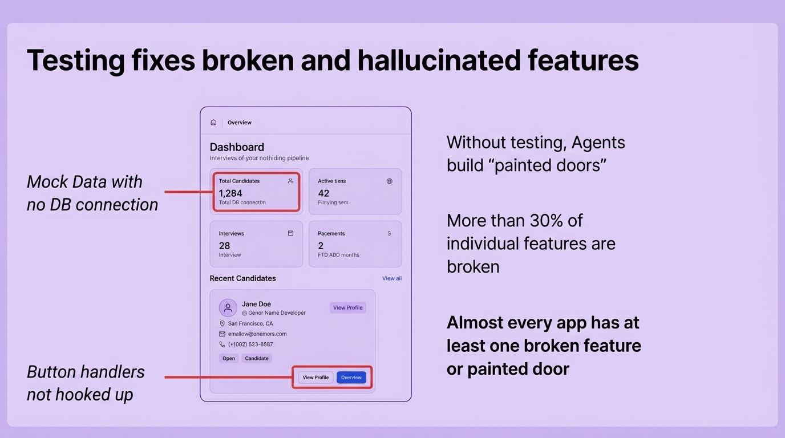
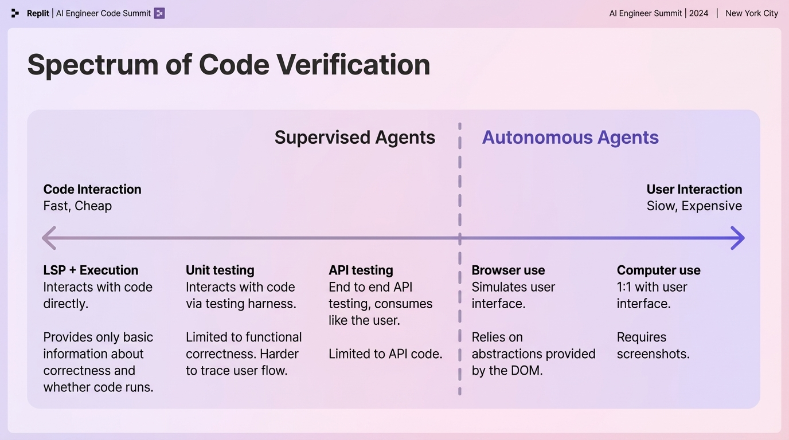

**Time:** 9:25 AM

**Speaker Bio:** VP of AI at Replit. Previously Head of Applied Research at Google Labs and Google X. Ph.D. in Computer Science, former Stanford instructor.

**Speaker Profile:** [Full Speaker Profile](../speakers/michele-catasta.md)

**Company:** Replit is a web-based development platform with 22M+ creators. Replit Agent lets users create and deploy fully functional applications in minutes.

**Focus:** The paradigm shift from AI copilots to autonomous agents. Catasta has been emphasizing how AI must move beyond support roles to truly autonomous task completion.

## Slides

### Slide: 09-29

**Key Point:** Highlights the critical problem of AI agents building non-functional features ("painted doors") without proper testing, with over 30% of features being broken when testing is absent.

**Literal Content:**
- Purple/lavender background
- Title: "Testing fixes broken and hallucinated features"
- Dashboard mockup showing "1,284 Total Candidates" (labeled "Mock Data with no DB connection")
- Button handlers labeled as "not hooked up"
- Three text statements on right:
  - "Without testing, Agents build 'painted doors'"
  - "More than 30% of individual features are broken"
  - "Almost every app has at least one broken feature or painted door"

### Slide: 09-31

**Key Point:** Presents a spectrum of testing approaches for AI agents, from fast/cheap code-level testing to slow/expensive user-interface testing, showing the tradeoff between supervision level and resource requirements.

**Literal Content:**
- Title: "Spectrum of Code Verification"
- Horizontal spectrum showing "Supervised Agents" vs "Autonomous Agents"
- Left side: "Code Interaction: Fast, Cheap"
- Right side: "User Interaction: Slow, Expensive"
- Testing methods from left to right:
  1. LSP + Execution (interacts with code directly, basic info)
  2. Unit testing (interacts via testing harness, limited to functional correctness)
  3. API testing (end to end, limited to API code)
  4. Browser use (simulates user interface, relies on DOM abstractions)
  5. Computer use (1:1 with user interface, requires screenshots)

### Slide: 09-33

**Key Point:** Introduces Replit Agent 3's multi-modal testing approach that combines various testing methods (API, browser, computer use) with multiple data sources for comprehensive and cost-effective autonomous application testing.

**Literal Content:**
- Title: "Autonomous App Testing"
- Three testing approaches shown:
  1. Computer Use Testing (Application ↔ Screenshot/Action ↔ Testing)
  2. Browser Use Testing (Application ↔ DOM/Action ↔ Testing)
  3. API Testing (Application ↔ API Calls ↔ Testing)
- Right side shows comprehensive approach with Application connected to Agent via Screenshot, DB, Logs, API Call, Action, and Testable code
- "Replit Agent 3" features:
  - Generates applications amenable to testing
  - Testing integrates information from multiple sources to generate more useful feedback
  - Cost effective w/ Computer Use only as a fallback

## Notes

- Building semi-async valley of death
- How do we build agents for non technical users
	- Supervised vs autonomous agents
- It's not about how long they run
- The autonomy given to Agents can be given a very specific scope
	- Agents make all technical decisions
	- Only if the scope you are giving the task is very broken
- The user maintains control over aspects of the project that they care about
- Tasks have a natural complexity
	- Plan -> implement -> test -> loop
	- Goal: maximize the irreducible runtime of the agent
- Building a lot of "painted doors" -- funny way to describe wireframe
	- More than 30% of features are broken
	- Users don't want to spend time doing testing
- Autonomous testing!
	- Break the feedback bottleneck
	- Prevent the accumulations of small errors
	- Overcomes of laziness of frontiers ("accumulations of whatevers")
* Context management
	* Persist on the file system
	* Use the code base
	* Dump the memory in the filesystem
* Subagent invoked by the core loop with a task and fresh context
	* Protects the main agents working memory
	* Avoiding "context pollution"
* Parallel agents presented as a way to stay in the zone, the long run times is not a satisfying user experience for productive people
	* Replit users would have no idea what a merge conflict is
* Core loop as the orchestrator of the subagents
	* Parallelism is decided on the fly

## Phrases:
* Painted doors
* Accumulations of whatevers
* "Time worked 282 minutes"
