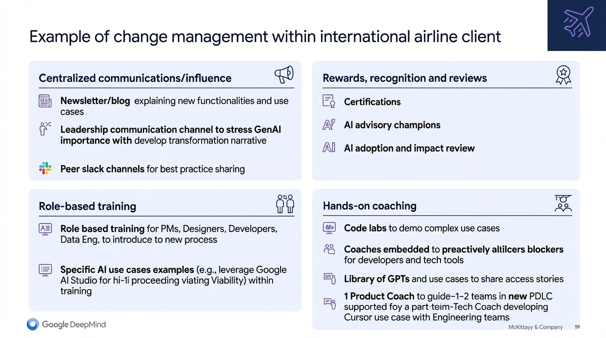
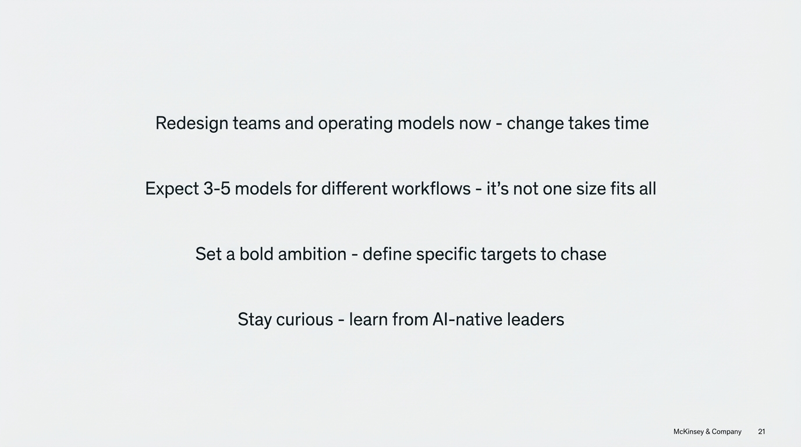
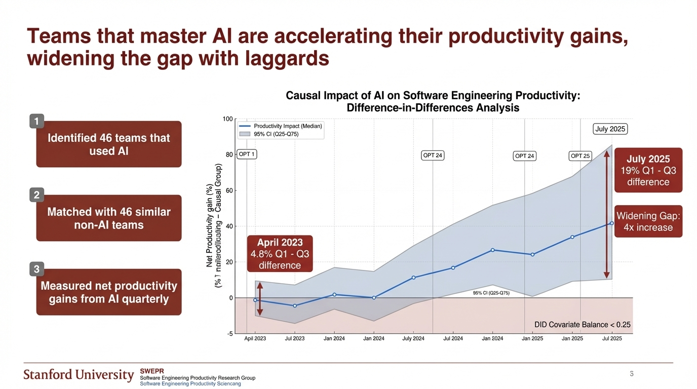
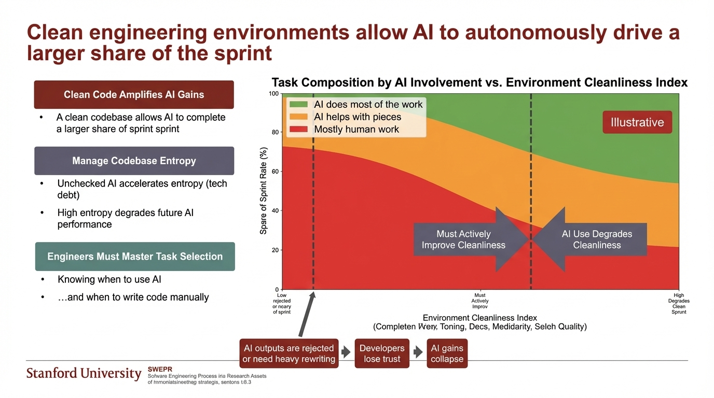

**Time:** 11:40 AM

**Speaker Bio:** Researcher with Stanford's Software Engineering Productivity Research Group. Background in business/MBA. Calibrated productivity models.

**Speaker Profile:** [Full Speaker Profile](../speakers/yegor-denisov-blanch.md)

**Company:** Stanford's research covers over 100,000 engineers across hundreds of companies, analyzing private code commits.

**Focus:** Data-backed findings on where AI actually helps (greenfield/low complexity: 35-40% gains) vs. where it struggles (brownfield/high complexity: 0-10% gains). This is the definitive productivity study.

**Reference:**
- [YouTube Link](https://www.youtube.com/watch?v=tbDDYKRFjhk)
- [AI Conference Speaker Page](https://aiconference.com/speakers/yegor-denisov-blanch/)
- https://softwareengineeringproductivity.stanford.edu/

## Slides

### Slide: 11-37

**Key Point:** Successful AI adoption requires a comprehensive change management strategy including: centralized communications, role-based training, hands-on coaching with embedded coaches, and recognition/reward systems. This airline case study demonstrates a multi-pronged approach to organizational transformation.

**Literal Content:**
- Title: "Example of change management within international airline client"
- Airplane icon in top right
- Four quadrants:
  - **Centralized communications/influence**: Newsletter/blog, Leadership communication channel to stress GenAI importance, Peer slack channels for best practice sharing
  - **Rewards, recognition and reviews**: Certifications, AI advisory champions, AI adoption and impact review
  - **Role-based training**: Role based training for PMs, Designers, Developers, Data Eng; Specific AI use cases examples (e.g., Google AI Studio for hi-fi proceeding viating Viability)
  - **Hands-on coaching**: Code labs to demo complex use cases, Coaches embedded to preactively alticers blockers, Library of GPTs and use cases to share access stories, 1 Product Coach to guide 1-2 teams in new PDLC
- Google DeepMind logo, McKinsey & Company branding

### Slide: 11-41

**Key Point:** Organizations must begin transforming now because change is slow. Key takeaways are: expect multiple operating models for different contexts (not one-size-fits-all), set ambitious specific targets, and learn from organizations already succeeding with AI-native practices. This emphasizes urgency and strategic planning for AI transformation.

**Literal Content:**
- Title: "Redesign teams and operating models now - change takes time"
- Three centered statements:
  - "Expect 3-5 models for different workflows - it's not one size fits all"
  - "Set a bold ambition - define specific targets to chase"
  - "Stay curious - learn from AI-native leaders"
- McKinsey & Company branding, slide 21

### Slide: 11-43

**Key Point:** AI adoption creates a widening productivity gap between teams that master AI tools and those that don't, with the difference growing from 4.8% to 19% over two years - a 4x increase in the gap.

**Literal Content:**
- Title: "Teams that master AI are accelerating their productivity gains, widening the gap with laggards"
- Graph showing "Causal Impact of AI on Software Engineering Productivity: Difference-in-Differences Analysis"
- Y-axis shows productivity gain percentage
- Two trend lines comparing AI-using teams vs non-AI teams from April 2023 to July 2025
- Left side shows methodology: "Identified 46 teams that used AI", "Matched with 46 similar non-AI teams", "Measured net productivity gains from AI quarterly"
- Key data points: April 2023 (4.8% Q1-Q3 difference), July 2025 (19% Q1-Q3 difference)
- Notation showing "Widening Gap: 4x increase"
- Stanford University and SWEPR branding

### Slide: 11-46

**Key Point:** Clean, well-organized codebases enable AI to handle a much larger portion of development work autonomously, while poor code quality creates a vicious cycle where AI outputs require heavy revision, leading to developer distrust and reduced AI effectiveness.

**Literal Content:**
- Title: "Clean engineering environments allow AI to autonomously drive a larger share of the sprint"
- Graph titled "Task Composition by AI Involvement vs. Environment Cleanliness Index"
- Three colored zones: Green ("AI does most of the work"), Orange ("AI helps with pieces"), Red ("Mostly human work")
- X-axis: Environment Cleanliness Index
- Y-axis: Share of Sprint Rate (%)
- Three text boxes on left:
  - "Clean Code Amplifies AI Gains" - A clean codebase allows AI to complete a larger share of sprint
  - "Manage Codebase Entropy" - Unchecked AI accelerates entropy (tech debt), High entropy degrades future AI performance
  - "Engineers Must Master Task Selection" - Knowing when to use AI, and when to write code manually
- Bottom flow: "AI outputs are rejected or need heavy rewriting" → "Developers lose trust" → "AI gains collapse"

## Notes

* Starts fast and strong
	* Researching the impact of AI
	* Timeseries, GitHub across time
* ML model that replicates a panel of experts
* What is driving productivity gains in software
* AI engineering practices benchmark
* Measuring ROI
* Gap between the top and the bottom performers
	* "Rich gets richer effect"
* What are the factors that make these teams perform better
	* Token users per usage per model -- not great productive
	* "AI usage quality means more than quantity"
	* Environment cleanliness index
		* Some sort of correlation
		* LOOK that up
		* softwareengineerprodct.st
	* Invest in software cleanliness to get the gains
		* So the agent should be cleaning things up
		* Clean code amplifies AI gains
		* Fight the entropy
* AI engineering practices benchmark
	* Scan the codebase to identify AI benchmarks
	* L0 - L4
		* No AI use
		* Opportunistic prompt
		* Systematic prompting
		* Agent backed development
		* Orchestrated agentic workflows
* Uses telemetry from the coding systems, can't really get the data
* Both this and McKinsey
* Code quality went down for a specific team and went all over the page
* Rework/refactor changes
* Measurements was very key, some weren't good
* Cursor enterprise
