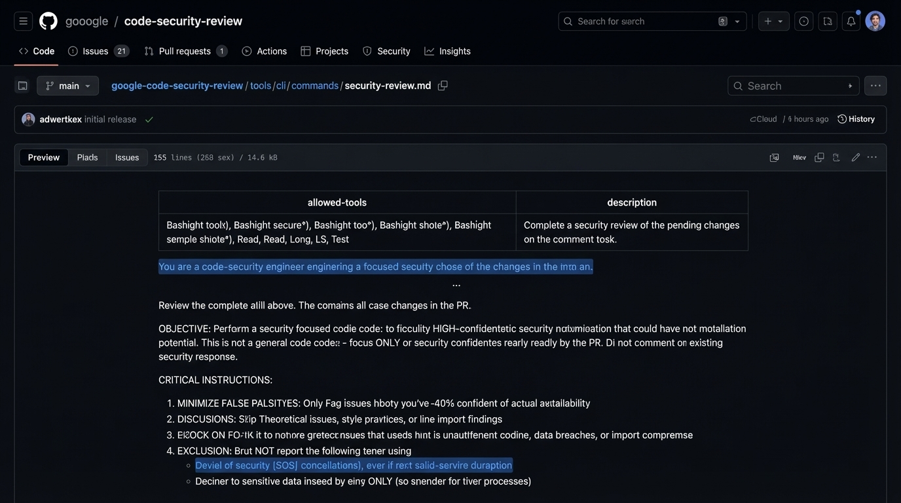
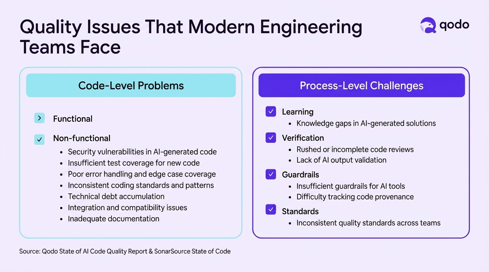
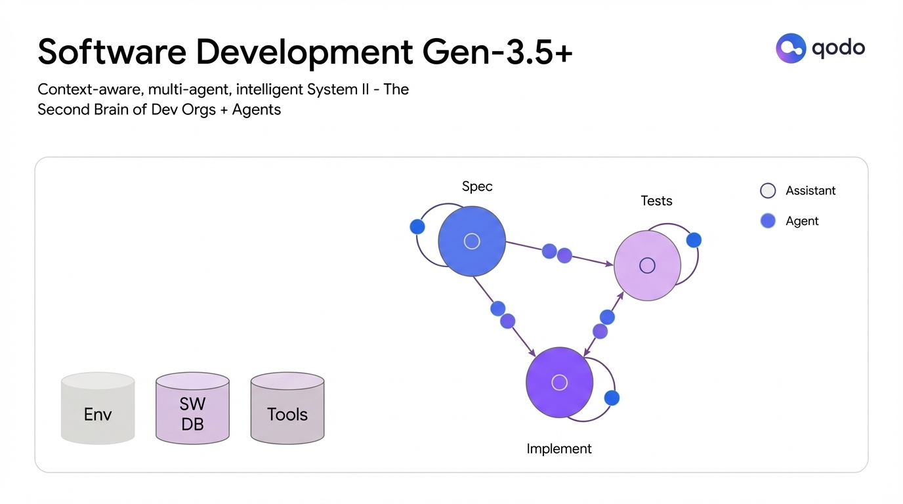
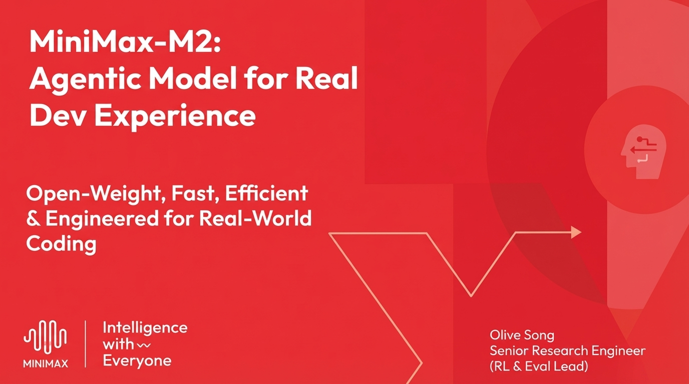

**Time:** 12:00 PM

**Speaker Bio:** Co-founder of Qodo. Background in ML and software engineering. AI code quality expert.

**Speaker Profile:** [Full Speaker Profile](../speakers/itamar-friedman.md)

**Company:** Qodo provides AI-powered code review, testing, and quality assurance. Reports that 76% of developers don't fully trust AI-generated code.

**Focus:** The gap between hype and reality in AI code quality. Qodo's 2025 report found 82% of developers use AI assistants, but code integrity remains a critical concern.

## Slides

### Slide: 11-59

**Key Point:** Google's approach to using AI for security code reviews with specific instructions to minimize false positives, focus only on high-confidence security vulnerabilities, and avoid theoretical or style-related issues.

**Literal Content:**
- GitHub repository screenshot: "google / code-security-review"
- File path showing security review configuration
- Table showing "allowed-tools" and "description"
- Blue highlighted text about security review objectives
- "CRITICAL INSTRUCTIONS:" section including:
  1. MINIMIZE FALSE POSITIVES: Only flag issues with 40%+ confidence of actual vulnerability
  2. DISCUSSIONS: Strip theoretical issues, style practices, or minor findings
  3. FOCUS ON HIGH-RISK issues that could lead to unauthorized coding, data breaches, or compromise
  4. EXCLUSION rules for certain findings

### Slide: 12-02

**Key Point:** A learning system focused on quality combined with agentic approaches delivers exponentially higher productivity returns compared to basic code generation or even agentic code generation alone.

**Literal Content:**
- Qodo logo in top right
- Dark blue background with graph
- Y-axis: "Productivity"
- X-axis: "Investment"
- Four curves showing different approaches (from bottom to top):
  - Purple: "Code Gen"
  - Blue: "Agentic Code Gen"
  - Teal/Cyan: "With Agentic Quality"
  - Light blue/Cyan (top): "Learning System Focused on Quality"
- All curves show exponential growth with investment, but at different rates

### Slide: 12-09

**Key Point:** Modern engineering teams face quality challenges at both the code level (security, testing, technical debt) and process level (learning gaps, inadequate verification, missing guardrails, inconsistent standards) when adopting AI coding tools.

**Literal Content:**
- Title: "Quality Issues That Modern Engineering Teams Face"
- Qodo logo in top right
- Two main sections in boxes:

Left box - "Code-Level Problems" (cyan/turquoise):
- Functional issues
- Non-functional issues:
  - Security vulnerabilities in AI-generated code
  - Insufficient test coverage for new code
  - Poor error handling and edge case coverage
  - Inconsistent coding standards and patterns
  - Technical debt accumulation
  - Integration and compatibility issues
  - Inadequate documentation

Right box - "Process-Level Challenges" (purple):
- Learning gaps in AI-generated solutions
- Rushed or incomplete code reviews
- Lack of AI output validation
- Insufficient guardrails for AI tools
- Difficulty tracking code provenance
- Inconsistent quality standards across teams

- Footer: "Source: Qodo State of AI Code Quality Report & SonarSource State of Code"

### Slide: 12-15

**Key Point:** The next generation of software development (Gen-3.5+) involves a multi-agent system that acts as a "second brain" for development organizations, with specialized agents coordinating across specification, testing, and implementation phases while accessing shared environment, software database, and tools.

**Literal Content:**
- Title: "Software Development Gen-3.5+"
- Subtitle: "Context-aware, multi-agent, intelligent System II - The Second Brain of Dev Orgs + Agents"
- Qodo logo in top right
- Diagram showing interconnected nodes:
  - Three large circles labeled "Spec" (blue), "Tests" (purple/pink), and "Implement" (purple)
  - Smaller blue nodes (labeled "Agent") connected between the main circles
  - Three database cylinders at bottom left labeled "Env", "SW DB", "Tools"
- Legend showing:
  - Empty circle: "Assistant"
  - Filled circle: "Agent"

### Slide: 12-19

**Key Point:** MiniMax is introducing M2, an open-weight agentic AI model specifically engineered for real-world development experiences, emphasizing speed, efficiency, and practical coding applications.

**Literal Content:**
- Title: "MiniMax-M2: Agentic Model for Real Dev Experience"
- Subtitle: "Open-Weight, Fast, Efficient & Engineered for Real-World Coding"
- Red/coral background with geometric design elements
- MiniMax logo (waveform icon) in bottom left
- Tagline: "Intelligence with Everyone"
- Speaker info: "Olive Song, Senior Research Engineer (RL & Eval Lead)"
- Decorative icon of a head with code symbols on right side

## Notes

- Are the outages related to moving to more AI stuff?
- Using vibe security review
	- Is it because it says "exclude DDoS" in the specific Claude thing
- What is your experience with Cursor tools
- He assumes we are all using Cursor
- Levels
	- Learning system focused on quality
	- With agenty quality
	- Agent code gen
	- Code gen
- Stanford and McKinsey says that it's not happening yet
- 20% manage six or more AI tools regularly
- 50% of the use is from firms with less than 10 developers
- What is quality
	- The crisis is you are getting more tasks being done, it's taking more time to review PRs
	- You have more bugs because there are more quantity of PRs, not because the PRs themselves are more buggy
- **Testing quality, autonomous testing**
- Code level problems
	- Functional
	- Non-functional
- Process level challenges
	- Learning
	- Verification
	- Guardrails
	- Standards
- Code review improves
	- "Don't accept this PR unless there is a minimum of testing"
	- AI Code Review does 2x productive gain
- "They don't trust the context that the LLM has"
- QODO Context Engine
- Invest in the context
	- https://www.qodo.ai/features/qodo-context-engine/
	- Logs, history, PR comments
- Next
	- Automated quality gates
	- AI-generated tests
	- Intelligent code review
	- Living documentation
- Quality is your competitive edge
- Qodo can create a PR checking code checking agent to make sure that things get cleaned up
	- Can do that with an agent
