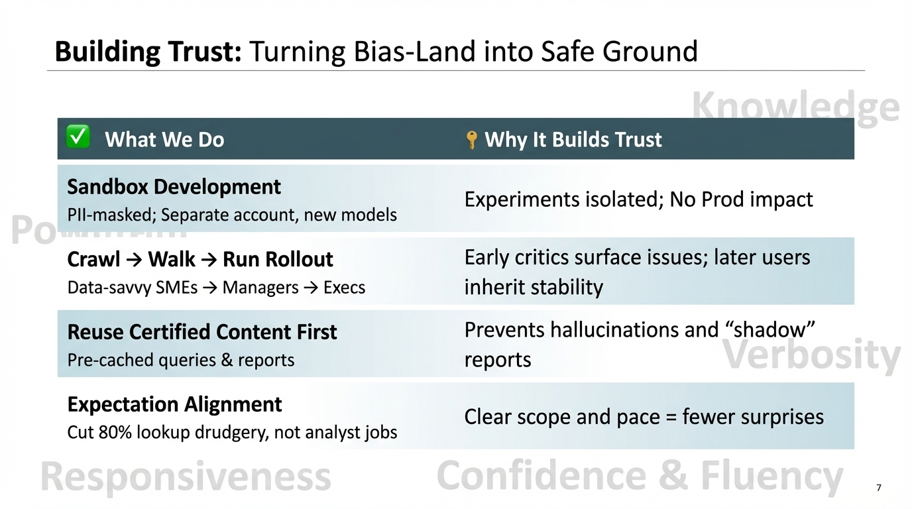
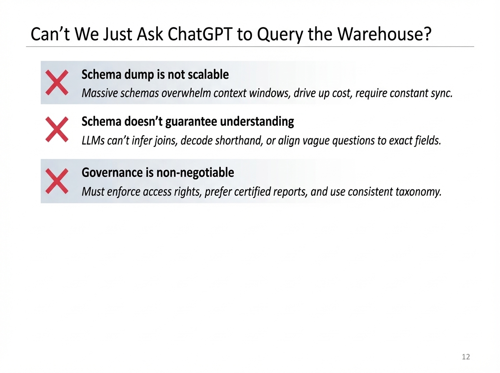

**Time:** 2:05 PM

**Speaker Bio:** GenAI Products Leader at Northwestern Mutual. Experience leading high-impact teams.

**Speaker Profile:** [Full Speaker Profile](../speakers/asaf-bord.md)

**Company:** Northwestern Mutual is a Fortune 100 financial company. GenBI combines Generative AI with Business Intelligence.

**Focus:** Enterprise AI strategy: crawl → walk → run. Incremental ROI delivery. Building trust step-by-step in conservative environments.

## Slides

### Slide: 14-11

**Key Point:** The slide outlines a comprehensive strategy for building organizational trust when implementing AI/LLM systems through careful rollout planning, sandboxing, reusing certified content, and managing expectations.

**Literal Content:**
- Title: "Building Trust: Turning Bias-Land into Safe Ground"
- Two-column table with "What We Do" (checkmark icon) and "Why It Builds Trust" (key icon)
- Four strategies listed:
  1. Sandbox Development (PII-masked; Separate account, new models) → Experiments isolated; No Prod impact
  2. Crawl → Walk → Run Rollout (Data-savvy SMEs → Managers → Execs) → Early critics surface issues; later users inherit stability
  3. Reuse Certified Content First (Pre-cached queries & reports) → Prevents hallucinations and "shadow" reports
  4. Expectation Alignment (Cut 80% lookup drudgery, not analyst jobs) → Clear scope and pace = fewer surprises
- Watermarked text in background: "Knowledge", "Policy", "Responsiveness", "Confidence & Fluency", "Verbosity"

### Slide: 14-19

**Key Point:** The slide addresses why simply giving an LLM direct database access is insufficient, highlighting scalability, understanding, and governance challenges that require more sophisticated solutions.

**Literal Content:**
- Title: "Can't We Just Ask ChatGPT to Query the Warehouse?"
- Three points with red X icons:
  1. "Schema dump is not scalable" - Massive schemas overwhelm context windows, drive up cost, require constant sync.
  2. "Schema doesn't guarantee understanding" - LLMs can't infer joins, decode shorthand, or align vague questions to exact fields.
  3. "Governance is non-negotiable" - Must enforce access rights, prefer certified reports, and use consistent taxonomy.

## Notes

* Northwestern Mutual
	* They have a lot of money and a lot of data
	* Risk averse
	* "Buy life insurance now, stay with us 40-50 years down the road"
	* How do we balance that with innovation
* "GenBI"
* 4 barriers
	1. Unknown tech
	2. Messy real data
	3. Blind-trust bias
	4. Budget & impact
* Using actual data instead of synthetic to really understand the mess
	* "The gap between demo and production is so broad"
	* Got to work with the people who uses the data in and out
	* What people are actually asking in the environment "basically the evals"
	* Brought the business as part of the research project itself
* Building trust
* Building incremental deliveries into the process ROI step by step
* Schema dump not scalable
	* Lookup for
* Business question -> orchestrator -> metadata agents (understanding the context)
* Then to RAG agent that tries to go to the exist report -> certified reports
* Tangible data to enriching metadata
* How do we price software in this new era
* Usage price vs seats price
