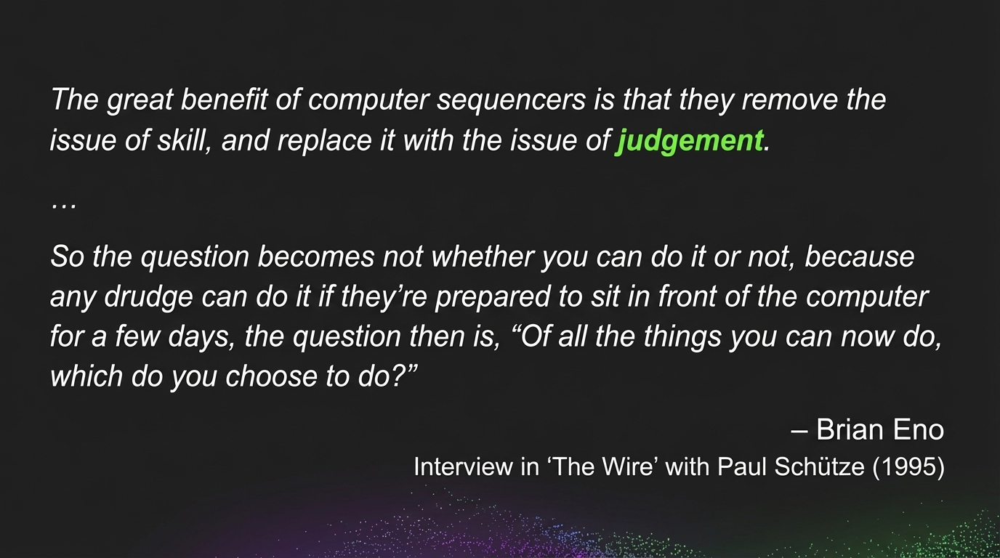
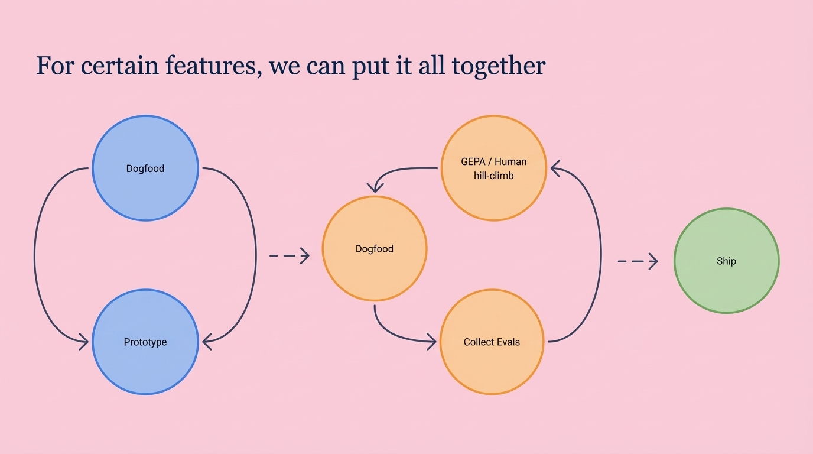

**Time:** 2:45 PM

**Speaker Bio:** Head of Engineering, AI at The Browser Company. Previously senior engineer at Instagram/Facebook (6 years).

**Speaker Profile:** [Full Speaker Profile](../speakers/samir-mody.md)

**Company:** The Browser Company is being acquired by Atlassian ($610M). Developing Arc and Dia browsers with AI integration.

**Focus:** UX/engineering lessons from rebuilding a beloved product (Arc) with AI. Understanding how AI agents integrate with user interfaces.

**Reference:** [LinkedIn Profile](https://www.linkedin.com/in/samir-mody)

## Notes

* What we learned going from Arc to Dia around AI
* Shipped a few ideas in Arc with AI stuff
	* Put out App 2
* Built a new one
	* With speed and security in mind
	* It gets to know you
	* On the way to achieving the vision
* What did we learn along the way
	* Optimize your tools and process for fast iteration
		* Prototype for AI production features
		* Building and running evals
		* Collection data for trains and evals
		* And automation for hill climbing
* Tools
	* Prompt editor in dev builds
	* Moved all these prompts into the tools itself
		* 10x the speed of ideating and iterating
		* "Ideating"
		* All with their full context
		* Super fun for everything to do it
	* GEPA as a way to refine the prompt
		* Seed them
		* Exec and score
		* Choose top prompts
		* Reflect and generate new prompts

* "Generate a skill based on the user input" -> multipage prompt
* GEPA hill climbing is really exciting
* Treating model behavior as a craft
	* Behavior design
	* Measurement and training
	* Model steering
	* Product design and the craft of the internet moved over time
		* Functional -> agentic behavior
		* What might the future hold?
	* We are in the early days of model behavior
	* The best people it might surprise you
		* Formation of a small behavior team
* Prompt Injections
	* Exfiltrating the data somehow I missed the explanation
	* Lethal trifecta
	* Wrapping untrusted context in tags
	* "While this can help, there are no guarantees"
	* It's on us to design our product with this in mind
	* **Read and confirm the data shared with the form as part of the tool call**
		* Human confirmation step

## Key Takeaways

1. Tools
2. Treating model behavior and craft and discipline
3. AI security as an emergent property of building products

* Technology shift -> Product Company -> Evolution Company
* When you recognize that it tech shifts, you have to embrace it with conviction

## Slides

### Slide: 2025-11-20-14-43

**Key Point:** The slide uses Brian Eno's quote to make a philosophical point about how AI/automation shifts the challenge from technical skill to strategic judgement and decision-making about what to build.

**Literal Content:**
- Dark background with colorful gradient at bottom
- Quote: "The great benefit of computer sequencers is that they remove the issue of skill, and replace it with the issue of judgement." (word "judgement" highlighted in green)
- "..."
- "So the question becomes not whether you can do it or not, because any drudge can do it if they're prepared to sit in front of the computer for a few days, the question then is, 'Of all the things you can now do, which do you choose to do?'"
- Attribution: "— Brian Eno"
- Source: "Interview in 'The Wire' with Paul Schütze (1995)"

### Slide: 2025-11-20-14-52

**Key Point:** The slide illustrates a development methodology that progresses from prototyping and internal testing (dogfooding) through evaluation and human-in-the-loop refinement before shipping features.

**Literal Content:**
- Pink background
- Title: "For certain features, we can put it all together"
- Diagram showing workflow progression (left to right):
  - Left circle (pink outline) contains two blue circles labeled "Dogfood" and "Prototype" with circular arrows
  - Arrow points to middle section (pink outline) with three orange circles: "Dogfood", "GEPA / Human hill-climb", and "Collect Evals" with circular arrows
  - Arrow points to right green circle labeled "Ship"
