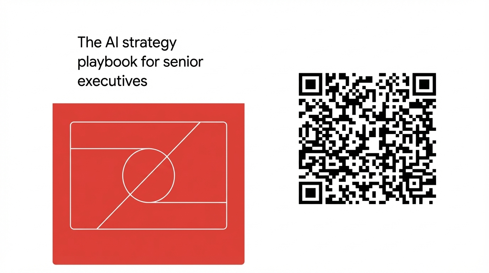
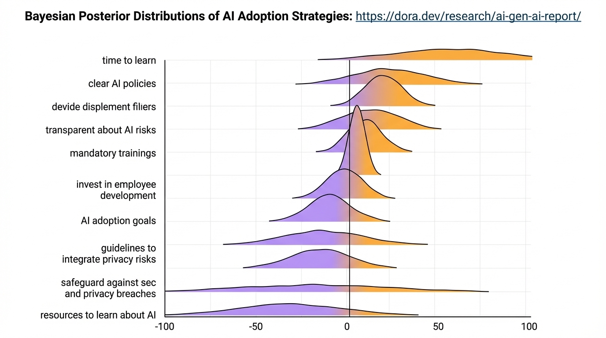

**Time:** 4:20 PM

**Speaker Bio:** Managing Partner of Tenex. Previously founded multiple venture-backed AI companies, scaled Google Cloud AI to millions of developers, adjunct professor at Carnegie Mellon.

**Speaker Profile:** [Full Speaker Profile](../speakers/arman-hezarkhani.md)

**Company:** Tenex compensates engineers based on "story points" (completed output) rather than hours. Anticipates multiple engineers earning $1M+ annually.

**Focus:** Revolutionary compensation model for the AI era. How output-based compensation directly incentivizes AI tool adoption and maximizes throughput.

**References:**
- [Startup Hub AI News](https://www.startuphub.ai/ai-news/ai-video/2025/tenex-the-10x-shift-in-ai-engineering-compensation/)
- [YouTube Link](https://www.youtube.com/watch?v=qhibA4PsBvQ)
- https://tenex.co
- https://x.com/ArmanHezarkhani

## Notes

* Pay engineers like sales guys
* We pay engineers based upon the story points they complete
* Paid on output
* Uncapped upside
* Incentivized to work smarter faster harder
* History of compensation
	* Hourly labor
	* Project based
	* Salary
	* Salary + bonus
	* Salary + bonus + equity
* Two products
	* Product reqs -> strategy (external facing)
	* Outputs a roadmap
	* Arch design -> AI engineer (external facing)
	* A lot of what we do is customer builds, that where story point models
* Most of our time goes in architect design document
	* Graded on some number of story points
	* When that story point is accepted the engineer gets paid based upon story points
* Client story:
	* Billboard company
		* 2 weeks of build to automate the moderator
	* Retail technology
		* Can run a model on device which does heat mapping
* Risks
	* Inflate story points -> strategies defines code
	* Rushes and quality drops -> 3 rounds of internal and external QA
	* Get sharp employees -> Hire the right people
* "Give your team a reason to go faster"

## Slides

### Slide: 2025-11-20-16-30

**Key Point:** A real-world retail AI implementation achieved measurable business impact (5%+ revenue increase) by deploying edge AI solutions that compress large models for sensor hardware, prioritize security, and integrate seamlessly with existing infrastructure.

**Literal Content:**
- Client story about "THE RETAIL TECHNOLOGY COMPANY"
- Three sections:
  - THE COMPANY: Describes a retail tech company connecting physical and digital stores through store analytics and customer engagement
  - THE WORK: Details building a Store Intelligence (SaaS) platform with edge AI, compressed teacher/student models, encrypted data streaming, and a single reporting API
  - Result highlighted: "5%+ ANNUALIZED Y1 IN-STORE REVENUE UPLIFT"
- Footer shows TENEX.CO and IX logo

### Slide: 2025-11-20-16-34

**Key Point:** Promoting a strategic resource (likely a whitepaper or guide) aimed at C-suite executives for developing AI strategy - the basketball court-like diagram suggests a "playbook" approach to AI implementation.

**Literal Content:**
- Title: "The AI strategy playbook for senior executives"
- Red square containing a simple geometric diagram (resembling a basketball court or strategic planning diagram with a circle and lines)
- QR code on the right side

### Slide: 2025-11-20-16-38

**Key Point:** Shows statistical analysis of different AI adoption strategies and their effectiveness/impact, with the Bayesian posterior distributions indicating uncertainty ranges and likely outcomes for each approach.

**Literal Content:**
- Title: "Bayesian Posterior Distributions of AI Adoption Strategies"
- URL: https://dora.dev/research/ai-gen-ai-report/
- Chart with ridge plots (violin plots) showing distributions for various AI adoption strategies:
  - time to learn
  - clear AI policies
  - device deployment fillers
  - transparent about AI risks
  - mandatory trainings
  - invest in employee development
  - AI adoption goals
  - guidelines to integrate privacy risks
  - safeguard against sec and privacy breaches
  - resources to learn about AI
- Each has purple and orange overlapping distributions centered around 0
