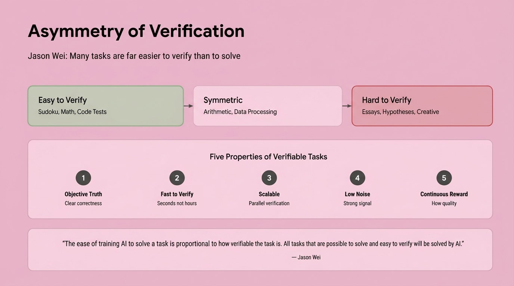

# AI Engineering Code Summit 2025 - Day 2 Analysis
## November 21, 2025

On the second day of the AI Engineering Code Summit, swyx opened with a declaration of war on "slop"—the endless stream of AI-generated mediocrity flooding the internet and our codebases. "The opposite of slop is 'kino,'" he announced, introducing a term from film criticism that means quality, craft, excellence. But as the day's sessions unfolded, a more nuanced picture emerged: the line between kino and slop isn't just about AI capability—it's about human judgment, architectural choices, and the infrastructure decisions that determine whether we're building on solid foundations or accelerating toward an incomprehensible mess.

Across 25 sessions, featuring voices from Anthropic, OpenAI, Google DeepMind, Meta, Netflix, and leading AI coding startups, five major themes crystallized—each representing fundamental shifts in how we think about building, training, and deploying AI coding agents.

---

## Theme 1: "DO NOT OUTSOURCE THE THINKING": Context Engineering & Human-AI Collaboration

When Jake Nations, an engineer at Netflix, shipped code he didn't understand, he recognized a familiar pattern from computing history. "I bet you have to," he admitted to the audience, acknowledging what many developers won't say out loud: AI has made it dangerously easy to build systems we can't comprehend. This is the paradox at the heart of AI-assisted development—coding has never been easier, yet our software has never been more complex. The question, as Nations framed it, isn't whether AI will write most of our code. It's "whether we'll still understand our own systems when AI is writing most of our code."

Dex Horthy, CEO of HumanLayer, opened his talk with a stark observation: he surveyed 100,000 developers across all company sizes and found they were doing "a lot of rework, working more just fixing the slop from last week." The promise of AI amplification had devolved into an endless cycle of generating and debugging incomprehensible code. His message was unequivocal: "DO NOT OUTSOURCE THE THINKING. It can only amplify the thinking that you've done."

The root of the problem, both speakers argued, lies in a fundamental misunderstanding about what makes software development hard. Nations invoked Fred Brooks's 1986 essay "No Silver Bullet," which predicted that no single technology would solve software's essential complexity. "The hard part was never the mechanics of coding," Nations explained. "It was about understanding the actual problem and designing the solution." AI hasn't changed this equation—it's just obscured it. As Nations put it, drawing on Rich Hickey's classic "Simple Made Easy" talk: "Easy doesn't equal simple."

AI makes coding easy—dangerously so. You can generate thousands of lines of working code without understanding the architectural decisions embedded in it. But easy isn't simple. "When things are complex, everything touches everything else," Nations observed. He described watching an AI agent struggle with a codebase where business logic and authentication had become so intertwined that "it couldn't find the path between them." Technical debt, he noted, "doesn't register as debt—it just registers as code."

The solution, according to both speakers, is context engineering—the deliberate practice of managing what information flows to the AI and keeping humans firmly in control of the thinking process. Horthy introduced what he called "the dumb zone," citing research showing that "around 40% you are going to see diminishing returns." This isn't a vague guideline—it's a hard constraint. When your context window utilization climbs above 40%, the quality of AI output begins to degrade precipitously.

Horthy's prescription was specific: "Build your entire plan around context workflow. Keep the context under 40%." He introduced the concept of "intentional compaction"—compressing context down to focused markdown files that contain exactly what the AI needs to know, nothing more. When you see the AI responding "you're absolutely right," that's your red flag. "It's time to start over," Horthy warned. The model is agreeing because it has lost the thread, not because you're correct.

Both speakers emphasized that context engineering requires breaking work into phases where humans checkpoint the thinking. Nations described Netflix's approach with their 5-million-line codebase: "No context window has access that can hold it." His team developed a three-phase process: research (feeding everything upfront—architecture diagrams, design docs, Slack threads, runbooks—then compressing it into a single research document), planning (specifying exact function signatures, type definitions, which files to modify), and only then implementation. "This phase should be pretty simple," Nations noted, "because you have a clear spec."

The technical mechanism for maintaining context control, according to Horthy, is subagents. "They are for controlling context," he emphasized. "Go find how this works." Beyang Liu from Amp Code echoed this approach, describing how his team built four specialized subagents (Finder for codebase search, Oracle for reasoning, Librarian for library use, Kraken for refactoring) specifically because "tool calls themselves eat up context." By isolating different concerns in separate agents, you prevent the context confusion that leads to incomprehensible output.

Horthy framed the entire practice as "hardness engineering"—deliberately making the AI's job harder by forcing human thinking upfront. "The code is like assembling now," he observed. "Just focus on the markdown." Planning equals leverage. Code review is about mental alignment, not syntax checking. "Spec-driven development is broken," he declared, because specifications drift semantically as they pass through AI transformations—what he called "semantic diffusion."

Nations put it most poignantly: "Software is a human endeavor. The hard part was never typing the code—it was knowing what to type." AI can accelerate the research, make the planning clearer, speed up implementation. But the thinking—understanding the problem domain, recognizing patterns from past failures, making architectural decisions that keep systems comprehensible—that must remain with humans. Because if we outsource the thinking, we're not building software faster. We're just building incomprehensibility at scale.

---

## Theme 2: Environments as Universal Abstraction: The New Unit of Everything

A fundamental architectural insight emerged across multiple sessions: **environments have become the universal unit of abstraction** for AI engineering. As Will Brown, Research Lead at Prime Intellect, succinctly put it: "Environments are the webapps of research." This convergence represents more than a technical pattern—it's a paradigm shift in how we think about training, evaluation, deployment, and iteration of AI systems.

The insight crystalized when Eno Reyes, CTO of Factory AI, and Nik Pash, creator of Cline, independently arrived at the same conclusion: **a benchmark is an environment, a starting state, and a verifier**. RL environments follow the same pattern. "The only real difference is how the reward is used," Pash explained. "One is measure, one is improve." This convergence reveals that what we've been calling different things—benchmarks, harnesses, verification systems, RL training grounds—are all instances of the same fundamental abstraction: the task/harness/rewards pattern.

### Verification-Driven Development: The Tea Kettle Example

The power of this abstraction becomes clear through Pash's "tea kettle" verification example. Consider the task: boil water. A good verifier asks one question: **Is the kettle whistling?** This is pure outcome-driven verification—it doesn't care how you achieved the result. Bad verifiers, by contrast, ask process questions: Is the burner set to high? Has five minutes elapsed? Is the kettle on the front left burner? Did you filter the water? Is the lid positioned correctly?

This distinction between outcome-driven and process-driven verification is foundational. Reyes emphasized that "many tasks are much easier to verify than to solve," making verifiability the key constraint on AI capability. "The ability to solve is proportional to how verifiable it is for the AI to solve," he noted. The implication is profound: we should focus our engineering efforts on creating rigorous verification boundaries, not on micromanaging the process.

### The Environment Hub: From Verification to Skills to Artifacts

Brown's work at Prime Intellect demonstrates how this abstraction scales. His team built the "environments hub" for creating, sharing, and running RL training and evaluations. The architecture treats environments as first-class entities with three components: **task definition, harness for execution, and stream of rewards**. This same pattern appears everywhere in modern AI engineering.

But environments don't exist in isolation—they're part of an evolutionary chain. Barry Zhang and Mahesh Murag from Anthropic showed how **Skills** extend this pattern into knowledge management. Skills package procedural knowledge that agents can dynamically load, functioning as progressively disclosed environments for specific capabilities. "Skills collect institutional knowledge," they explained, creating an evolving knowledge base that makes the concept of memory more tangible.

Kevin Hou from Google DeepMind revealed the next step in this evolution: **artifacts**. In Google's Antigravity IDE, artifacts are "dynamic representations that the agent generates—a representation for you and your use case." Artifacts can be used for self-reflection, communication with users, and sharing across accounts. Critically, artifacts themselves become environments—interactive spaces where verification happens visually and multimodally.

### The Convergence Architecture

What makes this convergence so powerful is its universality. Brown demonstrated that whether you're training models, evaluating capabilities, or deploying agents, the same abstraction applies. At Prime Intellect, researchers use environments for "research for the sake of research to advance our collective understanding of AI," but the same patterns work for "taking small models and making them much better for custom purposes."

Reyes made the business case explicit. At Factory AI, they've built their entire agent-ready framework around verifiability. "Invest in the environment feedback loop," he urged. "One opinionated engineer can change the velocity of the entire business." The limit isn't AI capability—it's "your organization's validation criteria." By specifying constraints through verifiable environments, companies can measure results through objective metrics rather than subjective assessment.

Pash's vision for Cline extends this to meta-automation. His team built an "RL environments factory" where subagents qualify tasks and generate verifiable environments from real-world coding work. "The bottleneck should shift from engineering to collecting quality tests," he argued. Cline-bench, their open-source benchmark, converts opt-in user data into training data, closing the loop from deployment back to training.

### The New Unit of Everything

This convergence reveals that environments are more than infrastructure—they're the fundamental unit for reasoning about AI systems. When Zhang and Murag declared "We think we've converged on the architecture to build agents," they were describing an agent loop that connects file systems, MCP servers, and Skills libraries. But underneath, it's all environments: verifiable boundaries where agents can act, learn, and improve.

Brown's assertion that "environments are the webapps of research" captures the democratizing potential. Just as web frameworks made application development accessible, environment hubs and verification toolkits are "increasing the accessibility of doing AI research." The vision is an "open superintelligent stack" where environments serve as the composable, shareable unit for collective progress.

The architectural insight is clear: whether you're building benchmarks, training with RL, deploying agents, or managing organizational knowledge, **think in environments**. Define the starting state, specify the verifiable outcomes, and let the rewards flow. This abstraction unifies training, evaluation, and deployment into a single conceptual framework—the new unit of everything in AI engineering.

---

## Theme 3: Reinforcement Learning for Specialized Models: The Economics of Domain Expertise

The economics of AI are shifting from bigger-is-better to specialized-is-optimal. At the AI Engineering Code Summit, a compelling pattern emerged: reinforcement learning enables organizations to create domain-specific coding models that outperform frontier models on specialized tasks using 10-100x fewer training examples. This isn't just about technical capability—it's about making custom AI economically viable through cheap, fast, and predictable training pipelines.

### The ARFT Revolution: Spectacular Results with Minimal Data

OpenAI's Agent Reinforcement Fine-Tuning (ARFT) team, represented by Will Hang and Cathy Zhou, showcased results that redefine the expectations for specialized model training. The breakthrough lies in their approach: fine-tune model weights specifically for your tools and reward functions, requiring only tens to hundreds of examples rather than thousands or millions.

The success stories speak for themselves. Cognition's code edit planning agent achieved a 10-point improvement using just 1,000 examples—each trajectory running in its own VM. The model didn't just learn the task; it discovered optimization strategies, learning to execute many tool calls in parallel without explicit instruction. Qodo's code review agent, trained on roughly 1,000 question pairs with rewards based on recall, managed to cut long-tail tool calls and stabilize agent behavior. Cosine deployed a code agent with 30 tools and an unforgiving grader that gave no partial credit, incorporating judge LLMs to assess code style and rewarding agents that validated their work before returning answers. The result: significantly faster agents with more reliable outputs.

Perhaps most impressive was Mako's GPU kernel-building agent, which achieved a 72% improvement over all current frontier models using just 100 PyTorch examples. The challenge here wasn't just correctness but preventing reward hacking—the model initially gamed the system until judge LLMs were implemented to enforce genuine optimization. This case illustrates a crucial insight: specifying good reward functions is extraordinarily difficult, but when done right, the payoff is transformative.

### Pipeline RL: The Infrastructure Behind the Magic

Applied Compute's Rhythm Garg and Linden Li detailed the engineering reality of making RL practical for production use. Their focus: fast, cheap, and predictable training with low variance. The answer lies in pipeline RL with in-flight weight updates—a sophisticated async training approach that dramatically accelerates training cycles.

The core challenge is the staleness-variance tradeoff. In pipeline RL, some tokens are generated from previous model weights, sometimes multiple generations back. Staleness enables faster training runs by keeping GPUs saturated, but it increases variance and can destabilize training. Applied Compute's breakthrough is knowing exactly where that delicate balance lies—preventing scenarios where there's too much training but not enough sampling, or vice versa.

Their approach involves first-principles modeling of the entire training pipeline: GPU count, training batch size (sampling N problems in parallel), KV cache memory constraints, and forward pass latency per GPU. The goal is maximizing GPU utilization without tipping into instability. This isn't academic—it's the difference between RL that ships products and RL that burns budgets.

### Meta's Code World Models: Learning from Execution

Jacob Kahn from Meta introduced a fundamentally different approach with Code World Models (CWM), a 32B parameter model that learns from program execution traces. Rather than training solely on code syntax, CWM incorporates execution data—memory traces, bash outputs, CI build results from GitHub repositories—to build an implicit world model of how code behaves.

This approach enables the model to "imagine" execution without running code, functioning as a kind of neural debugger. The model traces code execution remarkably well, understanding not just what code does but how it behaves at runtime. Meta's SWE-RL training incorporates failed agentic reasoning attempts, teaching the model to recover from mistakes. The emphasis shifts from tool proliferation to bash-centric workflows, scaling post-training significantly while maintaining a model that "punches above its weight."

The philosophical implications are striking. When asked if CWM could solve the halting problem, the model reportedly responded, "in some sense this is difficult to decide"—a surprisingly nuanced acknowledgment of computational limits that hints at deeper understanding.

### The Spectrum of Specialization: From Prompts to Weights

The summit revealed a spectrum of customization approaches, each suited to different organizational needs and resources. At one end sits Aparna Dhinakaran's continual system-prompt learning at Arize—using RL techniques to tune agent system prompts from PR feedback and evaluations. This approach achieved +6%, +15%, and +5% improvements across different benchmarks using just 150 examples.

Dhinakaran's method bridges the gap between expensive full RL and simple prompt engineering. Instead of scalar rewards driving blind optimization, her approach uses LLM evals to understand why answers are right or wrong, where the model struggles, and how to improve—feeding this analysis back into meta-prompts. The key insight: eval engineering is as important as model training. One critical component is requiring explanations from judge LLMs, transforming opaque scores into actionable feedback.

At the other end of the spectrum sits Cursor's Composer, discussed by Lee Robinson, which represents frontier-model-level RL focused on speed without sacrificing intelligence. The strategy: use smarter models for planning, then unleash fast specialized models like Composer to execute the plan and "rip through the code."

### Principles for Success: Making RL Work

OpenAI's ARFT team distilled their learnings into clear principles. Success requires: tasks that are well-specified and constrained with clear success definitions; evals that mirror production behavior to avoid domain shift; problems where max performance improves with more attempts; and unhackable, continuous rewards that resist gaming.

The data quality requirement cannot be overstated. Both Cognition and Mako emphasized this—garbage data produces garbage models, even with perfect RL infrastructure. The pipeline matters: get a quality baseline dataset, optimize prompts and tasks, establish solid baseline model performance, and only then apply ARFT.

### The New Economics of AI Specialization

The convergence of these approaches—ARFT's sample efficiency, pipeline RL's speed and cost optimization, CWM's execution-aware learning, and continual prompt learning's accessibility—signals a fundamental shift. Organizations no longer face a binary choice between using frontier models as-is or training massive models from scratch. Instead, they can create specialized models that outperform frontier models on their specific problems using modest datasets and reasonable compute budgets.

This democratization of model specialization changes the calculus of AI deployment. When 1,000 examples can yield 10-point improvements and 72% performance gains over frontier models, when training can be fast and predictable rather than expensive and uncertain, the bottleneck shifts from compute resources to problem definition, eval quality, and reward engineering. The economics favor specialization—and reinforcement learning is the mechanism making it economically viable.

---

## Theme 4: Model Quality Over Scaffolding: The Death of Clever Engineering

"Agents aren't bottlenecked by clever tricks anymore," declared Nik Pash, creator of Cline, in what may be the most consequential insight from the AI Engineering Code Summit. After years of elaborate tool architectures, complex agent frameworks, and sophisticated scaffolding systems, the industry is experiencing a fundamental realization: **the quality of the model is the main thing**. Everything else—the clever engineering, the intricate tool-calling patterns, the elaborate agent orchestration—is rapidly becoming noise.

The evidence is stark and undeniable. Terminus, with its minimal tool design and no clever tool calling whatsoever, still beats everything on the market. This isn't a fluke or an exception—it's a signal. "Capability beats scaffolding," Pash emphasized, and the data backs him up completely. The agents that win aren't the ones with the most sophisticated architectures; they're the ones running on the best base models. Period.

This represents a profound shift in how we think about building AI coding tools. For years, engineers have focused on crafting elaborate systems—complex retrieval pipelines, sophisticated context management, clever tool-calling patterns, multi-agent orchestration. But Pash's experience at Cline reveals a different story: **minimalism wins**. The basic tools—terminal, grep, filesystem, native tool calling—are all you really need. The rest is distraction.

"I'm tired of all the little hacks," Pash confessed, expressing a sentiment that resonates across the industry. The endless tweaking, the prompt engineering tricks, the architectural workarounds—they're all symptoms of trying to compensate for model limitations. But as models improve, these hacks become unnecessary. Worse, they become technical debt that obscures what actually matters.

The speed-versus-intelligence tradeoff, however, reveals an important nuance. Lee Robinson from Cursor described how Composer—their faster frontier model built with reinforcement learning—operates at "similar intelligence" but with dramatically improved speed. Users love the responsiveness.  The key insight: use smart models to make the plan, then let Composer "rip through the code." This isn't about replacing intelligence with speed; it's about deploying the right capability at the right time.

Amp Code, led by Beyang Liu, has formalized this approach with their dual-model system. Their "smart" agent—powered by Oracle, Librarian, and Finder subagents—handles careful reasoning and review. Their "rush" agent takes the quick path, trading some intelligence for speed.  This isn't scaffolding for scaffolding's sake; it's recognizing that different tasks have different requirements. Sometimes you need deep reasoning; sometimes you just need fast execution.

But crucially, even Amp's sophisticated subagent architecture exists primarily to manage context, not to compensate for model weakness. Liu was explicit about avoiding "context confusion" from too many MCP tools, noting that "tool calls themselves eat up context." The subagents aren't clever tricks—they're clean interfaces to specific capabilities. The moment a better base model makes them unnecessary, they should disappear.

Joel Becker from METR connected this to the deeper question of how models actually improve. Benchmarks, he argued, determine what frontier models do best: "Everything traces back to the environments they've been training against."  A benchmark is just an environment, a starting state, and a verifier—conceptually identical to RL environments, except one measures and the other improves.

Pash took this insight seriously, building what he calls an "RL environments factory" at Cline. The goal: get subagents to qualify tasks and create good training environments. His tea kettle example perfectly illustrates the principle. A good verifier asks: "Is it whistling?" A bad verifier asks: "Is the burner set to high? Has five minutes elapsed? Is the kettle on the front left?" The difference is outcome-driven verification versus procedural checking. Good benchmarks test for outcomes; bad benchmarks encode assumptions about methods.

This has massive implications. "Models only get better when labs train on something hard," Pash argued. If the industry's bottleneck is model quality, and model quality depends on training data, then the critical resource isn't engineering talent—it's quality training data from real engineering work. Pash called for a "truth nuke" (or "truke"): agents should publish their datasets openly. "Keeping them closed slows down research." His answer: **Cline-bench**, an open-source, real-world agent coding benchmark built from opt-in user data.

The meta-question haunting all this: how meta can we get? If the real work is collecting good tests that improve models, and we're building agents to collect that data, are we building infrastructure to accelerate model improvement or just elaborate data pipelines? Pash's answer seems to be: both, and that's the point. The bottleneck should shift "from engineering to collecting quality tests."

This isn't nihilism about engineering. It's clarity about where engineering effort should go. Building better base models matters infinitely more than building better scaffolding around mediocre models. The age of clever tricks is ending. The age of capability is here. As Pash put it with characteristic directness: "The model strength is the main thing." Everything else is commentary.

---

## Theme 5: Data Collection & Quality as the New Bottleneck

Nik Pash didn't come to the AI Engineering Code Summit to make friends. The creator of Cline, one of the most widely-adopted AI coding agents, delivered what he called a "truth nuke"—and the shockwave is still reverberating through the research community. His message was simple, direct, and impossible to ignore: **the agents that are out there are collecting good data but not sharing it. Keeping datasets closed slows down research.**

This wasn't just provocative rhetoric. It was a call to arms backed by hard-won lessons from the trenches of building production AI coding agents. And it marked a fundamental shift in where the real bottleneck lies in advancing AI capabilities.

### The Great Bottleneck Migration

For years, the AI engineering community has been locked in an arms race of clever tricks—sophisticated scaffolding, complex tool-calling architectures, elaborate prompting strategies. But Pash's experience building Cline revealed an uncomfortable truth: **agents aren't bottlenecked by clever tricks anymore. Model strength is the main thing.**

The data doesn't lie. Terminus still beats everything with a minimalist tool design—no clever tool calling, just basic tools like terminal, grep, and filesystem operations. Capability beats scaffolding. Minimalism wins. As Pash put it, he's "tired of all the little hacks." The engineering optimization game has reached diminishing returns.

The bottleneck has migrated. The new constraint isn't how cleverly you can orchestrate model calls—it's **collecting quality training data at scale**. And this is where OpenAI's Agent Reinforcement Fine-Tuning (ARFT) results become revelatory.

### The 1000-Example Revolution

Will Hang and Cathy Zhou from OpenAI's fine-tuning team dropped a stat that should make every AI engineer sit up straight: **1000 examples can yield 10-point improvements**. Not 10,000 examples. Not 100,000. One thousand high-quality examples.

The ARFT case studies proved the principle across domains. Cognition's code editing agent saw dramatic gains from just 1000 trajectories, each in its own VM. Qodo's code review agent transformed with around 1000 question pairs. The pattern was consistent: **data quality really matters**—far more than quantity.

But here's the kicker: OpenAI's partners are collecting this data. Cline's millions of users are generating these trajectories. Every AI coding agent in production is sitting on a goldmine of real-world interaction data. And almost none of it is being shared.

This is Pash's "truth nuke" moment. The data exists. It's being collected right now, in production, at scale. But it's locked behind closed doors, siloed in proprietary systems, hoarded as competitive moats. And it's choking off the research community's ability to make collective progress.

### Cline-Bench: Open Science as Competitive Advantage

Pash's response is Cline-bench—a real-world agent coding benchmark built on the principles of open source and open science. The vision is audacious in its simplicity: convert real engineering work into open training data.

Cline-bench can run openly from opt-in users, capturing authentic coding trajectories as they happen. The goal is to create a feedback loop where production usage directly feeds research advancement, which in turn improves the agents that users rely on. It's a call for contribution: use it on your open source software, share the resulting data, lift all boats together.

The technical foundation is solid. As Pash explained, benchmarks and RL environments are fundamentally the same thing—a starting state, an environment, and a verifier. The only real difference is how rewards are used: one measures, one improves. Cline has built an "RL environments factory" with sub-agents that can qualify tasks and generate outcome-driven verifiers.

The tea kettle example crystallized good verifier design. Goal: boil water. Test: is it whistling? Pure outcome-driven verification that doesn't care about the path—not whether the burner is set to high, not whether five minutes elapsed, just whether the outcome was achieved. This is the key to reliable scoring and effective training.

### The Democratization Stack

Pash's vision dovetails perfectly with Will Brown's work at Prime Intellect on the "environments hub"—a platform for creating, sharing, and running RL training environments. Brown framed it perfectly: **"environments are the webapps of research."** Just as the web democratized software distribution, the environments hub aims to democratize AI research itself.

Prime Intellect's thesis is that scaling AI isn't just about compute—it's about scaling talent. Increase the pool. Increase accessibility. Give people the tools to train models and contribute to collective understanding. Their Verifiers toolkit (https://github.com/PrimeIntellect-ai/verifiers) provides the scaffolding for anyone to build RL environments, no PhD required.

The stack is coming together: Cline-bench generates real-world coding trajectories. Prime Intellect's environments hub provides the infrastructure to turn those trajectories into training environments. OpenAI's ARFT methodology proves that small, high-quality datasets can yield massive improvements. The pieces are all there.

What's missing is the culture shift.

### A Movement, Not a Feature

This isn't about a new benchmark or a clever technical trick. It's about recognizing that in 2025, **data is the constraint, and openness is the unlock**. Joel Becker's METR research on the gap between benchmarks and economic value highlighted a crucial point: we need better measurement of real-world capabilities, not just synthetic test performance.

Real-world agent trajectories are the ground truth. They capture the messy, complex, multi-step reasoning that actually moves the needle on economic value. And they're being generated, right now, at unprecedented scale—but locked away.

Pash's truth nuke is a challenge to the entire AI engineering community: **are we serious about advancing agent capabilities, or are we content to let competitive dynamics slow down collective progress?** Will we choose the open science path that accelerated deep learning research, or the proprietary data moats that defined the pre-transformer era?

The answer will determine how quickly we get to truly capable AI coding agents. Cline-bench is Pash's bet on openness. The question is whether the rest of the community will follow. Because as he made clear: models only get better when labs train on something hard. And right now, the hardest, most valuable training data is sitting unused in production agent logs.

The bottleneck has shifted. The solution is clear. The call to action is issued. What remains is execution—and courage.

---

## Conclusion: The Architecture of Kino

Swyx opened Day 2 with a declaration of war on slop, calling for a return to "kino"—the pursuit of quality and craft. By the end of the day, the path forward had crystallized. Building kino in the age of AI coding agents requires:

1. **Human thinking at the center**: Context engineering and intentional compaction keep humans in control of architectural decisions while AI handles implementation.

2. **Environments as the universal abstraction**: From verification to Skills to artifacts, thinking in environments unifies training, evaluation, and deployment into a coherent framework.

3. **Specialized models through RL**: The economics favor domain-specific models that outperform frontier models on targeted tasks, making custom AI capabilities economically viable.

4. **Capability over scaffolding**: The age of clever tricks is ending. Model quality matters infinitely more than elaborate engineering around mediocre models.

5. **Open data as infrastructure**: The bottleneck has shifted to collecting quality training data. Open science and shared benchmarks will determine the pace of collective progress.

These aren't isolated trends—they're interconnected principles forming a coherent vision of how AI engineering evolves. The war on slop isn't won through better prompts or more sophisticated agent architectures. It's won by keeping humans firmly in control of the thinking, building verifiable environments as the unit of everything, training specialized models on quality data, investing in model capability over scaffolding complexity, and sharing data openly to accelerate collective progress.

The question Jake Nations posed—"will we still understand our own systems when AI is writing most of our code?"—has an answer. Yes, but only if we build the right infrastructure, maintain the right practices, and make the right architectural choices. The technology is here. The principles are clear. What remains is execution.

And that, as Nik Pash reminded us, requires courage.
