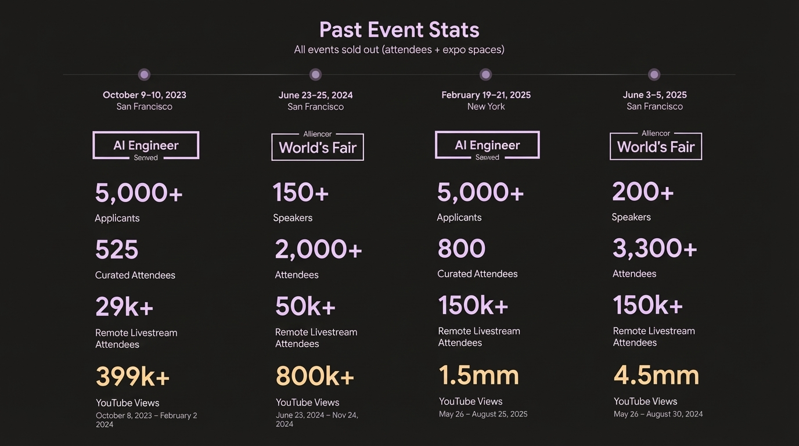
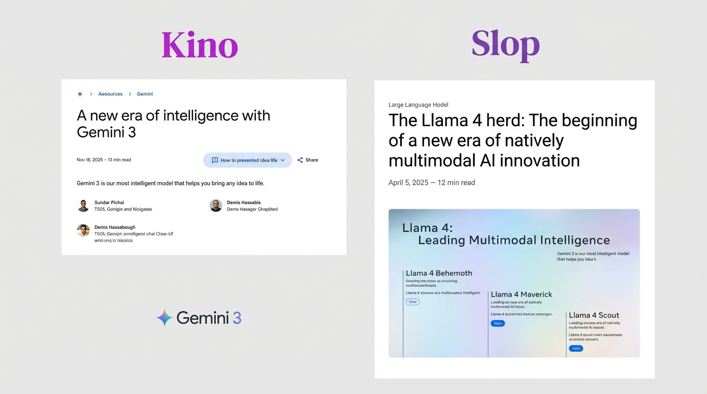
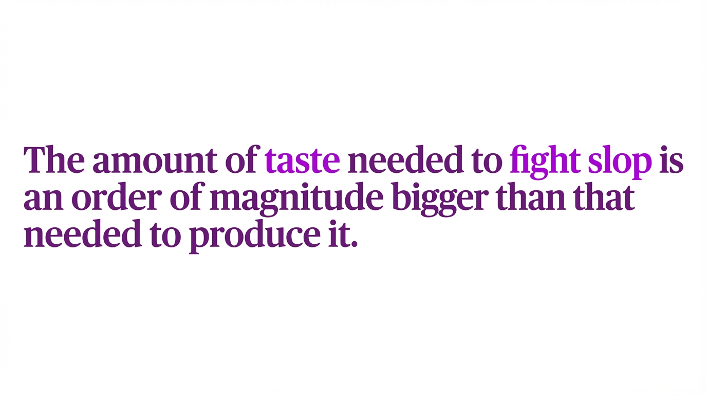
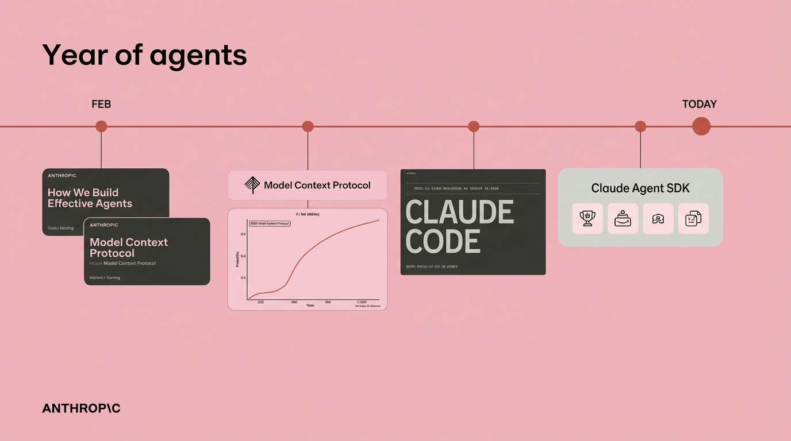
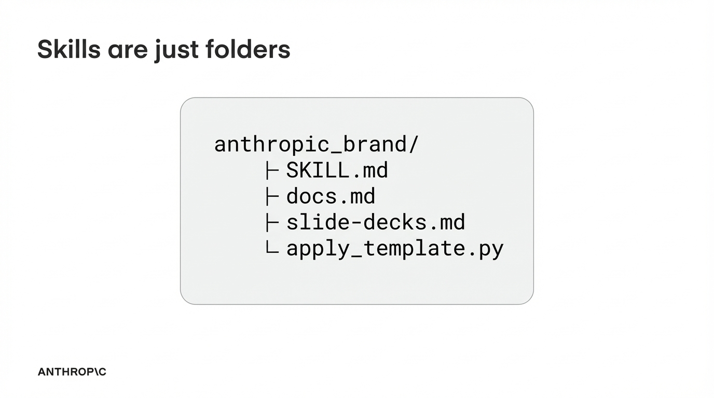
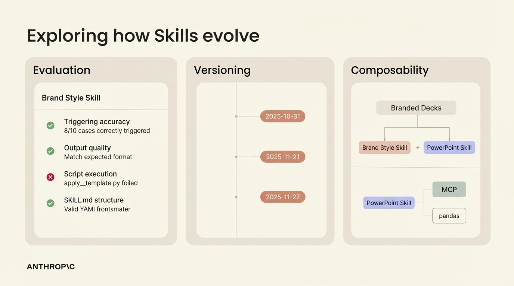

## 9:11am - 9:30am | Don't Build Agents, Build Skills Instead

**Speakers:** Barry Zhang & Mahesh Murag (both Members of Technical Staff, Anthropic)

**Speaker Profiles:** [Barry Zhang](../speakers/barry-zhang.md) | [Mahesh Murag](../speakers/mahesh-murag.md)

**Bio:** Members of Technical Staff, Anthropic

**Topic:** How Skills are the solution for agents to work reliably in production by packaging procedural knowledge that agents can dynamically load


### Notes

- still notice gaps with agents
- not always experiences for how it works
- the reason why we built skills instead of agents
- claude agent SDK does something out the box
- "code is all you need"
	- we don't need to have multiple agents
- "the agent underneath is more universal that we thought"
	- claude code is general purpose agent
- skills are files and we can use that a way to manage thing
	- can put scripts inside of a skill
- skills are progressively disclosed
	- just the top
	- then when you need more it gets the full file
	- and that can extend to include scripts
- 1000s of skills in the last 5 weeks
- Foundations Skills
	- Document Skills (Anthropic)
	- Scientific Skills (k-dense-ai) scientific research skills
	- Browserbase - automation anything in the browse
	- Notion - notion skills to edit stuff
	- Fortune 100 - org-wide skills
	- Enterprise FinTech for 1000s of SWEs
- trends
	- more complex, production-grade skills
	- complementing MCPs tools
	- non-developers building high-value skills
- Complete picture
	- Agent loop
		- File system
		- MCP Servers
	- Give them a library of skills
- Agent with MCP server and a set of skills
	- Claude for Financial Services
	- Claude for Life Sciences
- How skills evolve in the future
	- Testing and evaluation
- huge value of skills is around sharing and execution
- skill can collect institutional knowledge
- building the skills and sharing them will help make your own agents more capable
- vision of evolving knowledge base
	- especially when claude can make new skills
	- skills makes the concept of memory more tangible
- "We think we've converged on the architecture to build agents"

## Slides

### Slide: 2025-11-21-09-09


**Key Point:** Demonstrates the rapid growth and scale of the AI Engineer conference series, showing consistent sell-outs and massive audience reach both in-person and online, with YouTube viewership growing from hundreds of thousands to millions.

**Literal Content:**
- Dark slide titled "Past Event Stats"
- Subtitle: "All events sold out (attendees + expo spaces)"
- Timeline of four events:
  - October 9-10, 2023, San Francisco: AI Engineer - 5,000+ Applicants, 525 Curated Attendees, 29k+ Remote Livestream, 399k+ YouTube Views
  - June 23-25, 2024, San Francisco: World's Fair - 150+ Speakers, 2,000+ Attendees, 50k+ Remote Livestream, 800k+ YouTube Views
  - February 19-21, 2025, New York: AI Engineer - 5,000+ Applicants, 800 Curated Attendees, 150k+ Remote Livestream, 1.5mm YouTube Views
  - June 3-5, 2025, San Francisco: World's Fair - 200+ Speakers, 3,300+ Attendees, 150k+ Remote Livestream, 4.5mm YouTube Views

### Slide: 2025-11-21-09-10


**Key Point:** Appears to be contrasting Google's Gemini 3 announcement against Meta's Llama 4 release, possibly commenting on marketing approaches or product positioning (the labels "Kino" vs "Slop" suggest a value judgment about the quality or presentation of these announcements).

**Literal Content:**
- Split screen comparison showing:
  - Left side labeled "Kino": Google's announcement page for "Gemini 3" dated Nov 18, 2025, titled "A new era of intelligence with Gemini 3" with author photos and Gemini 3 logo
  - Right side labeled "Slop": An article about "Llama 4 herd" dated April 5, 2025, showing a diagram of "Llama 4: Leading Multimodal Intelligence" with four variants (Behemoth, Maverick, Scout)

### Slide: 2025-11-21-09-11


**Key Point:** Contrasts evidence-based projections of AI capabilities (based on actual data) versus speculative/overhyped predictions about future AI capabilities - highlighting the difference between realistic expectations and hype.

**Literal Content:**
- Title: "The same AI chart = Kino vs Slop"
- Two charts side by side:
  - Left chart (Meta logo): Shows "The time-horizon of software engineering tasks different LLMs can complete 50% of the time" with timeline from 2012-2026, showing progression of capabilities
  - Right chart: "AI 2027" showing progression of models (OpenAI, Claude, Google Gemini Ultra) from 2027 onwards
- Bottom labels: "Evidence" (left) and "Fan Fiction" (right)

### Slide: 2025-11-21-09-12


**Key Point:** A critical statement about AI-generated content quality - it takes significantly more human effort, judgment, and taste to filter out low-quality AI outputs ("slop") than it does to generate them, highlighting the challenge of maintaining quality standards in an AI-abundant world.

**Literal Content:**
- Text in purple: "The amount of taste needed to fight slop is an order of magnitude bigger than that needed to produce it."

### Slide: 2025-11-21-09-17


**Key Point:** Chronicles Anthropic's development timeline in 2025 showing their progressive release of agent-related technologies: from building effective agents, to establishing MCP (Model Context Protocol), to launching Claude Code, and finally the Claude Agent SDK - demonstrating their strategic evolution in the agent space.

**Literal Content:**
- Title: "Year of agents"
- Timeline from FEB to TODAY showing progression:
  - "How We Build Effective Agents" (Anthropic)
  - "Model Context Protocol" with adoption graph
  - "CLAUDE CODE" logo
  - "Claude Agent SDK" with icons
- Anthropic branding at bottom

### Slide: 2025-11-21-09-20


**Key Point:** Demystifies the concept of "Skills" in their system - they're simply organized as file system folders containing markdown documentation and Python scripts, making them accessible and easy to understand for developers.

**Literal Content:**
- Title: "Skills are just folders"
- Shows folder structure:
  ```
  anthropic_brand/
  ├─ SKILL.md
  ├─ docs.md
  ├─ slide-decks.md
  └─ apply_template.py
  ```
- Anthropic branding at bottom

### Slide: 2025-11-21-09-27


**Key Point:** Illustrates the three key aspects of Skills development lifecycle: systematic evaluation/testing, version control over time, and composability where skills can be combined or used with other tools (like MCP and pandas) to create more complex capabilities.

**Literal Content:**
- Title: "Exploring how Skills evolve"
- Three columns showing:
  1. **Evaluation**: "Brand Style Skill" with test results (triggering accuracy 8/10, output quality matched, script execution failed, SKILL.md structure valid)
  2. **Versioning**: Timeline showing dates 2025-10-31, 2025-11-21, 2025-11-27
  3. **Composability**: Diagram showing "Branded Decks" composed of "Brand Style Skill" + "PowerPoint Skill", and separately "PowerPoint Skill" connected to "MCP" and "pandas"
- Anthropic branding at bottom
