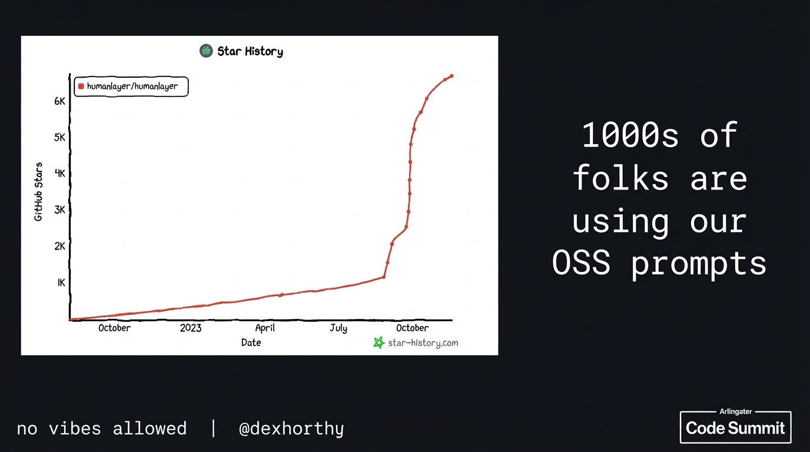

## 9:31am - 9:50am | No Vibes Allowed: Solving Hard Problems in Complex Codebases

**Speaker:** Dex Horthy, CEO, HumanLayer

**Speaker Profile:** [Full Speaker Profile](../speakers/dex-horthy.md)

**Bio:** CEO, HumanLayer

**Topic:** Solving hard problems in complex production codebases where AI tools struggle

### Links

https://github.com/humanlayer/humanlayer

@dexhorthy

### Notes

* 12 factor agents in June
* Context engineering
* Does AI agents actually help
* 100K developers across all company sizes
* a lot of rework, working more just fixing the slop from last week
* how can we get the most out of data models
* we were shipping so much we had to change the way that we collaborate
* took 8 weeks
* research plan prompt system
* refresh context
* how do you know when it s time to start of
* "you're absolutely right" -- time to start over
* intentional compaction -> compress the context down to a markdown file
* what exactly, are we compaction
	* what takes up space in your context window
	* correctness
	* completeness
	* size
	* trajectory
* LLMs are stateless function
	* put better tokens in to get the right tokens out
* geoff huntly did a research
* "dumb zone"
	* around the 40% you are going to see diminishing turn
* use subagents
	* they are for controlling context
		* go find how this works (subagents)
* "build your entire plan around context workflow"
* "keep the context under 40%"
* DO NOT OUTSOURCE THE THINKING
	* it can only amplify the thinking that you've done
* spec driven development is broken
	* what does it mean
* semantic diffusion
* the code is like assembling now and just focus o the markdown
* "memento is the best movie on context engineering"
* "on demand compressed context"
* planning == leverage
* code review -> mental alignment
* this talk had twice as much slides as the time allows
* hardness engineering as a subset of ctxe
* hard part will be term work flow and update sdlc
* hiring to build an idea

## Slides

### Slide: 2025-11-21-09-35

**Key Point:** Demonstrates the significant adoption and growth of their open-source prompt library, using GitHub stars as a metric to show thousands of users have adopted their OSS prompts over approximately one year.

**Literal Content:**
- Left side: "Star History" graph showing humanlayer/humanlayer GitHub stars growth from October 2023 to October (current), showing exponential growth from ~1K to 7K stars
- Right side (on black background): "1000s of folks are using our OSS prompts"
- Footer: "no vibes allowed | @dexhorthy"
- Code Summit branding

### Slide: 2025-11-21-09-37

**Key Point:** Appears to be a title or transition slide emphasizing their data-driven, evidence-based approach ("no vibes allowed") - likely reinforcing the theme that their work is based on measurable results rather than hype or speculation.

**Literal Content:**
- Large text: "no vibes allowed | @dexhorthy"
- Code Summit branding

### Slide: 2025-11-21-09-50

**Key Point:** Illustrates a structured, human-in-the-loop development process with three distinct phases (Research, Planning, Implementation), each requiring human review and incorporating revision cycles - emphasizing the importance of human oversight in AI-assisted development rather than fully autonomous coding.

**Literal Content:**
- Three parallel workflow diagrams showing:
  - **Phase 1 Research**: Research → Research Document → Human Review (with Revisions feedback loop)
  - **Phase 2 Planning**: Planning → Implementation Plan → Human Review (with Revisions feedback loop)
  - **Phase 3 Impl**: Impl → Clean Code → Human Review (with Revisions feedback loop)
- Author attribution: "JAKE NATIONS, SEP 04, 2025"
- Reference: "https://www.arthropod.software/p/vibe-coding-our-way-to-disaster"
- Footer: "no vibes allowed | @dexhorthy"
