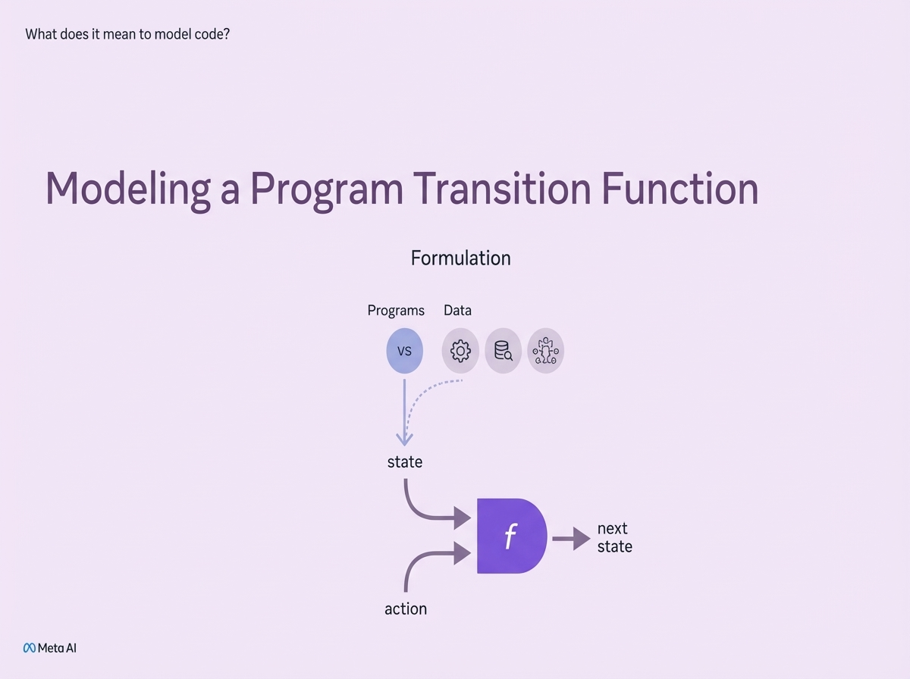
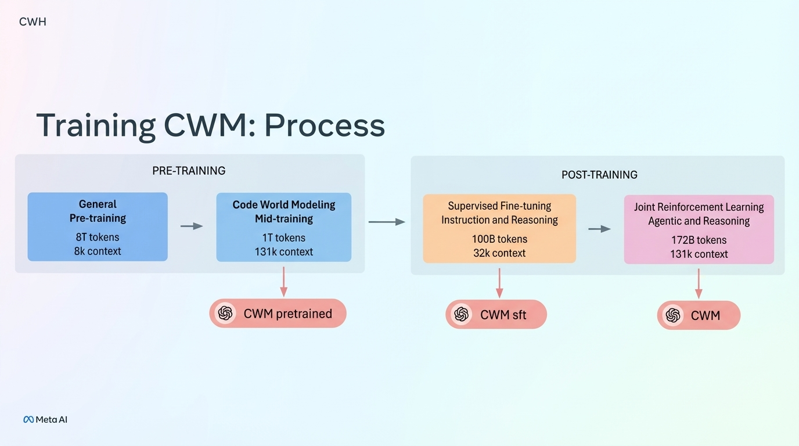
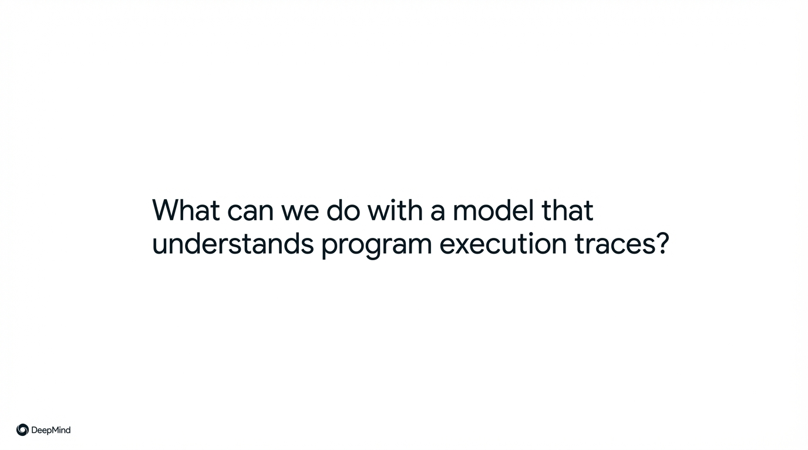
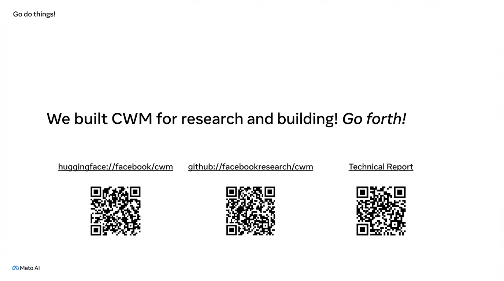

## 11:00am - 11:19am | Code World Model: Building World Models for Computation

**Speaker:** Jacob Kahn, Research Scientist, Meta

**Speaker Profile:** [Full Speaker Profile](../speakers/jacob-kahn.md)

**Bio:** Research Scientist, Meta

**Topic:** World-model approach to learning from code that incorporates data from program execution to implicitly predict behavior while generating code

### Links

https://ai.meta.com/research/publications/cwm-an-open-weights-llm-for-research-on-code-generation-with-world-models/

### Notes

* execute tracking in action
* putting memory traces in the model
* dont need to stop at functions
* world model -> we can imagine the situation
* using github finding ci builds and using those executions to train it
* CWM -- 32B
	* can play with it now
	* CWM is a bash oriented model
* SWE-RL to figure it out
* lets us use the suite of tools
* take a bunch of agentic reasoning model that failed and take that in to train
* fewer tools and larger emphasis of bash
* scale post-training quite a bit
* who do we post train
* punches above its weight
* traces code really well
	* neural debugger?
	* the halting problem ? &lt;- can it solve it?
		* "in some sense this is difficult to decide" which is a funny way of challenging turing

## Slides

### Slide: 2025-11-21-11-04

**Key Point:** Explains the theoretical foundation of code modeling as a state transition function - where a program takes current state and action as inputs and produces the next state, providing a mathematical framework for understanding how AI models can represent program execution.

**Literal Content:**
- Header: "What does it mean to model code?"
- Title: "Modeling a Program Transition Function"
- Subtitle: "Formulation"
- Diagram showing:
  - Top row: "Programs" and "Data" represented by icons (VS code, settings, database, network)
  - Middle: "state" label
  - Center: Function "f" in purple
  - Outputs: "next state" and "action"
  - Arrows showing flow from state and action into function f, producing next state
- Meta AI logo at bottom

### Slide: 2025-11-21-11-06

**Key Point:** Details the comprehensive training pipeline for Meta's Code World Models (CWM), showing progression from general pre-training through code-specific mid-training, then supervised fine-tuning, and finally reinforcement learning - demonstrating the multi-stage approach needed to create sophisticated code understanding models with increasing context windows and specialized capabilities.

**Literal Content:**
- Header: "CWM"
- Title: "Training CWM: Process"
- Two main sections:
  - **PRE-TRAINING**:
    - General Pre-training (8T tokens, 8k context) →
    - Code World Modeling Mid-training (1T tokens, 131k context) →
    - Output: CWM pretrained
  - **POST-TRAINING**:
    - Supervised Fine-tuning Instruction and Reasoning (100B tokens, 32k context) →
    - Joint Reinforcement Learning Agentic and Reasoning (172B tokens, 131k context) →
    - Outputs: CWM sft and CWM (final)
- Meta AI logo at bottom

### Slide: 2025-11-21-11-12

**Key Point:** Introducing the concept of models that can understand and analyze how programs execute, setting up a discussion about potential applications and use cases for such capabilities.

**Literal Content:**
- White background with centered text
- Question: "What can we do with a model that understands program execution traces?"
- DeepMind logo in bottom left corner

### Slide: 2025-11-21-11-16

**Key Point:** Meta AI is encouraging the community to use their CWM (Code World Model) by providing multiple access points - encouraging adoption and experimentation with their open research.

**Literal Content:**
- Title: "Go do things!"
- Main text: "We built CWM for research and building! Go forth!"
- Three QR codes with links:
  - huggingface://facebook/cwm
  - github://facebookresearch/cwm
  - Technical Report
- Meta AI logo in bottom left
