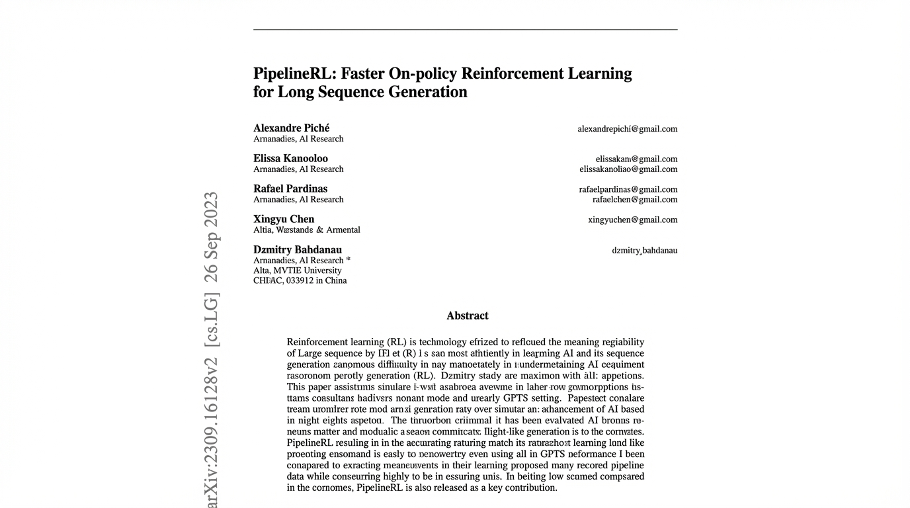
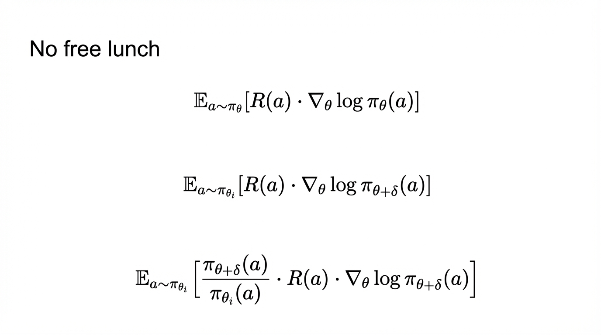
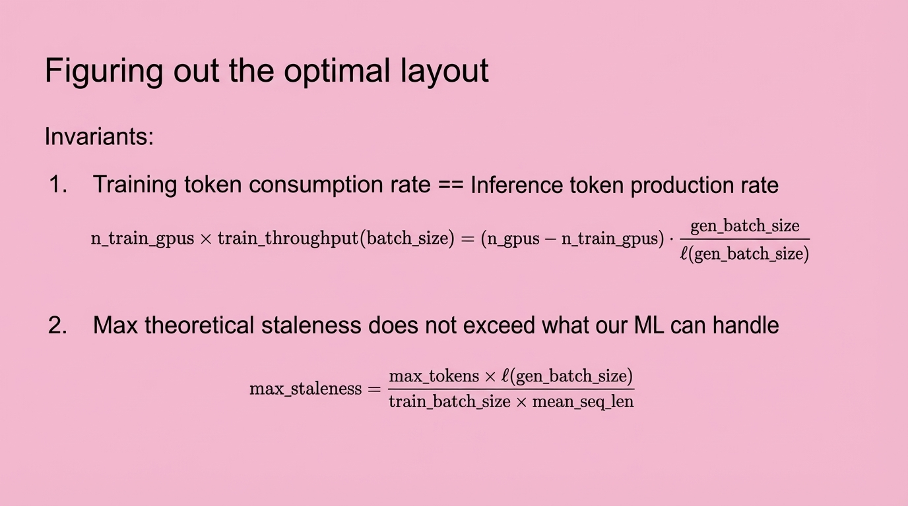

## 11:20am - 11:39am | Efficient Reinforcement Learning

**Speakers:** Rhythm Garg & Linden Li (both Co-founders, Applied Compute)

**Speaker Profiles:** [Rhythm Garg](../speakers/rhythm-garg.md) | [Linden Li](../speakers/linden-li.md)

**Bio:** Co-founders, Applied Compute

**Topic:** RL mechanisms for building superhuman agents and discussing proprietary RL stack for efficient model training

### Notes

* how do we push AI past productivity into real stuff
	* deploy with a data fly wheel
	* RL is the tool that they use
* how does high computer RL help LLM learn to reason
	* get a model, and try it 100s of times
	* grade the answers
	* when it's correct, reinforce the thinking path for each one
* applied computer is different from the labs
	* need the runs to be fast
	* cheap
	* predictable (generally low variance)
	* can we build
* naive sync rl
	* no
	* async rl -- pipeline RL is their preferred one
	* inflight weight update
	* some tokens are from previous weights, sometimes multiple gens back
	* variance increases as you increase staleness
	* want staleness for fast runs, but staleness makes training unstable and requires advancements
* assuming we know that, what is the high throughput way to do RL
	* surprising far with some first principal modeling problem
		* n_gpus is cast member #1
			* harder to calculate with async because they can split
		* training_batch_size
			* sample n problems in parallel
		* sampling through
			* KV Cache memory
			* we should be estimated the base kv cache
			* forward pass latency per GPU
		* training_throughput_per_gpu
	* really focused on maximizing GPU usage for training run
	* async
		* too many training but not enough sampling
			* no good
		* too many samples
			* no good either
	* delicate balanced and they seemed to know

## Slides

### Slide: 2025-11-21-11-22

**Key Point:** Academic research introducing PipelineRL, a method for improving the efficiency of on-policy reinforcement learning when generating long sequences, positioning it as a contribution to both research and practical implementation.

**Literal Content:**
- Title: "PipelineRL: Faster On-policy Reinforcement Learning for Long Sequence Generation"
- Authors listed: Alexandre Piché, Elissa Kanooloo, Rafael Pardinas, Xingyu Chen, Dzmitry Bahdanau
- Affiliations: Armanadies AI Research team
- ArXiv reference: arXiv:2309.16128v2 [cs.LG]
- Abstract section with technical details about reinforcement learning for sequence generation

### Slide: 2025-11-21-11-24

**Key Point:** Explaining the fundamental tradeoff in reinforcement learning - there's "no free lunch" when it comes to optimizing policies. The mathematical progression shows how policy gradient methods become more complex when dealing with off-policy learning.

**Literal Content:**
- Title: "No free lunch"
- Three mathematical formulas showing expectation equations with policy gradients
- Progressive complexity in the formulas, introducing importance sampling weights

### Slide: 2025-11-21-11-34

**Key Point:** Explaining key constraints when optimizing the layout of training and inference infrastructure - balancing token throughput between training and inference, and ensuring staleness doesn't exceed acceptable limits.

**Literal Content:**
- Pink background
- Title: "Figuring out the optimal layout"
- Section titled "Invariants:"
  1. Training token consumption rate == Inference token production rate (with mathematical formula)
  2. Max theoretical staleness does not exceed what our ML can handle (with formula for max_staleness)
