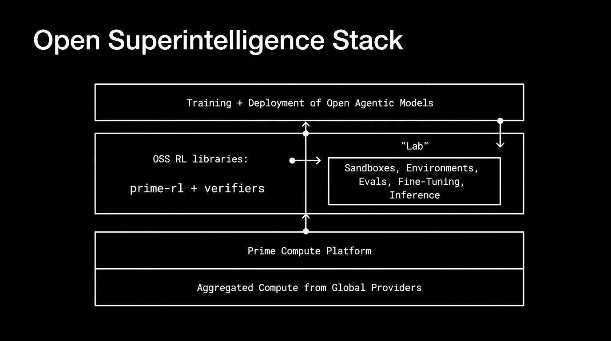
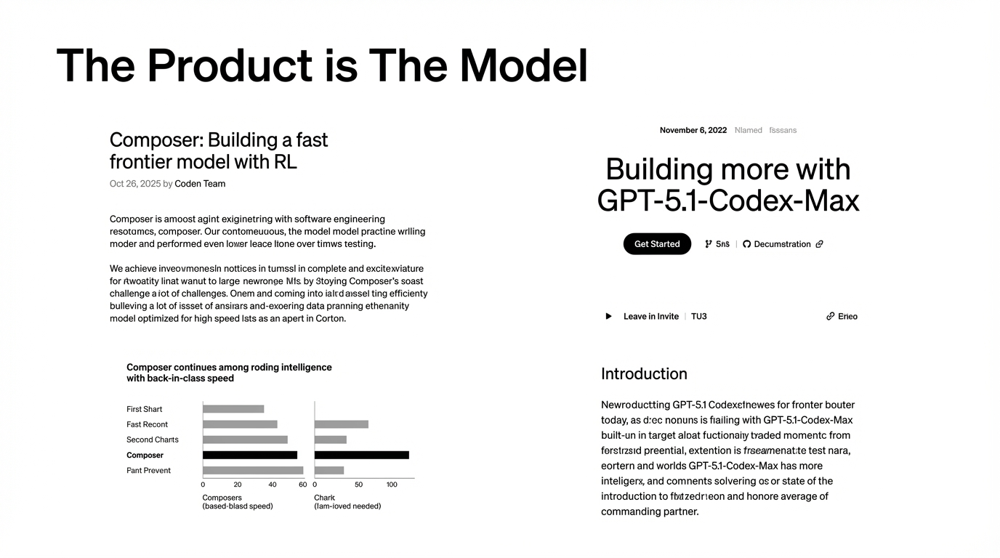
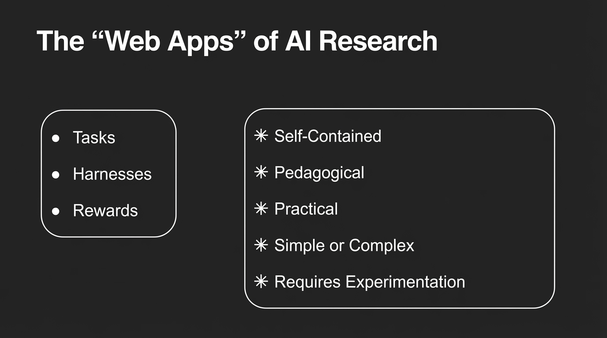

## 11:40am - 11:59am | RL Environments at Scale

**Speaker:** Will Brown, Research Lead, Prime Intellect

**Speaker Profile:** [Full Speaker Profile](../speakers/will-brown.md)

**Bio:** Research Lead, Prime Intellect

**Topic:** Scaling reinforcement learning environments for training advanced AI coding models

### Links

https://www.primeintellect.ai/

### Notes

* RL environments how to scale them
* different on scale -- how can we scale talent?
* increase the pool
* increase the accessibility of doing doing AI research
* models aren't like software
* open superintelligent stack
	* prime compute platform
	* goal is to give people the tools to be able to train models
* the places in your product where you might want to train the model
	* where the product is the model very directly
* training the model in the harness
	* environments are essentially the same things are agents
	* task, harness and the rewards
	* or the stream of rewards
	* all environments
* environments are the webapps of research"
* the "environments hub" for creating sharing RL training and evals
* "verifiers" is a tool kit for reinforcement learning
	* https://github.com/PrimeIntellect-ai/verifiers
* patterns and extensibility
* example: wiki-search
	* give an agent the ability to call tools to find pages
	* python based
	* uv run prime-rl
* "take small models and making them much better for custom purpose"
	* it is prompt tuning
	* is it model selection
	* what is the thing i care about
* prime-rl + intellect-3
	* 100b+ model
* great community outreach
* they are calling a harness or whatever "as an environment"
* or "research for the sake of research to advance our collective understanding of ai"
* break open the black box of the model

## Slides

### Slide: 2025-11-21-11-38

**Key Point:** Distinguishing between the technical "laws" of scaling AI (data, compute, parameters) versus the practical/human aspects (community, applications, accessibility), with emphasis on the challenge of scaling human talent alongside technical infrastructure.

**Literal Content:**
- Dark purple/navy background with pink text
- Title: "Axes of Scaling"
- Left column "Laws:": Data, Compute, Parameters
- Right column "Practices:": Community, Applications, Accessibility
- Bottom question: "How can we scale talent?" (with "talent" in italics)

### Slide: 2025-11-21-11-40

**Key Point:** While models themselves differ from traditional software, the research process shares many similarities with software development practices. However, AI research is more conceptual and less tangible than traditional OSS development.

**Literal Content:**
- Black background with pink title text
- Title: "AI Research vs. OSS"
- Quote: "Models aren't like software"
- Section "True, but research very much is:"
  - abstractions and best practices
  - better tooling <--> iteration efficiency
  - compounding improvements over time
- Bottom line: "Key difference: more conceptual, less tangible"

### Slide: 2025-11-21-11-41

**Key Point:** Presenting a complete technology stack for building open superintelligence, emphasizing the full infrastructure from compute aggregation through training, deployment, and experimentation capabilities.

**Literal Content:**
- Black background with white text
- Title: "Open Superintelligence Stack"
- Layered architecture diagram showing:
  - Top: "Training + Deployment of Open Agentic Models"
  - Middle: Two sections - "OSS RL libraries: prime-rl + verifiers" and "Lab" box (containing "Sandboxes, Environments, Evals, Fine-Tuning, Inference")
  - Bottom two layers: "Prime Compute Platform" and "Aggregated Compute from Global Providers"

### Slide: 2025-11-21-11-42

**Key Point:** Emphasizing that the model itself is the core product offering, showing how the company iterates and improves their models over time (Composer and GPT-5.1-Codex-Max examples).

**Literal Content:**
- Title: "The Product is The Model"
- Left side shows blog post excerpt: "Composer: Building a fast frontier model with RL" (Oct 26, 2025 by Coden Team)
- Shows comparison chart of "Composer continues among roding intelligence with back-in-class speed"
- Right side shows another blog post: "Building more with GPT-5.1-Codex-Max" (November 6, 2022)
- Both posts include "Get Started" buttons and documentation links

### Slide: 2025-11-21-11-44

**Key Point:** Drawing an analogy between web apps and AI research components - suggesting that AI research should be modular, self-contained, educational, and practical, similar to how web applications are built and shared.

**Literal Content:**
- Black background with white text
- Title: "The 'Web Apps' of AI Research"
- Left box contains bullet points:
  - Tasks
  - Harnesses
  - Rewards
- Right box contains characteristics:
  - Self-Contained
  - Pedagogical
  - Practical
  - Simple or Complex
  - Requires Experimentation
