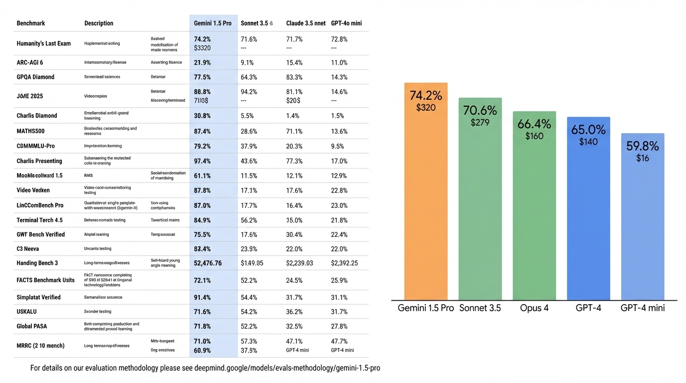
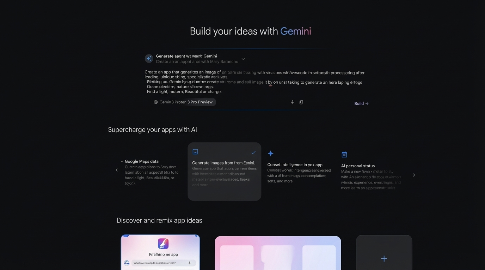
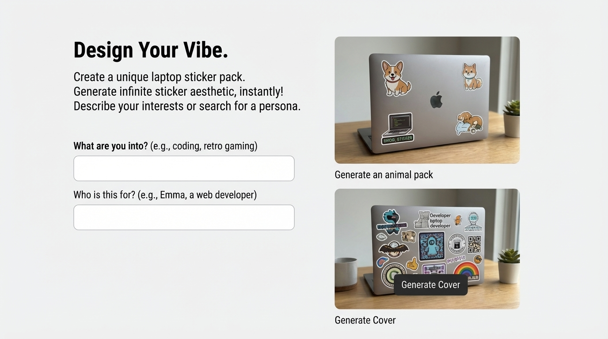
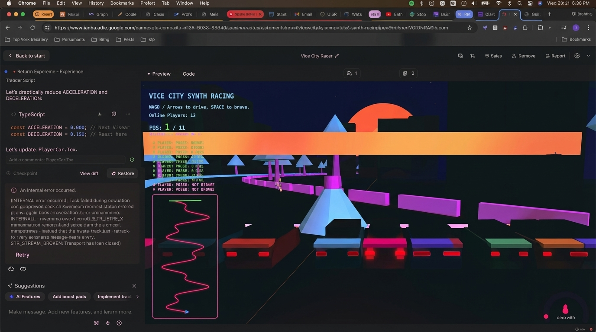
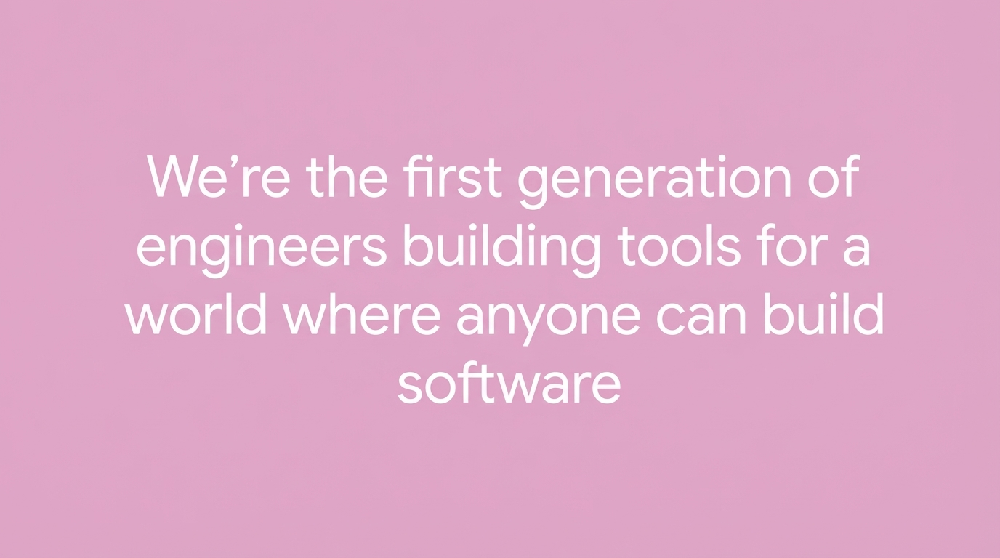

## 1:45pm - 2:04pm | Building in the Gemini Era with Google DeepMind

**Speakers:** Kat Kampf & Ammaar Reshi (both Google)

**Speaker Profiles:** [Kat Kampf](../speakers/kat-kampf.md) | [Ammaar Reshi](../speakers/ammaar-reshi.md)

**Bio:** Kat Kampf - Product Manager, Google; Ammaar Reshi - Product & Design Lead, Google

**Topic:** (tba on talk content)

### Notes

- exciting week for deepmind
- innovating for many years
- gemini 3 pro
- build anything
	- ui and sensibility
	- agentic tool calling
- nanonanana
	- has search
	- can ask it and it will give e.g. cooking instructions
	- e.g. change the focus
	- and big stuff
- ai.studio/build
	- build experience
	- free to use
	- bunch of ai trips
	- webcam on tennis spring
	- shared application -- build and sharing
	- **use google search grounding**
- giving you ideas during the load screen about new ideas
	- like the proactive stuff that jules was talking about yesterday
- vibe coding a comix book
	- vibe coding and winging the presentation
	- very fun way of building the story, gemini 3
	- includes a choose your own adventure
- design sensibilities
	- no more purple gradients
	- shader animations
	- no cyberpunk shit
	- "no more groking their way around figma"
- sticker model
	- add an api key
	- add different words for laptop stickers
- using aistudio to build aistudio
	- it has an export to antigravity
- Making video games
	- have a bot now
	- make a start screen
	- all these are front end react app
- full backend support and runtime support
	- we dont want you to think about those details
- live demo of a one shot networking game
	- too many people in the room but it looked like it was working
- first gen where anyone can build software

## Slides

### Slide: 13-48

**Key Point:** Gemini 1.5 Pro achieves the highest benchmark performance (74.2%) across diverse tasks while being competitively priced, demonstrating superior capabilities in reasoning, coding, mathematics, and multimodal tasks compared to other leading models.

**Literal Content:**
- Comprehensive benchmark comparison table showing Gemini 1.5 Pro vs Sonnet 3.5, Claude 3.5, and GPT-4o mini
- 20 different benchmarks listed including: Humanity's Last Exam, ARC-AGI, GPQA Diamond, JME 2025, MATHSS00, COMMMLU-Pro, and more
- Bar chart showing cost comparison: Gemini 1.5 Pro (74.2%, $320), Sonnet 3.5 (70.6%, $279), Opus 4 (66.4%, $160), GPT-4 (65.0%, $140), GPT-4 mini (59.8%, $16)
- Footer references methodology at deepmind.google/models/evals-methodology/gemini-1.5-pro

### Slide: 13-49

**Key Point:** Demonstrates Gemini's ability to generate culturally specific, detailed instructional content with visual elements - showcasing multimodal generation capabilities that combine text, images, and structured information presentation.

**Literal Content:**
- Title: "World knowledge - HOW TO MAKE ELAICHI CHAI (CARDAMOM TEA)"
- Decorative floral border design with pink/red flowers
- Ingredients shown with icons: Water, Milk, Tea Luxury Powder, Green Cardamom, Sugar (Optional), Ginger
- 5-step process with illustrated diagrams:
  1. Prepare Cardamom & Water (Crush 2-3 cardamom pods, bring 1 cup water to boil)
  2. Add Tea & Spices (Add 1-2 tsp tea leaves, crushed cardamom, optional ginger, simmer 2-3 minutes)
  3. Pour Milk & Sugar (Pour 1 cup milk, add sugar to taste, bring to boil again)
  4. Simmer & Steep (Lower heat, simmer another 2-3 minutes for flavor development)
  5. Strain & Serve (Strain hot chai into cups, enjoy!)
- Tips section

### Slide: 13-53

**Key Point:** Gemini provides a comprehensive development platform with AI-powered features including app generation from natural language, image generation, intelligence integration, and app idea discovery - positioning it as an end-to-end solution for AI-powered application development.

**Literal Content:**
- Title: "Build your ideas with Gemini"
- Top section shows prompt interface with model selector showing "Gemini 3 Pro Preview" with "Build →" button
- Middle section: "Supercharge your apps with AI"
- Four feature cards in carousel:
  - Google Maps data integration
  - Generate images from Gemini
  - Connect intelligence in your app
  - AI personal status features
- Bottom section: "Discover and remix app ideas" with app preview cards

### Slide: 13-58

**Key Point:** Showcases Gemini's ability to generate personalized, themed creative content based on user interests and personas - demonstrating practical application of AI for customization and design tasks that appeal to individual preferences.

**Literal Content:**
- Title: "Design Your Vibe."
- Subtitle: "Create a unique laptop sticker pack. Generate infinite sticker aesthetic, instantly! Describe your interests or search for a persona."
- Two input fields:
  - "What are you into? (e.g., coding, retro gaming)"
  - "Who is this for? (e.g., Emma, a web developer)"
- Two example outputs with photos of laptops:
  - MacBook with corgi/dog stickers and coding-themed stickers - labeled "Generate an animal pack"
  - MacBook covered with developer-themed stickers - labeled "Generate Cover"

### Slide: 14-02

**Key Point:** Demonstrates Gemini's ability to generate and modify game code interactively, showing live code editing for game mechanics (acceleration/deceleration) and the resulting visual output - illustrating practical code generation for complex interactive applications despite encountering some errors.

**Literal Content:**
- Browser window showing Google AI Studio interface
- Left panel shows TypeScript code with game mechanics variables:
  - `const ACCELERATION = 0.000;`
  - `const DECELERATION = 0.150;`
- "Checkpoint" and "View diff"/"Restore" buttons visible
- Error message showing internal error
- "Retry" button
- Right panel shows "Vice City Racer" game with retro synthwave aesthetic
- Game shows "VICE CITY SYNTH RACING" title, position "1 / 11", "Online Players: 13"
- Multiplayer status and 3D racing track with geometric shapes, neon colors

### Slide: 14-03

**Key Point:** A bold, aspirational statement positioning the current era as a fundamental shift in software development - where AI tools are democratizing programming and enabling non-engineers to build software, representing a paradigm shift in who can create technology.

**Literal Content:**
- Pink background with white text
- Single sentence centered on slide: "We're the first generation of engineers building tools for a world where anyone can build software"
