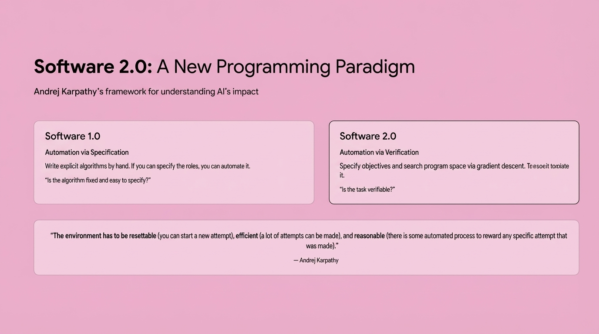
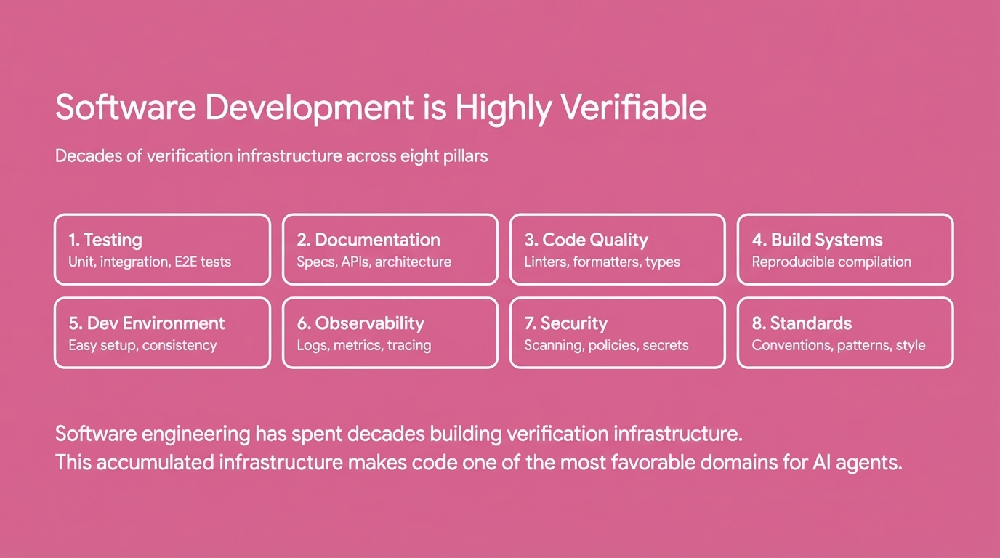

## 2:05pm - 2:24pm | Making Codebases "Agent-Ready"

**Speaker:** Eno Reyes, CTO, Factory AI

**Speaker Profile:** [Full Speaker Profile](../speakers/eno-reyes.md)

**Bio:** CTO, Factory AI

**Topic:** Eight categories that determine if a codebase is agent-ready, and framework for making agents more productive

### Notes

* 8 categories to make your code base Agent Ready
* environment reset -- ability to verify things?
	* was it possible is specify the specific a verification boundary
	* many tasks are much easier to verify than to solve
	* scalable
	* ability to solve is proportionally to how verifiable it is for the ai to soft
* software dev is highly variable
* (insert slide)
* test
* from verification to specification
* what is rigorous validation
* specifying the constraints by which you want to be validated
* SLDC
	* last task decomp
	* code review
	* in response
	* task parallelization
	* QA & Test generation
	* Documentation Automation
* key takeaways
	* verifiability is the key
	* software developer is highly verifiable
	* most codebases lack
	* specification enable
	* factory provides the build the verify the system
	* results are measurables through object metrics
* ask
	* "a slop test is better than no test"
	* the agents can help set things up
	* the more opinionated you get the faster the cycle continues
* OpEx is the input to engineering
* Invest in the environment feedback loop
* "one opinionated engineer can change the velocity of the entire business"
* "limit is your organization validation criteria"

## Slides

### Slide: 14-05

**Key Point:** Introduces Factory's main thesis - the challenge isn't just building AI agents that can code, but rather preparing and structuring codebases to be "agent ready" so autonomous systems can effectively work with them. This reframes the AI engineering problem from agent capability to codebase compatibility.

**Literal Content:**
- Factory logo (asterisk/flower symbol) with "FACTORY" text
- Title: "Building Autonomous Engineering Systems"
- Subtitle: "or, how do we make codebases that are agent ready?"
- Pink background consistent with Factory branding

### Slide: 14-06

**Key Point:** Explains the fundamental paradigm shift from Software 1.0 (writing explicit algorithms) to Software 2.0 (defining objectives and letting AI find solutions through verification). The key question changes from "can we specify the rules?" to "can we verify the output?"

**Literal Content:**
- Title: "Software 2.0: A New Programming Paradigm"
- Subtitle: "Andrej Karpathy's framework for understanding AI's impact"
- Two comparison boxes:

  **Software 1.0**
  - Automation via Specification
  - Write explicit algorithms by hand. If you can specify the rules, you can automate it.
  - "Is the algorithm fixed and easy to specify?"

  **Software 2.0**
  - Automation via Verification
  - Specify objectives and search program space via gradient descent.
  - "Is the task verifiable?"

- Bottom quote: "The environment has to be resettable, efficient, and reasonable"
- Attribution: "— Andrej Karpathy"

### Slide: 14-07

**Key Point:** Explains why some domains are more amenable to AI automation than others - tasks that are "easy to verify" (like code with tests) are ideal for AI, while creative/subjective tasks remain challenging. Code is particularly well-suited because it has objective correctness, fast verification, and clear signals.

**Literal Content:**
- Title: "Asymmetry of Verification"
- Subtitle: "Jason Wei: Many tasks are far easier to verify than to solve"
- Three-stage diagram with arrows:
  - **Easy to Verify** (green box): Sudoku, Math, Code Tests
  - **Symmetric** (pink box): Arithmetic, Data Processing
  - **Hard to Verify** (red box): Essays, Hypotheses, Creative

- **Five Properties of Verifiable Tasks**:
  1. **Objective Truth** - Clear correctness
  2. **Fast to Verify** - Seconds not hours
  3. **Scalable** - Parallel verification
  4. **Low Noise** - Strong signal
  5. **Continuous Reward** - How quality

- Bottom quote: "The ease of training AI to solve a task is proportional to how verifiable the task is."
- Attribution: "— Jason Wei"

### Slide: 14-09

**Key Point:** Software development has uniquely strong verification infrastructure built over decades (testing, documentation, linters, build systems, etc.), making it exceptionally well-suited for AI agents compared to other domains.

**Literal Content:**
- Title: "Software Development is Highly Verifiable"
- Subtitle: "Decades of verification infrastructure across eight pillars"
- Eight rounded rectangular boxes arranged in 2 rows:

  **Row 1:**
  1. **Testing** - Unit, integration, E2E tests
  2. **Documentation** - Specs, APIs, architecture
  3. **Code Quality** - Linters, formatters, types
  4. **Build Systems** - Reproducible compilation

  **Row 2:**
  5. **Dev Environment** - Easy setup, consistency
  6. **Observability** - Logs, metrics, tracing
  7. **Security** - Scanning, policies, secrets
  8. **Standards** - Conventions, patterns, style

- Bottom text: "Software engineering has spent decades building verification infrastructure. This accumulated infrastructure makes code one of the most favorable domains for AI agents."

### Slide: 14-10

**Key Point:** AI agents require complete, robust development infrastructure to function effectively, unlike human developers who can work around gaps in testing, documentation, and tooling. The slide emphasizes the eight pillars of verifiable software development that are critical for autonomous AI systems.

**Literal Content:**
- Title: "The Problem: Most Codebases Lack Sufficient Verifiability"
- Subtitle: "Humans work around incomplete infrastructure. AI agents cannot."
- Two-column comparison:
  - Left (pink box): "What Humans Can Handle" - lists 8 items including 80% test coverage, outdated docs, no linters/formatters, flaky builds, complex setup, missing observability, no security scanning, inconsistent patterns
  - Right (white box with red text): "What Breaks AI Agents" - corresponding problems with X marks: no tests, no docs, no quality checks, unreliable builds, complex setup, no observability, no security checks, no standards
- Bottom note: "Most organizations have partial infrastructure across the eight pillars. AI agents need systematic coverage to succeed."

### Slide: 14-12

**Key Point:** Strong verification infrastructure enables autonomous SDLC workflows. When you have proper tests, specs, and validation in place, AI agents can reliably handle complex development tasks like code review, test generation, and incident response.

**Literal Content:**
- Title: "Autonomous SDLC Processes"
- Subtitle: "What becomes possible with strong verification"
- Six process boxes arranged in 2x3 grid:
  1. **Large Task Decomposition**: Migration projects with verifiable steps
  2. **Task Parallelization**: Verification enables parallel execution
  3. **Code Review**: Automated, context-aware reviews for every PR
  4. **QA & Test Generation**: Generate test scenarios and validate edge cases
  5. **Incident Response**: Analyzes errors, proposes fixes, validates solutions
  6. **Documentation Automation**: Keep docs in sync, generate API specs
- Bottom note: "Each process leverages your verification infrastructure. The better your specs, tests, and validation, the more reliably these processes run."

### Slide: 14-14

**Key Point:** Organizations should take a systematic approach to building AI-ready codebases by first assessing their verification infrastructure, then improving it, deploying AI agents that use those specifications, and continuously iterating. This creates a virtuous cycle between better infrastructure and more capable AI agents.

**Literal Content:**
- Title: "The Path Forward"
- Subtitle: "From specifications to fully autonomous systems"
- Four numbered steps with icons:
  1. **Assess** (network icon): Measure your verification infrastructure across all 8 pillars
  2. **Improve** (compass icon): Systematically enhance verifiability through automated fixes
  3. **Deploy** (rocket icon): Roll out AI agents that leverage your specifications
  4. **Iterate** (refresh icon): Continuous feedback loop improves both specs and agents
- Bottom section: "Key Takeaways"
  - Verifiability is key to AI agent effectiveness
  - Software development is highly verifiable when infrastructure exists
  - Most codebases lack sufficient verification infrastructure
  - Specifications enable modular, reliable AI systems
  - Factory provides the platform to build verifiable systems
  - Results are measurable through objective metrics

### Slide: 14-20

**Key Point:** This is the title slide introducing Amp as an opinionated coding agent, setting up a presentation at the AI Engineering NYC conference in November 2025.

**Literal Content:**
- Company logo: "amp" in pink
- Title: "Amp: An Opinionated Frontier Coding Agent"
- Footer: "AIE NYC NOVEMBER 2025"
- Minimalist design with large serif typography

### Slide: 14-23

**Key Point:** This slide presents the key architectural and philosophical questions/decisions that Amp made in building their coding agent. These represent fundamental trade-offs in AI agent design.

**Literal Content:**
- Title: "An Opinionated Take"
- Dark gradient background (red to black)
- Eight numbered questions in white text:
  1. MCP or Custom Tools?
  2. Models vs. Agents
  3. To Reason or Not To Reason?
  4. GUI vs. TUI?
  5. Smart or Fast?
  6. Is Coding Still a Craft?
  7. Smart or Cheap?
  8. AGI or...?
