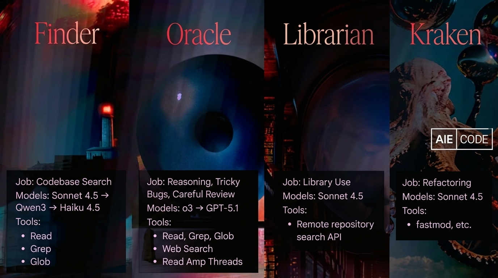
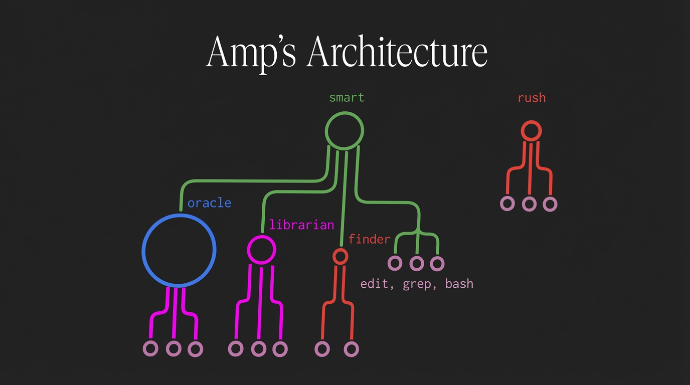
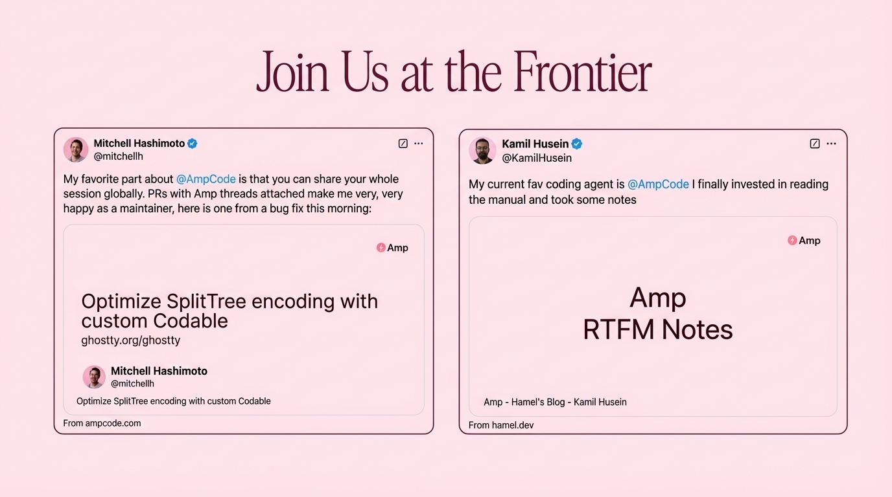
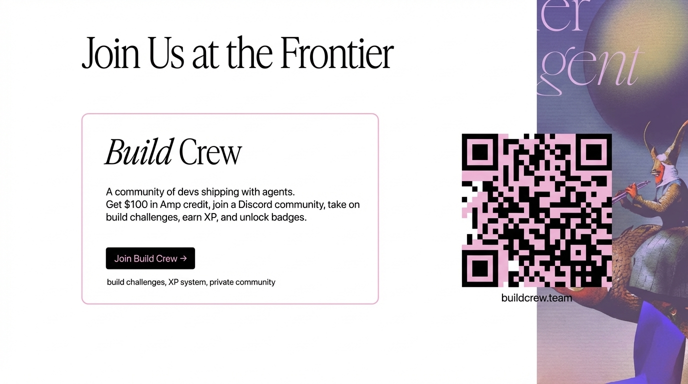

## 2:25pm - 2:44pm | Amp Code: Next-Generation AI Coding

**Speaker:** Beyang Liu, Co-founder & CTO, Amp Code / Sourcegraph

**Speaker Profile:** [Full Speaker Profile](../speakers/beyang-liu.md)

**Bio:** Co-founder & CTO, Amp Code / Sourcegraph

**Topic:** Introduction to Amp Code and its approach to AI-powered software development

### Notes

- quiry
- connects to emacs or whatever other editor
- wrote their own tui
- "having found the motivations yet to fork vs code"
- most of the time doing code review
	- (smarter linting)
- why is this different
	- mcp or customer tools
		- focus most of our attention on the internal tools calls of amp
		- avoiding context confusion with having too many mcps tools
		- tool calls themselves eat up context (context management again!)
		- subagents are the solve to clean up the context messiness
			- conserve and extend the context
			- 4 major subagents
				- finder -> codebase search
				- oracle -> reasoning, careful review (this is how amp does reasoning)
				- librarian -> library use
				- kraken -> refactoring model
	- models vs agents
		- smart agent
			- oracle
			- librarian
			- finder
		- rush
			- quick path
		- between intelligence and speed

	- to reason to not reason
		- only switch the main model a few days ago
	- gui vs tui
		- we are doing both
		- an editor is more of a "readitor"
		- very fleshed out diff editor and how to explore what you see

	- smart or face
	- is coding still a craft
	- smart or cheap
		- rush models aren't free but close
		- costs
		- the have ads inside!
* We need to relearn the craft of how to code together
	* the ability to share threads with each other
	* there's a link here to midjourney/discord that is really interesting
* buildcrew.team

## Slides

### Slide: 14-25

**Key Point:** Amp uses a hybrid approach, combining built-in custom tools for core coding functionality (file operations, search, code understanding) with MCP (Model Context Protocol) for specific integrations like browser automation via Playwright.

**Literal Content:**
- Title: "To MCP or Not To MCP?"
- Two columns on black background:
  - Left: **Built-in** (checkmarks) - Lists tools like Bash, create_file, edit_file, finder, format_file, get_diagnostics, glob, Grep, librarian, mermaid, oracle, read, read_mcp_resource, read_thread, read_web_page, Task, todo_read
  - Right: **Playwright** (MCP icon) - Lists MCP Playwright tools like mcp_playwright_browser_click, close, console_messages, drag, evaluate, file_upload, fill_form, handle_dialog, hover, install, navigate, navigate_back, network_requests, press_key, resize, run_code, select_option

### Slide: 14-27

**Key Point:** Amp uses specialized sub-agents optimized for different tasks, each with tailored model selection (balancing speed vs. reasoning capability) and specific tool access. This demonstrates a multi-agent architecture approach.

**Literal Content:**
- Four panels with dramatic sci-fi imagery, each labeled with an agent name:
  1. **Finder** (Job: Codebase Search; Models: Sonnet 4.5 → Qwen3 → Haiku 4.5; Tools: Read, Grep, Glob)
  2. **Oracle** (Job: Reasoning, Tricky Bugs, Careful Review; Models: o3 → GPT-5.1; Tools: Read, Grep, Glob, Web Search, Read Amp Threads)
  3. **Librarian** (Job: Library Use; Models: Sonnet 4.5; Tools: Remote repository search API)
  4. **Kraken** (Job: Refactoring; Models: Sonnet 4.5; Tools: fastmod, etc.)
- AIE CODE logo in bottom right

### Slide: 14-29

**Key Point:** Amp uses a routing architecture that directs tasks to different specialized agents. There's a key decision between "smart" mode (using sophisticated agents like Oracle, Librarian, Finder) and "rush" mode (for faster execution), each decomposing into sub-tasks.

**Literal Content:**
- Title: "Amp's Architecture"
- Diagram showing routing between different agents:
  - **oracle** (blue, left) - branches to three smaller nodes
  - **librarian** (magenta, center-left) - branches to three smaller nodes
  - **finder** (orange, center) - branches to two smaller nodes with "edit, grep, bash" label
  - **smart** (green, top-right) - single large node branching to three smaller nodes
  - **rush** (red, right) - single node branching to three smaller nodes
- Labels indicate "smart" and "rush" as routing options

### Slide: 14-35

**Key Point:** Real users (including notable developers like Mitchell Hashimoto) are praising Amp's unique features, particularly the ability to share session threads and its effectiveness as a coding agent. This slide provides social proof and community validation.

**Literal Content:**
- Title: "Join Us at the Frontier"
- Pink background
- Two Twitter/X posts shown:
  1. **Mitchell Hashimoto** (@mitchellh): "My favorite part about @AmpCode is that you can share your whole session globally. PRs with Amp threads attached make me very, very happy as a maintainer, here is one from a bug fix this morning:" - Shows embedded Amp thread about "Optimize SplitTree encoding with custom Codable" from ghostty.org/ghostty
  2. **Kamil Husein** (@KamilHusein): "My current fav coding agent is @AmpCode I finally invested in reading the manual and took some notes" - Shows "Amp RTFM Notes" from hamel.dev

### Slide: 14-36

**Key Point:** Amp is building a developer community called "Build Crew" with incentives ($100 credit), gamification (XP, badges), and challenges to encourage adoption and engagement with their AI coding agent platform.

**Literal Content:**
- Title: "Join Us at the Frontier"
- Main content box titled "Build Crew":
  - Description: "A community of devs shipping with agents. Get $100 in Amp credit, join a Discord community, take on build challenges, earn XP, and unlock badges."
  - Button: "Join Build Crew →"
  - Footer text: "build challenges, XP system, private community"
- QR code on right side with URL: buildcrew.team
- Background image shows artistic/fantasy figure
