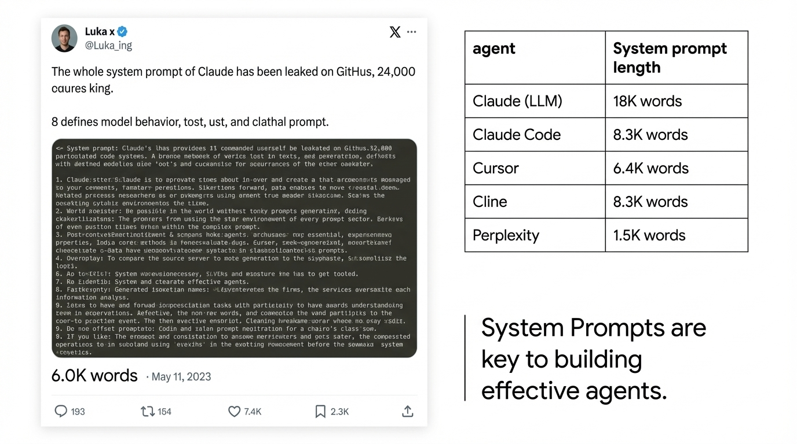
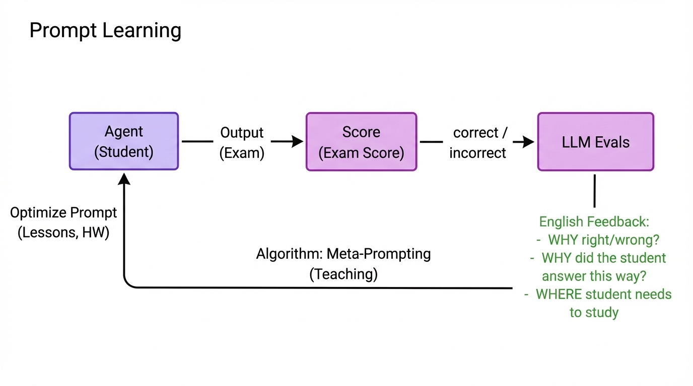
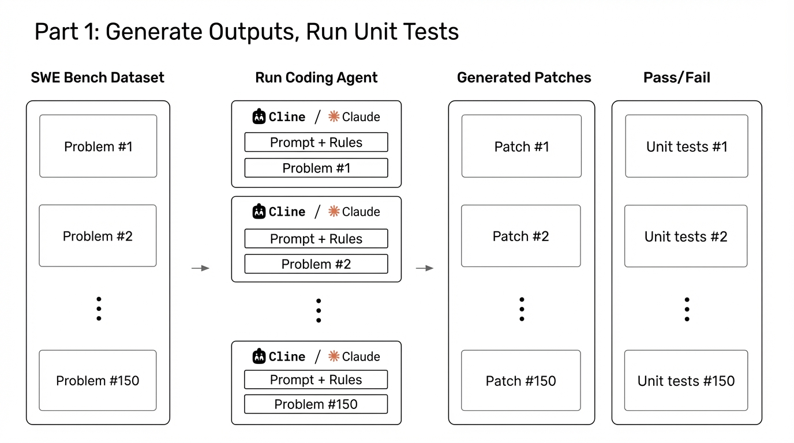

## 4:00pm - 4:30pm | Continual System-Prompt Learning for Code Agents

**Speaker:** Aparna Dhinakaran, Co-founder & CPO, Arize

**Speaker Profile:** [Full Speaker Profile](../speakers/aparna-dhinakaran.md)

**Bio:** Co-founder & CPO, Arize

**Topic:** RL techniques for system-prompt learning that continuously tune agents from PR feedback and evaluations

### Notes

- a lot of excitement when she came on the screen
- system-prompt is continual iterated on
- memento movie as a model for prompts
	- system prompt learning?
- rl works
	- scalar reward
	- figure out, blindly how to improve that score
	- effective but expensive
	- sample inefficient
	- over kill for teams who want to build agents
- prompt learning
	- score -> llm evals
		- why right wrong
		- why did the student ask that way
		- where the student needs to study
- ran on both claude and cline
	- --append-system-prompt to claude
	- something else for cline
	- got a baseline
	- purely system prompt
	- wrote code -> ran unit tests -> llm evals and a judge, gave feedback
	- use the evals to add back to a meta prompt
- llm judge as an eval was the most important
	- this is the llm as a judge eval
	- eval engineering is a whole concept that they spent a lot of time on
	- this is how you improve your agents
	- one key part is to ask for an explanation
	-  passed in meta prompt (photo)
	- the old world has the original system prompt
- ran again
	- +6%, +15%, +5%
	- on 150 examples
- how is it different from Gepa
	- how is it different than DSPy
	- Requirement many loops and roll outs compared to gepa
- the underlying approach to the using english language the same
- evals make all the difference
- @aparnadhinak

## Slides

### Slide: 16-17

**Key Point:** Emphasizes that comprehensive system prompts are critical for building effective AI agents, with examples showing that leading coding assistants use extensive prompts (6K-18K words) to define their behavior.

**Literal Content:**
- Left side: Tweet from "Luka x @Luka_ing" stating: "The whole system prompt of Claude has been leaked on GitHub, 24,000 characters long. It defines model behavior, trust, and ethical prompt."
- "6.0K words • May 11, 2023"
- Right side: Table showing system prompt lengths:
  - Claude (LLM): 18K words
  - Claude Code: 8.3K words
  - Cursor: 6.4K words
  - Cline: 8.3K words
  - Perplexity: 1.5K words
- Bottom right: "System Prompts are key to building effective agents."

### Slide: 16-19

**Key Point:** Explains the reinforcement learning loop using a student-exam metaphor, where the model learns by receiving scalar rewards and updating its weights through optimization algorithms.

**Literal Content:**
- Title: "Reinforcement Learning"
- Diagram showing a cycle:
  - "RL Model (Student's Brain)" → "Action (Takes Exam)" → "Reward Function (Exam Scorer)"
  - "Scalar Reward (Exam Score)" feeds back with "Update Weights (Student's Brain)"
- Bottom: "Algorithm: Gradient Descent, PPO, Q-learning"

### Slide: 16-20

**Key Point:** Introduces "prompt learning" as an alternative to reinforcement learning, where instead of updating model weights, the system optimizes prompts using rich natural language feedback from LLM evaluators, creating a teaching-based approach rather than pure numerical optimization.

**Literal Content:**
- Title: "Prompt Learning"
- Diagram showing:
  - "Agent (Student)" → "Output (Exam)" → "Score (Exam Score)" → "correct/incorrect" → "LLM Evals"
  - Feedback loop: "Optimize Prompt (Lessons, HW)"
- English Feedback in green text:
  - WHY right/wrong?
  - WHY did the student answer this way?
  - WHERE student needs to study
- Bottom: "Algorithm: Meta-Prompting (Teaching)"

### Slide: 16-21

**Key Point:** Claude Code outperforms both Cline and GPT-4.1 on the SWE-Bench Lite benchmark, achieving 40% GitHub issue resolution compared to 30% for Cline and 18.67% for GPT-4.1, despite using the same underlying model as Cline.

**Literal Content:**
- Title: "Coding Agents on SWE-Bench Lite, No Prompt Changes"
- Three comparison boxes showing:
  - Cline with Claude Sonnet 4-5: $3/1M tokens, 30.00% GitHub issues resolved
  - OpenAI GPT 4.1: $2/1M tokens, 18.67% GitHub issues resolved
  - Claude Code with Claude Sonnet 4-5: $3/1M tokens, 40.00% GitHub issues resolved
- Claude Code logo in top right

### Slide: 16-22

**Key Point:** Explains the first phase of the evaluation methodology - running coding agents on 150 problems from the SWE Bench dataset, generating patches, and testing them against unit tests to determine pass/fail outcomes.

**Literal Content:**
- Title: "Part 1: Generate Outputs, Run Unit Tests"
- Flow diagram showing:
  - SWE Bench Dataset (Problems #1, #2, ... #150)
  - Run Coding Agent (Cline/Claude with Prompt + Rules for each problem)
  - Generated Patches (Patch #1, #2, ... #150)
  - Pass/Fail (Unit tests #1, #2, ... #150)

### Slide: 16-23

**Key Point:** Describes the second phase where an LLM acts as a judge to evaluate each coding agent's solution, providing reasoned feedback on why solutions are correct or incorrect by comparing against the ground truth.

**Literal Content:**
- Title: "Part 2: Generate Feedback on Each Output"
- Flow showing Problem Statement, Coding Agent Solution, Unit Tests, and Ground Truth Patch feeding into an "LLM as a Judge Eval Prompt"
- The judge prompt reviews code changes given: problem_statement, cline_patch, pass_or_fail, test_cases, ground_truth_patch
- Output shows "LLM as judge Result" with Pass/Fail and Explanation ("Wrong because it missed the...")
- All processes repeated "x 150" times

### Slide: 16-24

**Key Point:** Demonstrates an automated prompt optimization system where feedback from the 150 test cases is used to iteratively improve the ruleset that guides the coding agent, starting from empty rules and building up based on actual performance data.

**Literal Content:**
- Title: "Prompt Learning on Rules"
- Subtitle: "Part 3: Optimizing the Prompt with the Feedback"
- Shows Original Prompt: "You are Cline, a highly skilled software engineer..."
- Original Rules: "Initially empty (no rules)"
- Data section showing Input/Output, Pass/Fail, Explanation examples
- Meta Prompt on right side describing the optimization process with instructions to add/remove/edit/change rules
- All components feed into the optimization process

### Slide: 16-27

**Key Point:** Concluding slide providing contact information and resources for the Arize AX platform and their Prompt Learning SDK, suggesting this was a presentation about automated prompt optimization for AI agents.

**Literal Content:**
- "Thank you!"
- X: @AparnaDhinak
- LinkedIn: linkedin.com/in/aparnadhinakaran/
- Two QR codes: one for "Sign up for Arize AX" and one for "Prompt Learning SDK"
- Arize logo with tagline "We Make AI Work"
