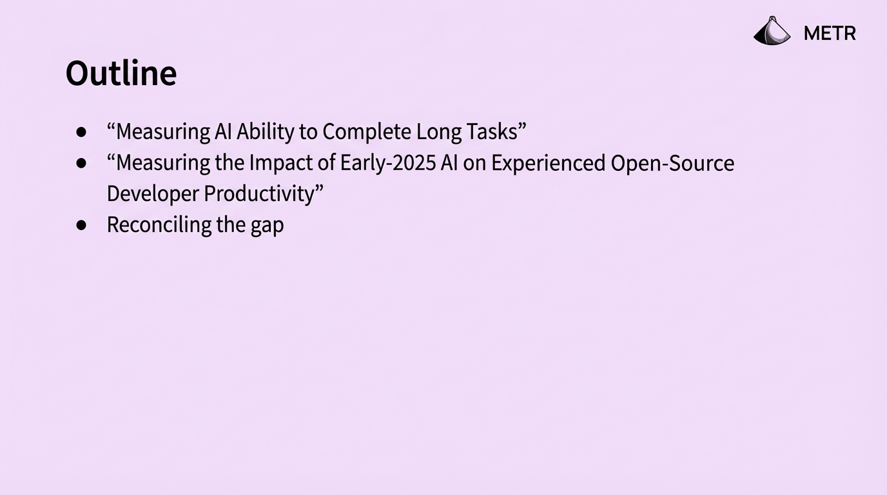
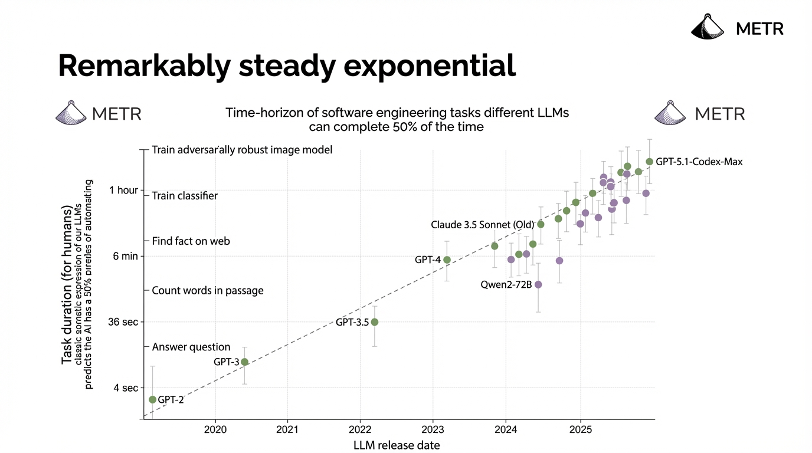

## 5:00pm - 5:19pm | Benchmarks vs economics: the AI capability measurement gap

**Speaker:** Joel Becker, Researcher, METR

**Speaker Profile:** [Full Speaker Profile](../speakers/joel-becker.md)

**Bio:** Researcher, METR

**Topic:** Reconciling lab and field evidence on AI capabilities and what this means for automated AI R&D

## Slides

### Slide: 16-42

**Key Point:** Introduction slide outlining a talk about measuring AI capabilities for long-horizon tasks and AI's impact on developer productivity, suggesting research into understanding the gap between theoretical AI capabilities and practical developer outcomes.

**Literal Content:**
- Title: "Outline"
- METR logo in top right
- Three bullet points:
  - "Measuring AI Ability to Complete Long Tasks"
  - "Measuring the Impact of Early-2025 AI on Experienced Open-Source Developer Productivity"
  - "Reconciling the gap"

### Slide: 16-48

**Key Point:** Demonstrates that AI model capabilities for completing software engineering tasks have grown exponentially and consistently over time, with task completion time-horizons increasing from seconds (GPT-2) to over an hour (latest models) following a remarkably steady exponential trend.

**Literal Content:**
- Title: "Remarkably steady exponential"
- METR logos
- Subtitle: "Time-horizon of software engineering tasks different LLMs can complete 50% of the time"
- Graph showing task duration vs LLM release date from 2020-2025
- Y-axis (logarithmic): from 4 sec to 1 hour, with examples like "Answer question", "Count words in passage", "Find fact on web", "Train classifier", "Train adversarially robust image model"
- Shows progression: GPT-2, GPT-3, GPT-3.5, GPT-4, Claude 3.5 Sonnet (Old), Qwen2-72B, GPT-5.1-Codex-Max
- Dotted trend line showing exponential growth
