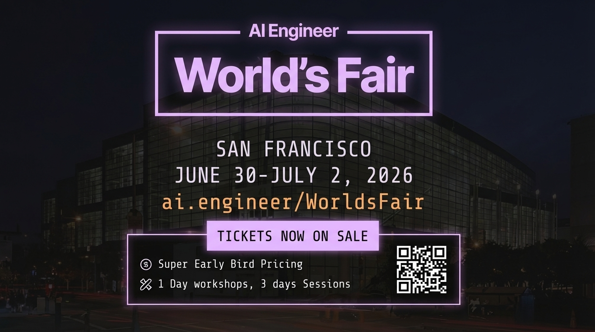

## 5:20pm - 5:39pm | Defying Gravity

**Speaker:** Kevin Hou, Engineering, Google DeepMind

**Speaker Profile:** [Full Speaker Profile](../speakers/kevin-hou.md)

**Bio:** Engineering, Google DeepMind

**Topic:** Building Google Antigravity and discussing the future of agentic IDEs with Gemini 3

### Notes

- last one of the day
- give me an energy boost
- unapologetically agent-first
- what is it
	- editor
	- browser
	- agent manager
- agents are now living outside your ide, manage different surfaces
- agent manage is a high level view
	- only on agent manager window
- "yes we forked vs code"
- agent controlled browser
	- chrome browser
	- context retrieval
	- give it access to your google docs
	- it lets the agent take control of your browser
	- it showed the recording of the browser doing it
- the editor and the browsers are tools for the agent manager
	- it has an inbox
	- lets you manage many agents at once
	- this is for the agents talking to you
- brand new product paradigm
	- ran out of capacity
	- "on behalf of the team I want to apologize for our global chip shortage"
- why did we build the product?
	- gemini got good a lot of things
	- product is only as good as the models that powered it
	- intelligence and reasoning
	- advanced tool use
	- better at instruction following
	- longer running tasks
	- multi-modal
- "AGY's approach to AGI"
	- raising the capability
	- there much more that happens beyond the code
	- look up the beginnings guide on the browser
- can we use it to come up with verification/specification
- multi-modal experience
	- you can comment on the design
	- interface with the agent in image space
- age of artifacts
	- the editor can be the space
	- a new interaction pattern
	- what is an artifact
		- a dynamic representation that the agent generates
		- and representation for you and your usecase
		- it can be used for self-reflection or communicate to the user
		- and can be used across accounts
	- this should replace the idea of follow what's going on with the thinking is around the agents
	- model decides if it needs an artifact
	- what type of artifact
	- why it is needed
	- who needs to see it
	- comments on artifacts
	- highlight to select on different modality
	- build to optimize the UI of artifacts
	- can go back to the editor but mainly we are interacting with the artifact
- does it have recommendations?
- what does it mean to be in deep research
- "antigravity will be the most advanced product on the market because we are building it for ourselves"
- tightly together with the gemini team
	- identify gaps on both sides
	- agent first experience

## Slides

### Slide: 17-13

**Key Point:** Introduction to Google's image generation capabilities (Nano Banana Pro) and how it enables multi-modal development tools for both generating visual assets and understanding visual content.

**Literal Content:**
- Google Antigravity logo in top left
- Title: "Raise the Ceiling: Images"
- Embedded YouTube video preview showing "Nano Banana Pro" with Google Antigravity branding
- Bullet points listing:
  - Bring multi-modality to dev tools
  - Generate:
    - UI mockups
    - Logo & assets
  - Understanding:
    - Videos & screenshots

### Slide: 17-17

**Key Point:** Demonstrates an agent-driven artifact generation system where the AI model autonomously decides when to create artifacts, what they contain, why they're needed, and who should see them, following a structured workflow from planning through execution to memory retention.

**Literal Content:**
- Google Antigravity logo in top left
- Heading: "The model decides:"
  - **If** it should generate an artifact
  - **What** that artifact should contain
  - **Why** it is needed
  - **Who** needs to see it (subagent, other agents, notify user, etc.)
- Bottom section shows a workflow diagram with 5 stages:
  - Plan & Research (showing document screenshots)
  - Feedback (showing implementation plan)
  - Execution (showing requirements)
  - Walkthrough (showing an image)
  - Memory (showing flowchart diagram)
- Blue arrows connecting each stage

### Slide: 17-26

**Key Point:** Summary slide highlighting three key aspects of the Antigravity platform: ambitious AI agents, an agent-first architecture with artifact management, and a research/product feedback loop that drives continuous improvement.

**Literal Content:**
- Google Antigravity logo in top left
- Left side heading: "It's WICKED How Antigravity Defies Gravity" (with stylized "WICKED" text)
- Right side numbered list:
  1. AI Agent with High Ambition
  2. Agent-First: Artifacts + Manager
  3. Research / Product Flywheel

### Slide: 17-30

**Key Point:** Showcases the massive growth and success of AI Engineer events, demonstrating increasing scale in applicants, attendees, and reach across both in-person and remote audiences.

**Literal Content:**
- Heading: "Past Event Stats"
- Subtitle: "All events sold out (attendance + expo sponsorships)"
- Timeline showing 4 events:
  - **October 8-10, 2023** (San Francisco) - AI Engineer Summit: 5,000+ Applicants, 525 Curated Attendees, 29k+ Remote Livestream Attendees, 399k+ YouTube Views
  - **June 23-25, 2024** (San Francisco) - World's Fair: 150+ Speakers, 2,000+ Attendees, 50k+ Remote Livestream Attendees, 800k+ YouTube Views
  - **February 19-21, 2025** (New York) - AI Engineer Summit: 5,000+ Applicants, 800 Curated Attendees, 150k+ Remote Livestream Attendees, 1.5mm YouTube Views
  - **June 3-5, 2025** (San Francisco) - World's Fair: 200+ Speakers, 3,300+ Attendees, 150k+ Remote Livestream Attendees, 4.5mm YouTube Views

### Slide: 17-33

**Key Point:** Advertisement for the upcoming AI Engineer World's Fair in San Francisco (June 30-July 2, 2026), promoting super early bird ticket sales with a 4-day event format.

**Literal Content:**
- Header: "AI Engineer World's Fair"
- Location: "SAN FRANCISCO"
- Date: "JUNE 30-JULY 2, 2026"
- URL: "ai.engineer/WorldsFair"
- "TICKETS NOW ON SALE" (in pink/purple box)
- Details:
  - Super Early Bird Pricing
  - 1 Day workshops, 3 days Sessions
- QR code for ticket purchase
- Background image of San Francisco cityscape at night

### Slide: 17-34

**Key Point:** Advertisement for the first AI Engineer Europe event in London (April 8-10, 2026), promoting super early bird ticket sales with a 3-day event format, expanding the AI Engineer conference series internationally.

**Literal Content:**
- Header: "AI Engineer EUROPE"
- Location: "LONDON"
- Date: "APRIL 8-10, 2026"
- URL: "ai.engineer/Europe"
- "TICKETS NOW ON SALE" (in pink/purple box)
- Details:
  - Super Early Bird Pricing
  - 1 Day workshops, 2 days Sessions
- QR code for ticket purchase
- Background image of London skyline featuring Big Ben at dusk/evening
