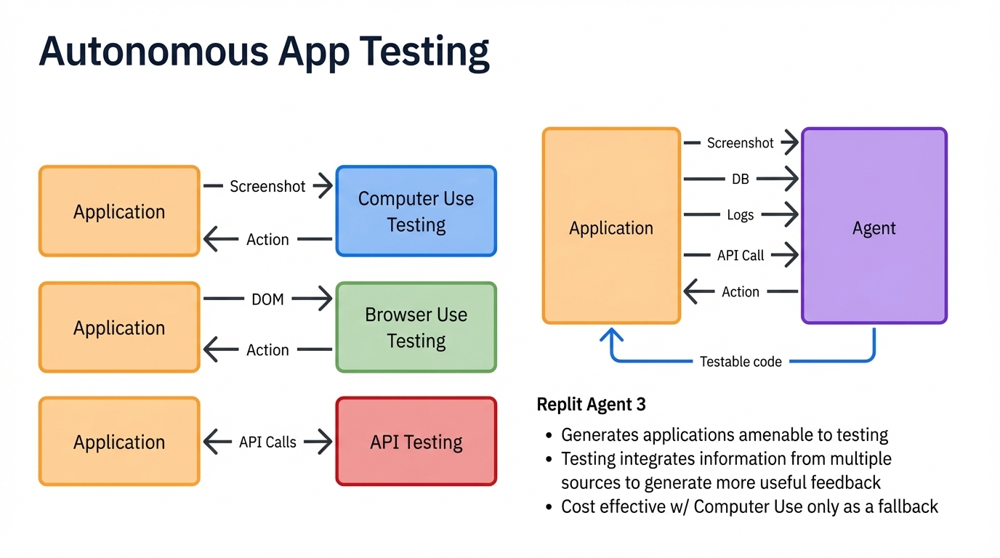

# 2025-11-20-09-33

## Talk
Michele Catasta (Replit) - AI Agent Testing

## Session
[Michele Catasta - Replit](../2025-11-20/11-20-09-25-michele-catasta-replit.md)

## Literal Content
- Title: "Autonomous App Testing"
- Three testing approaches shown:
  1. Computer Use Testing (Application ↔ Screenshot/Action ↔ Testing)
  2. Browser Use Testing (Application ↔ DOM/Action ↔ Testing)
  3. API Testing (Application ↔ API Calls ↔ Testing)
- Right side shows comprehensive approach with Application connected to Agent via Screenshot, DB, Logs, API Call, Action, and Testable code
- "Replit Agent 3" features:
  - Generates applications amenable to testing
  - Testing integrates information from multiple sources to generate more useful feedback
  - Cost effective w/ Computer Use only as a fallback

## Key Point
Introduces Replit Agent 3's multi-modal testing approach that combines various testing methods (API, browser, computer use) with multiple data sources for comprehensive and cost-effective autonomous application testing.
