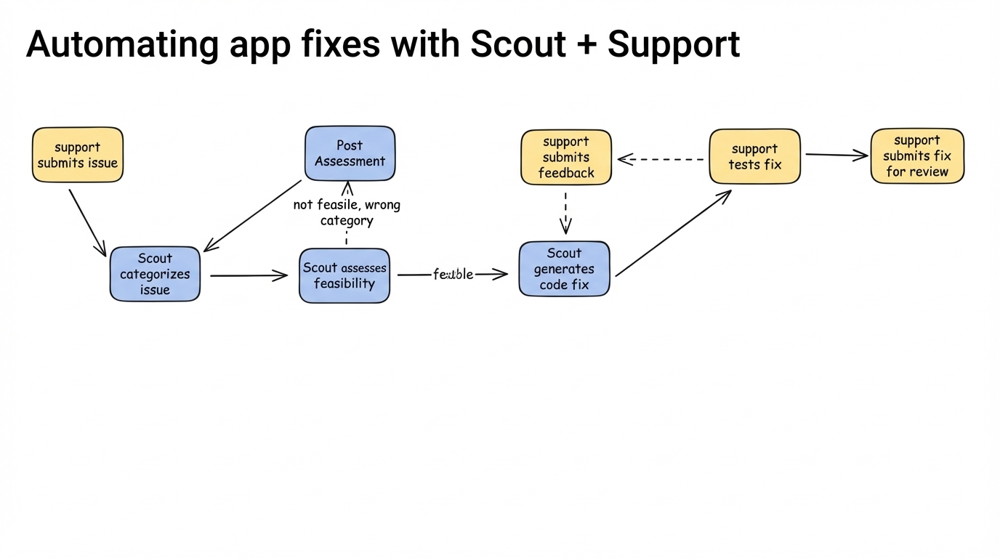

# 2025-11-20-09-55

## Talk
Lisa Orr (Zapier) - Automating Fixes with Scout + Support

## Session
[Lisa Orr - Zapier](../2025-11-20/11-20-09-45-lisa-orr-zapier.md)

## Literal Content
- Title: "Automating app fixes with Scout + Support"
- Flowchart showing two paths:
  - Left path (support submits issue): Scout categorizes issue → Post Assessment (if not feasible/wrong category) → Scout assesses feasibility → (if feasible) → Scout generates code fix
  - Right path: support submits feedback → support tests fix → support submits fix for review

## Key Point
Demonstrates an automated workflow where a "Scout" system categorizes support issues, assesses feasibility, generates code fixes, and integrates with human support for testing and review, creating a semi-automated bug fixing pipeline.
