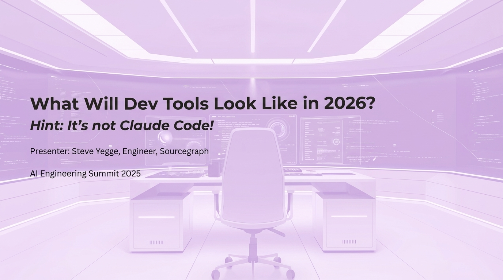

# 2025-11-20-10-01

## Talk
Steve Yegge & Gene Kim - What Will Dev Tools Look Like in 2026?

## Session
[Steve Yegge & Gene Kim](../2025-11-20/11-20-10-05-steve-yegge-gene-kim.md)

## Literal Content
- Purple/lavender background
- Title: "What Will Dev Tools Look Like in 2026?"
- Subtitle: "Hint: It's not Claude Code!"
- Presenter: Steve Yegge, Engineer, Sourcegraph
- AI Engineering Summit 2025
- Background shows futuristic workspace with chair, monitors, and code displays

## Key Point
This is a provocative talk title suggesting that current AI coding tools like Claude Code won't be the final form of development tools, inviting speculation about the near-future evolution of AI-powered development environments.
