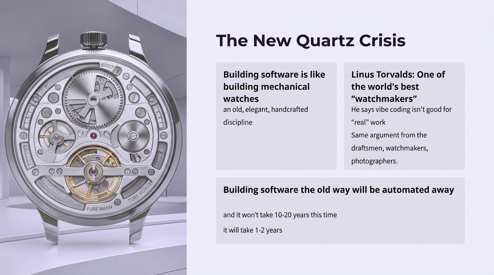

# 2025-11-20-10-04

## Talk
Steve Yegge & Gene Kim - What Will Dev Tools Look Like in 2026?

## Session
[Steve Yegge & Gene Kim](../2025-11-20/11-20-10-05-steve-yegge-gene-kim.md)

## Literal Content
- Title: "The New Quartz Crisis"
- Image of mechanical watch showing intricate gears and mechanisms
- Three text blocks:
  1. "Building software is like building mechanical watches: an old, elegant, handcrafted discipline"
  2. "Linus Torvalds: One of the world's best 'watchmakers' - He says vibe coding isn't good for 'real' work - Same argument from the draftsmen, watchmakers, photographers."
  3. "Building software the old way will be automated away - and it won't take 10-20 years this time - it will take 1-2 years"

## Key Point
Uses the historical "Quartz Crisis" (when quartz watches disrupted mechanical watchmaking) as an analogy for how AI will rapidly automate traditional software development, dismissing resistance from veteran developers like Linus Torvalds as similar to past craftspeople resisting technological change.
