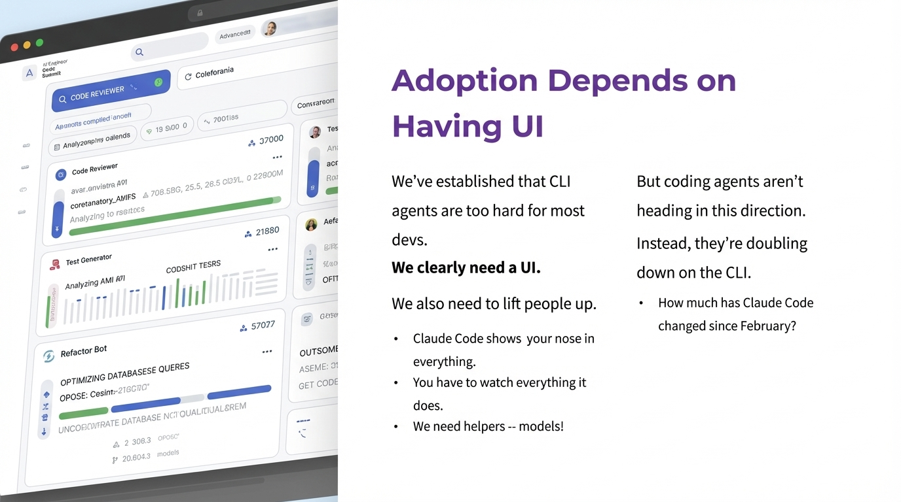

# 2025-11-20-10-05

## Talk
Steve Yegge & Gene Kim - What Will Dev Tools Look Like in 2026?

## Session
[Steve Yegge & Gene Kim](../2025-11-20/11-20-10-05-steve-yegge-gene-kim.md)

## Literal Content
- Title: "Adoption Depends on Having UI"
- Left side: Screenshot of a UI dashboard showing "CODE REVIEWER" and various metrics/tasks
- Right side text:
  - "We've established that CLI agents are too hard for most devs."
  - "We clearly need a UI."
  - "We also need to lift people up."
  - Bullets about Claude Code:
    - "Claude Code shows your nose in everything."
    - "You have to watch everything it does."
    - "We need helpers -- models!"
  - "But coding agents aren't heading in this direction."
  - "Instead, they're doubling down on the CLI."
  - "How much has Claude Code changed since February?"

## Key Point
Argues that for widespread adoption, AI coding tools need user-friendly graphical interfaces rather than CLI-based approaches. Critiques tools like Claude Code for being too hands-on and not evolving toward more helpful, autonomous UI-based models that can work with less supervision.
