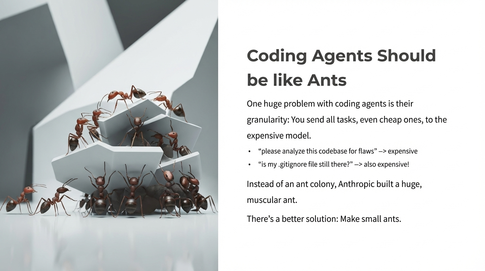

# 2025-11-20-10-06

## Talk
Steve Yegge & Gene Kim - What Will Dev Tools Look Like in 2026?

## Session
[Steve Yegge & Gene Kim](../2025-11-20/11-20-10-05-steve-yegge-gene-kim.md)

## Literal Content
- Title: "Coding Agents Should be like Ants"
- Image of ants working together carrying geometric shapes
- Bullet points explaining the problem:
  - "One huge problem with coding agents is their granularity: You send all tasks, even cheap ones, to the expensive model."
  - Examples: "please analyze this codebase for flaws" → expensive
  - "is my .gitignore file still there?" → also expensive!
  - "Instead of an ant colony, Anthropic built a huge, muscular ant."
  - "There's a better solution: Make small ants."

## Key Point
Coding agents should follow an ant colony model with many specialized small agents handling different complexity tasks, rather than using one large expensive model for all tasks regardless of complexity. This advocates for task decomposition and routing to appropriately-sized models.
