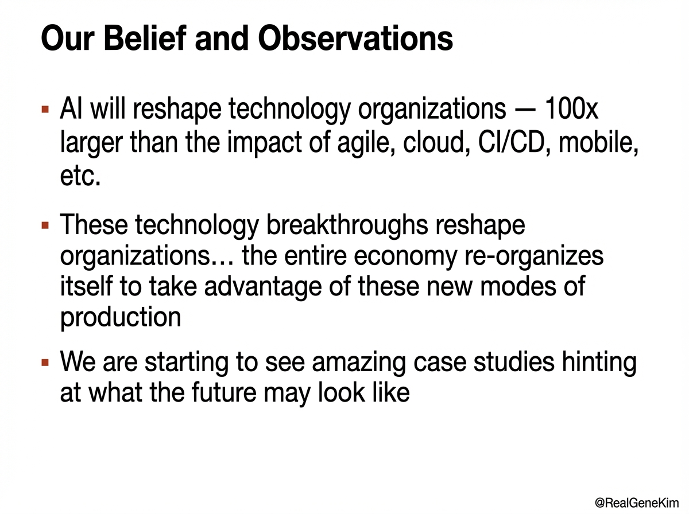

# 2025-11-20-10-10

## Talk
Steve Yegge & Gene Kim - What Will Dev Tools Look Like in 2026?

## Session
[Steve Yegge & Gene Kim](../2025-11-20/11-20-10-05-steve-yegge-gene-kim.md)

## Literal Content
- Title: "Our Belief and Observations"
- Three bullet points:
  - "AI will reshape technology organizations — 100x larger than the impact of agile, cloud, CI/CD, mobile, etc."
  - "These technology breakthroughs reshape organizations... the entire economy re-organizes itself to take advantage of these new modes of production"
  - "We are starting to see amazing case studies hinting at what the future may look like"
- Twitter handle: @RealGeneKim

## Key Point
AI represents a transformational shift far exceeding previous technology revolutions (agile, cloud, CI/CD), requiring fundamental organizational restructuring to capture its value, similar to how previous tech breakthroughs reshaped entire economies.
