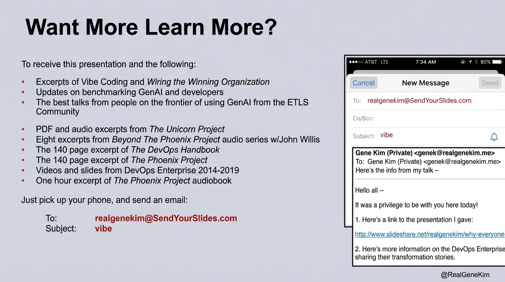

# 2025-11-20-10-25

## Talk
Bill Chen & Brian Fioca (OpenAI) - Building with OpenAI Tools

## Session
[Bill Chen & Brian Fioca - OpenAI](../2025-11-20/11-20-11-00-bill-chen-brian-fioca-openai.md)

## Literal Content
- Title: "Want More Learn More?"
- Left side lists resources including:
  - Excerpts of Vibe Coding and *Wiring the Winning Organization*
  - Updates on benchmarking GenAI and developers
  - Best talks from ETLS Community
  - PDF and audio excerpts from *The Unicorn Project*
  - Eight excerpts from *Beyond The Phoenix Project* audio series w/John Willis
  - 140 page excerpts from *The DevOps Handbook* and *The Phoenix Project*
  - Videos and slides from DevOps Enterprise 2014-2019
  - One hour excerpt of *The Phoenix Project* audiobook
- Contact information: "realgenekim@SendYourSlides.com" with subject "vibe"
- @RealGeneKim handle

## Key Point
This is a resource slide offering extensive materials on DevOps, AI development, and organizational transformation, inviting attendees to email for access to Gene Kim's research and publications.
