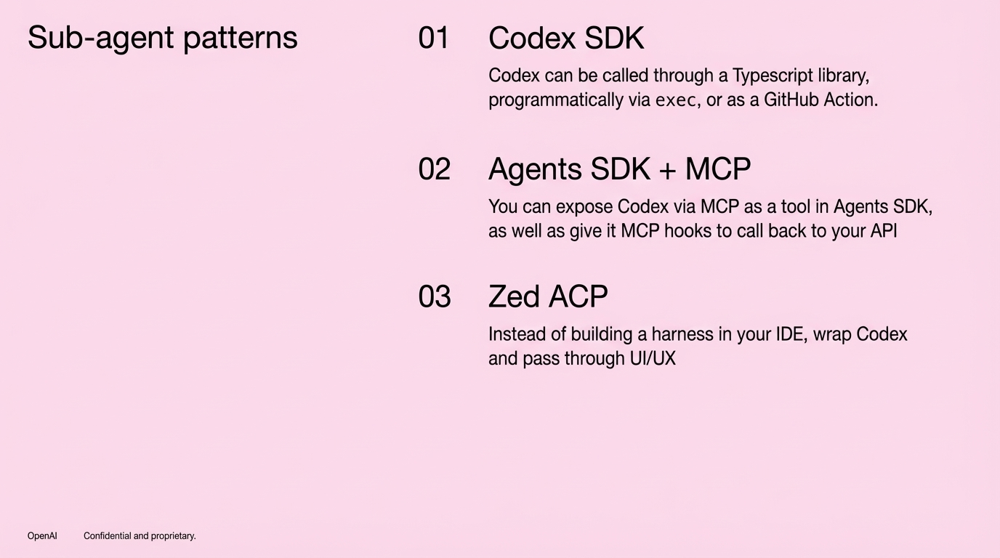

# 2025-11-20-11-15

## Talk
Bill Chen & Brian Fioca (OpenAI) - Building with OpenAI Tools

## Session
[Bill Chen & Brian Fioca - OpenAI](../2025-11-20/11-20-11-00-bill-chen-brian-fioca-openai.md)

## Literal Content
- Title: "Sub-agent patterns"
- Pink background
- Three numbered sections:
  - "01 Codex SDK" - "Codex can be called through a Typescript library, programmatically via exec, or as a GitHub Action."
  - "02 Agents SDK + MCP" - "You can expose Codex via MCP as a tool in Agents SDK, as well as give it MCP hooks to call back to your API"
  - "03 Zed ACP" - "Instead of building a harness in your IDE, wrap Codex and pass through UI/UX"
- Footer: "OpenAI | Confidential and proprietary."

## Key Point
OpenAI is presenting three architectural patterns for integrating Codex as a sub-agent: direct SDK integration, MCP-based tool exposure in agent frameworks, and IDE wrapper integration through Zed ACP. This demonstrates multiple integration strategies for different use cases.
