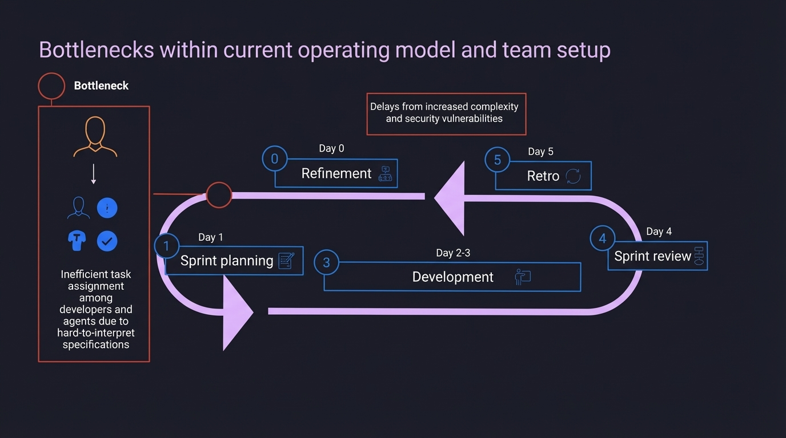

# 2025-11-20-11-25

## Talk
Martin Harrysson & Natasha Maniar (McKinsey) - AI-Native Development

## Session
[Martin Harrysson & Natasha Maniar - McKinsey](../2025-11-20/11-20-11-20-martin-harrysson-natasha-maniar-mckinsey.md)

## Literal Content
- Title: "Bottlenecks within current operating model and team setup"
- Diagram showing a sprint cycle (Days 0-5: Refinement, Sprint planning, Development, Sprint review, Retro)
- Two bottlenecks highlighted:
  1. "Delays from increased complexity and security vulnerabilities" (pointing to the sprint flow)
  2. "Inefficient task assignment among developers and agents due to hard-to-interpret specifications" (shown in a box with icons representing people and tasks)

## Key Point
Current agile/sprint-based operating models face significant bottlenecks when integrating AI agents: task allocation between humans and agents is inefficient due to unclear specifications, and there are delays from managing increased complexity and security concerns in AI-assisted development.
