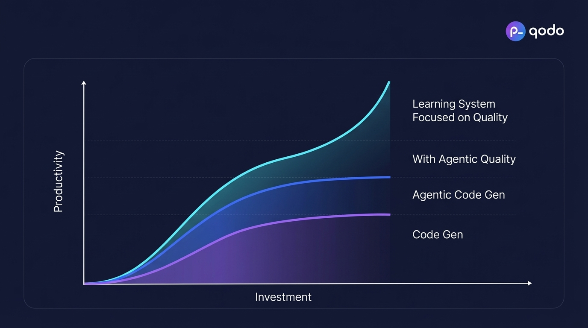

# 2025-11-20-12-02

## Talk
Itamar Friedman (Qodo) - Quality in AI-Generated Code

## Session
[Itamar Friedman - Qodo](../2025-11-20/11-20-12-00-itamar-friedman-qodo.md)

## Literal Content
- Qodo logo in top right
- Dark blue background with graph
- Y-axis: "Productivity"
- X-axis: "Investment"
- Four curves showing different approaches (from bottom to top):
  - Purple: "Code Gen"
  - Blue: "Agentic Code Gen"
  - Teal/Cyan: "With Agentic Quality"
  - Light blue/Cyan (top): "Learning System Focused on Quality"
- All curves show exponential growth with investment, but at different rates

## Key Point
A learning system focused on quality combined with agentic approaches delivers exponentially higher productivity returns compared to basic code generation or even agentic code generation alone.
