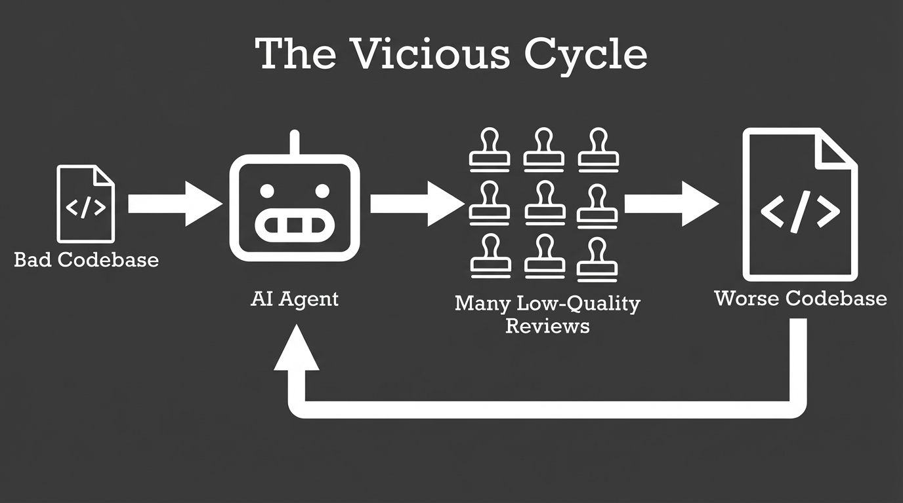

# 2025-11-20-15-17

## Talk
Max Kanat-Alexander - Capital One

## Session
[Max Kanat-Alexander - Capital One](../2025-11-20/11-20-15-05-max-kanat-alexander-capital-one.md)

## Literal Content
- Dark background
- Title: "The Vicious Cycle"
- Flow diagram showing:
  - "Bad Codebase" (code file icon) → "AI Agent" (robot icon) → "Many Low-Quality Reviews" (stamp icons) → "Worse Codebase" (code file icon)
  - Arrow loops back from "Worse Codebase" to "AI Agent"

## Key Point
The slide warns about a negative feedback loop where AI agents trained on bad code produce low-quality reviews, which further degrade the codebase, creating a vicious cycle of declining code quality.
