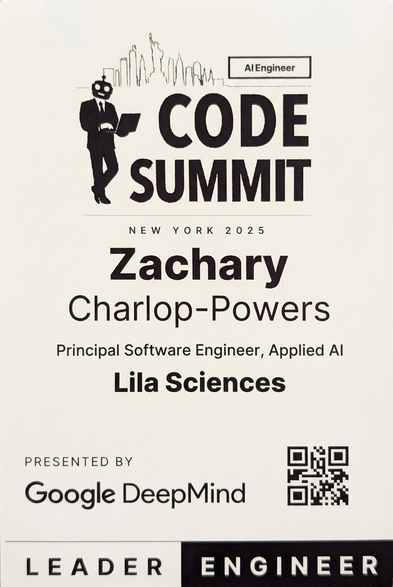

# 2025-11-20-16-00

## Talk
NLW - Super.ai

## Session
[NLW - Super.ai](../2025-11-20/11-20-16-00-nlw-super-ai.md)

## Literal Content
- AIEngineer CODE SUMMIT logo with New York skyline and business person icon
- "NEW YORK 2025"
- "Zachary Charlop-Powers"
- "Principal Software Engineer, Applied AI"
- "Lila Sciences"
- "PRESENTED BY Google DeepMind" (with logo)
- QR code in bottom right
- Footer badges: "LEADER" and "ENGINEER"

## Key Point
This is a speaker introduction slide for Zachary Charlop-Powers from Lila Sciences, presenting at the AI Engineer Code Summit in New York 2025, with Google DeepMind as the presenter.
