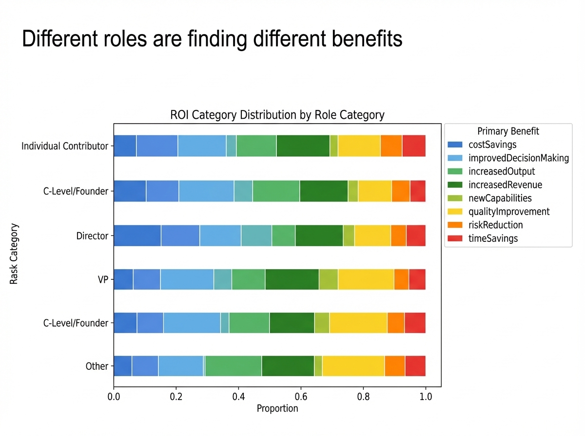

# 2025-11-20-16-13

## Talk
NLW - Super.ai

## Session
[NLW - Super.ai](../2025-11-20/11-20-16-00-nlw-super-ai.md)

## Literal Content
- Title: "Different roles are finding different benefits"
- Stacked horizontal bar chart labeled "ROI Category Distribution by Role Category"
- Shows 6 different roles (Individual Contributor, C-Level/Founder, Director, VP, Other)
- Bars segmented by different colored sections representing: costSavings, improvedDecisionMaking, increasedOutput, increasedRevenue, newCapabilities, qualityImprovement, riskReduction, and timeSavings

## Key Point
AI benefits vary significantly by organizational role - different job levels and functions realize value from AI in different ways, suggesting that AI adoption strategies should be tailored to specific role categories rather than one-size-fits-all.
