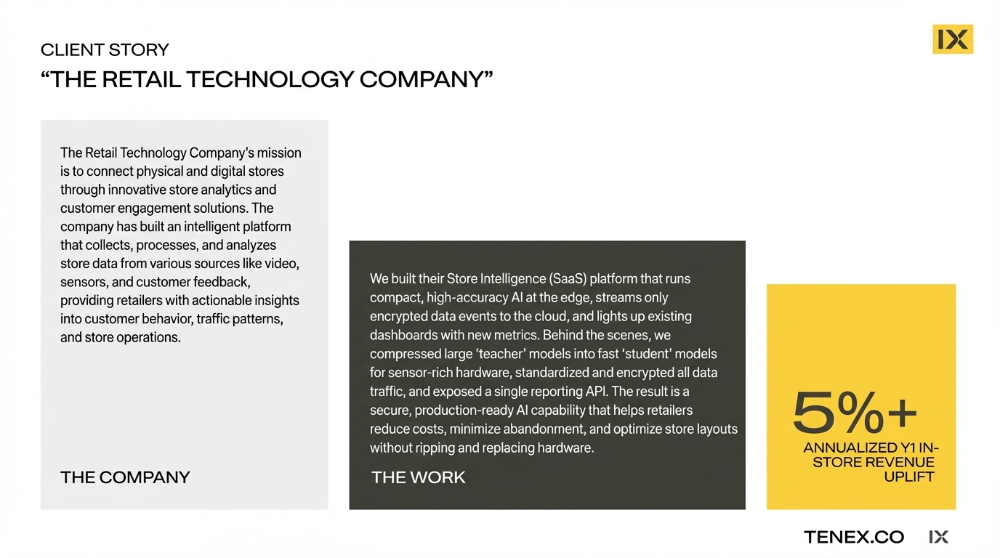

# 2025-11-20-16-30

## Talk
Arman Hezarkhani - Tenex

## Session
[Arman Hezarkhani - Tenex](../2025-11-20/11-20-16-20-arman-hezarkhani-tenex.md)

## Literal Content
- Client story about "THE RETAIL TECHNOLOGY COMPANY"
- Three sections:
  - THE COMPANY: Describes a retail tech company connecting physical and digital stores through store analytics and customer engagement
  - THE WORK: Details building a Store Intelligence (SaaS) platform with edge AI, compressed teacher/student models, encrypted data streaming, and a single reporting API
  - Result highlighted: "5%+ ANNUALIZED Y1 IN-STORE REVENUE UPLIFT"
- Footer shows TENEX.CO and IX logo

## Key Point
A real-world retail AI implementation achieved measurable business impact (5%+ revenue increase) by deploying edge AI solutions that compress large models for sensor hardware, prioritize security, and integrate seamlessly with existing infrastructure.
