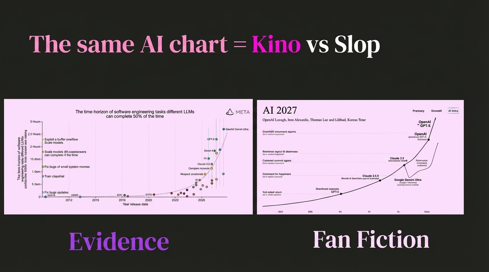

# 2025-11-21-09-11

## Talk
Skills

## Session
[Barry Zhang & Mahesh Murag - Anthropic](../2025-11-21/11-21-09-11-barry-zhang-mahesh-murag-anthropic.md)

## Literal Content
- Title: "The same AI chart = Kino vs Slop"
- Two charts side by side:
  - Left chart (Meta logo): Shows "The time-horizon of software engineering tasks different LLMs can complete 50% of the time" with timeline from 2012-2026, showing progression of capabilities
  - Right chart: "AI 2027" showing progression of models (OpenAI, Claude, Google Gemini Ultra) from 2027 onwards
- Bottom labels: "Evidence" (left) and "Fan Fiction" (right)

## Key Point
Contrasts evidence-based projections of AI capabilities (based on actual data) versus speculative/overhyped predictions about future AI capabilities - highlighting the difference between realistic expectations and hype.
