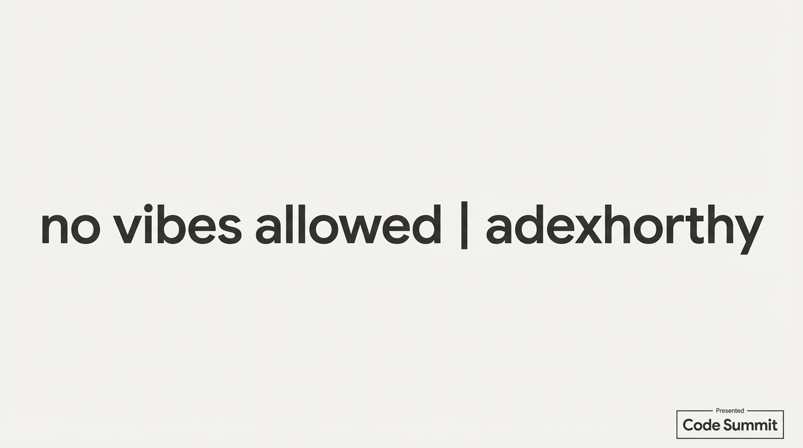

# 2025-11-21-09-37

## Talk
Context Engineering

## Session
[Dex Horthy - HumanLayer](../2025-11-21/11-21-09-31-dex-horthy-humanlayer.md)

## Literal Content
- Large text: "no vibes allowed | @dexhorthy"
- Code Summit branding

## Key Point
Appears to be a title or transition slide emphasizing their data-driven, evidence-based approach ("no vibes allowed") - likely reinforcing the theme that their work is based on measurable results rather than hype or speculation.
