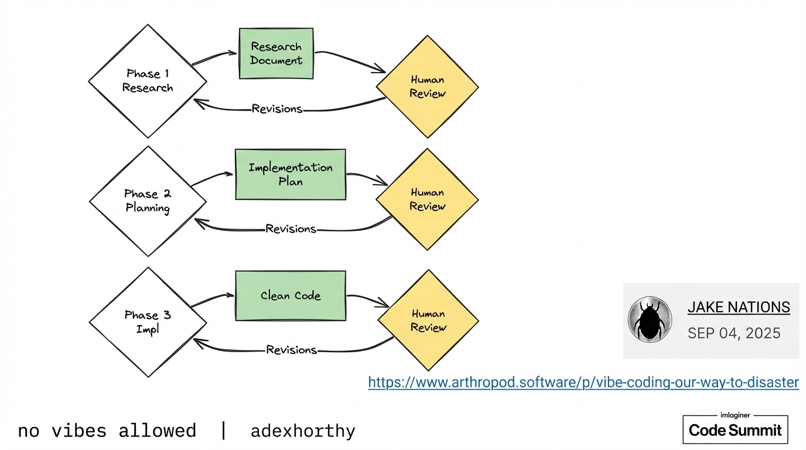

# 2025-11-21-09-50

## Talk
Context Engineering

## Session
[Dex Horthy - HumanLayer](../2025-11-21/11-21-09-31-dex-horthy-humanlayer.md)

## Literal Content
- Three parallel workflow diagrams showing:
  - **Phase 1 Research**: Research → Research Document → Human Review (with Revisions feedback loop)
  - **Phase 2 Planning**: Planning → Implementation Plan → Human Review (with Revisions feedback loop)
  - **Phase 3 Impl**: Impl → Clean Code → Human Review (with Revisions feedback loop)
- Author attribution: "JAKE NATIONS, SEP 04, 2025"
- Reference: "https://www.arthropod.software/p/vibe-coding-our-way-to-disaster"
- Footer: "no vibes allowed | @dexhorthy"

## Key Point
Illustrates a structured, human-in-the-loop development process with three distinct phases (Research, Planning, Implementation), each requiring human review and incorporating revision cycles - emphasizing the importance of human oversight in AI-assisted development rather than fully autonomous coding.
