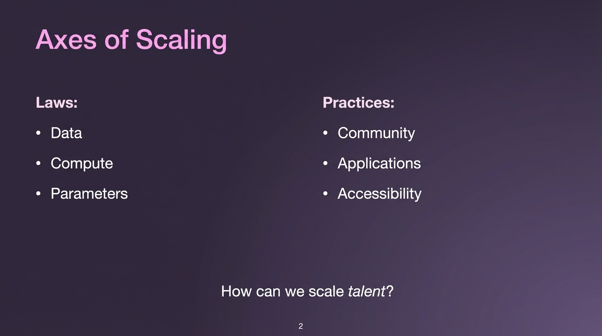

# 2025-11-21-11-38

## Talk
RL Environments

## Session
[Will Brown - Prime Intellect](../2025-11-21/11-21-11-40-will-brown-prime-intellect.md)

## Literal Content
- Dark purple/navy background with pink text
- Title: "Axes of Scaling"
- Left column "Laws:": Data, Compute, Parameters
- Right column "Practices:": Community, Applications, Accessibility
- Bottom question: "How can we scale talent?" (with "talent" in italics)

## Key Point
Distinguishing between the technical "laws" of scaling AI (data, compute, parameters) versus the practical/human aspects (community, applications, accessibility), with emphasis on the challenge of scaling human talent alongside technical infrastructure.
