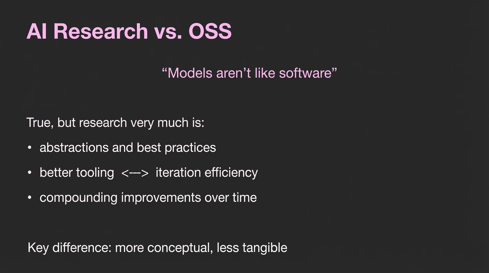

# 2025-11-21-11-40

## Talk
RL Environments

## Session
[Will Brown - Prime Intellect](../2025-11-21/11-21-11-40-will-brown-prime-intellect.md)

## Literal Content
- Black background with pink title text
- Title: "AI Research vs. OSS"
- Quote: "Models aren't like software"
- Section "True, but research very much is:"
  - abstractions and best practices
  - better tooling <--> iteration efficiency
  - compounding improvements over time
- Bottom line: "Key difference: more conceptual, less tangible"

## Key Point
While models themselves differ from traditional software, the research process shares many similarities with software development practices. However, AI research is more conceptual and less tangible than traditional OSS development.
