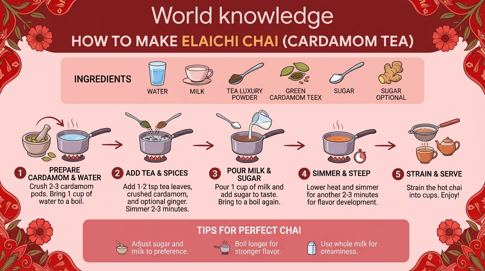

# 2025-11-21-13-49

## Talk
Kat Kampf & Ammaar Reshi (Google) - Gemini Era

## Session
[Kat Kampf & Ammaar Reshi - Google](../2025-11-21/11-21-13-45-kat-kampf-ammaar-reshi-google.md)

## Literal Content
- Title: "World knowledge - HOW TO MAKE ELAICHI CHAI (CARDAMOM TEA)"
- Decorative floral border design with pink/red flowers
- Ingredients shown with icons: Water, Milk, Tea Luxury Powder, Green Cardamom, Sugar (Optional), Ginger
- 5-step process with illustrated diagrams:
  1. Prepare Cardamom & Water (Crush 2-3 cardamom pods, bring 1 cup water to boil)
  2. Add Tea & Spices (Add 1-2 tsp tea leaves, crushed cardamom, optional ginger, simmer 2-3 minutes)
  3. Pour Milk & Sugar (Pour 1 cup milk, add sugar to taste, bring to boil again)
  4. Simmer & Steep (Lower heat, simmer another 2-3 minutes for flavor development)
  5. Strain & Serve (Strain hot chai into cups, enjoy!)
- Tips section

## Key Point
Demonstrates Gemini's ability to generate culturally specific, detailed instructional content with visual elements - showcasing multimodal generation capabilities that combine text, images, and structured information presentation.
