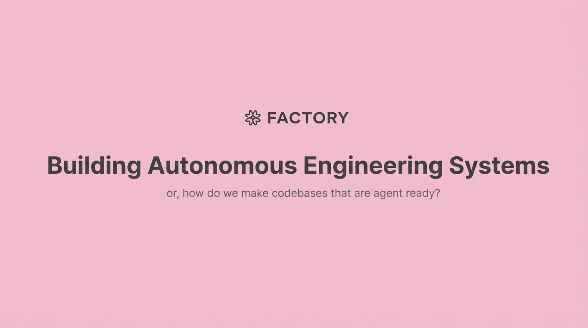

# 2025-11-21-14-05

## Talk
Eno Reyes (Factory AI) - Agent-Ready Codebases

## Session
[Eno Reyes - Factory AI](../2025-11-21/11-21-14-05-eno-reyes-factory-ai.md)

## Literal Content
- Factory logo (asterisk/flower symbol) with "FACTORY" text
- Title: "Building Autonomous Engineering Systems"
- Subtitle: "or, how do we make codebases that are agent ready?"
- Pink background consistent with Factory branding

## Key Point
Introduces Factory's main thesis - the challenge isn't just building AI agents that can code, but rather preparing and structuring codebases to be "agent ready" so autonomous systems can effectively work with them. This reframes the AI engineering problem from agent capability to codebase compatibility.
