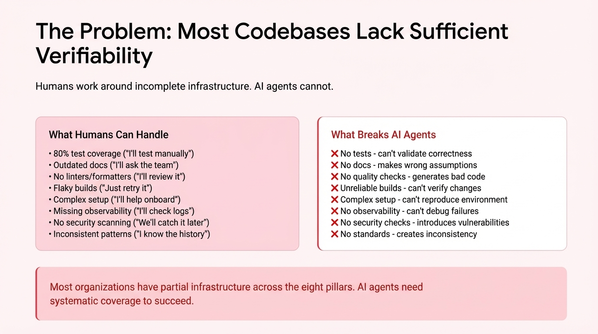

# 2025-11-21-14-10

## Talk
Eno Reyes (Factory AI) - Agent-Ready Codebases

## Session
[Eno Reyes - Factory AI](../2025-11-21/11-21-14-05-eno-reyes-factory-ai.md)

## Literal Content
- Title: "The Problem: Most Codebases Lack Sufficient Verifiability"
- Subtitle: "Humans work around incomplete infrastructure. AI agents cannot."
- Two-column comparison:
  - Left (pink box): "What Humans Can Handle" - lists 8 items including 80% test coverage, outdated docs, no linters/formatters, flaky builds, complex setup, missing observability, no security scanning, inconsistent patterns
  - Right (white box with red text): "What Breaks AI Agents" - corresponding problems with X marks: no tests, no docs, no quality checks, unreliable builds, complex setup, no observability, no security checks, no standards
- Bottom note: "Most organizations have partial infrastructure across the eight pillars. AI agents need systematic coverage to succeed."

## Key Point
AI agents require complete, robust development infrastructure to function effectively, unlike human developers who can work around gaps in testing, documentation, and tooling. The slide emphasizes the eight pillars of verifiable software development that are critical for autonomous AI systems.
