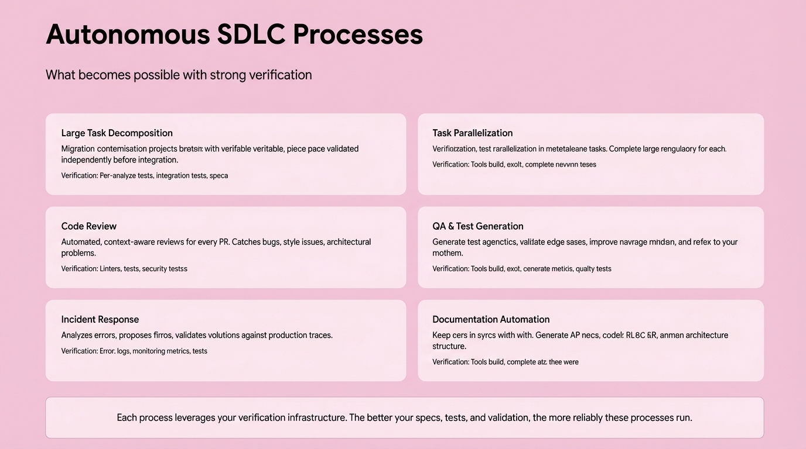

# 2025-11-21-14-12

## Talk
Eno Reyes (Factory AI) - Agent-Ready Codebases

## Session
[Eno Reyes - Factory AI](../2025-11-21/11-21-14-05-eno-reyes-factory-ai.md)

## Literal Content
- Title: "Autonomous SDLC Processes"
- Subtitle: "What becomes possible with strong verification"
- Six process boxes arranged in 2x3 grid:
  1. **Large Task Decomposition**: Migration projects with verifiable steps
  2. **Task Parallelization**: Verification enables parallel execution
  3. **Code Review**: Automated, context-aware reviews for every PR
  4. **QA & Test Generation**: Generate test scenarios and validate edge cases
  5. **Incident Response**: Analyzes errors, proposes fixes, validates solutions
  6. **Documentation Automation**: Keep docs in sync, generate API specs
- Bottom note: "Each process leverages your verification infrastructure. The better your specs, tests, and validation, the more reliably these processes run."

## Key Point
Strong verification infrastructure enables autonomous SDLC workflows. When you have proper tests, specs, and validation in place, AI agents can reliably handle complex development tasks like code review, test generation, and incident response.
