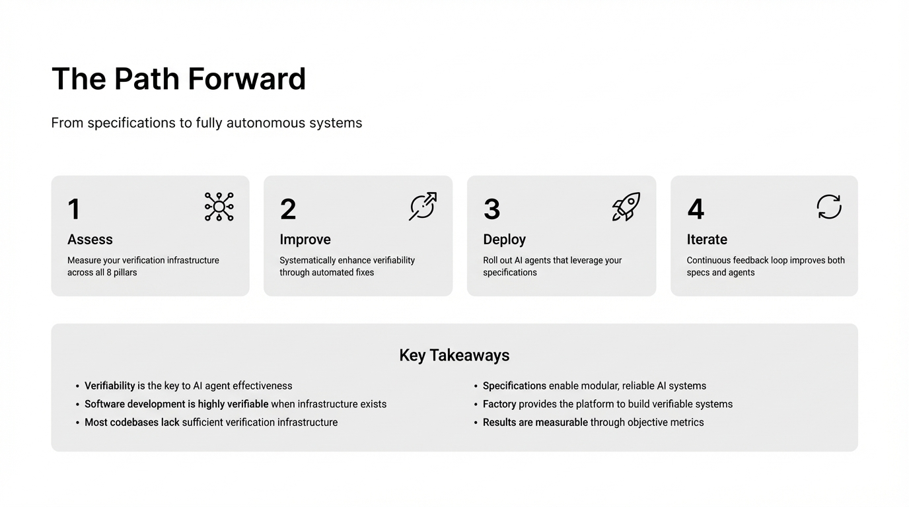

# 2025-11-21-14-14

## Talk
Eno Reyes (Factory AI) - Agent-Ready Codebases

## Session
[Eno Reyes - Factory AI](../2025-11-21/11-21-14-05-eno-reyes-factory-ai.md)

## Literal Content
- Title: "The Path Forward"
- Subtitle: "From specifications to fully autonomous systems"
- Four numbered steps with icons:
  1. **Assess** (network icon): Measure your verification infrastructure across all 8 pillars
  2. **Improve** (compass icon): Systematically enhance verifiability through automated fixes
  3. **Deploy** (rocket icon): Roll out AI agents that leverage your specifications
  4. **Iterate** (refresh icon): Continuous feedback loop improves both specs and agents
- Bottom section: "Key Takeaways"
  - Verifiability is key to AI agent effectiveness
  - Software development is highly verifiable when infrastructure exists
  - Most codebases lack sufficient verification infrastructure
  - Specifications enable modular, reliable AI systems
  - Factory provides the platform to build verifiable systems
  - Results are measurable through objective metrics

## Key Point
Organizations should take a systematic approach to building AI-ready codebases by first assessing their verification infrastructure, then improving it, deploying AI agents that use those specifications, and continuously iterating. This creates a virtuous cycle between better infrastructure and more capable AI agents.
