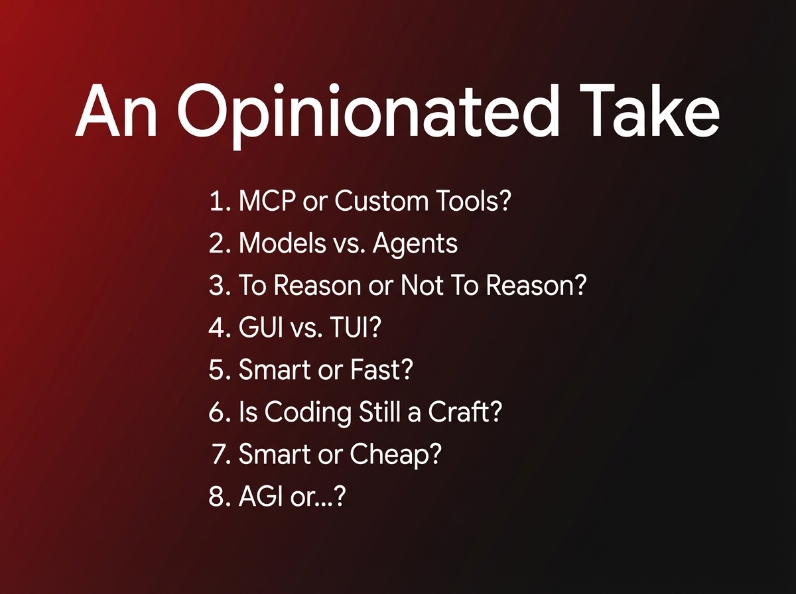

# 2025-11-21-14-23

## Talk
Eno Reyes (Factory AI) - Agent-Ready Codebases

## Session
[Eno Reyes - Factory AI](../2025-11-21/11-21-14-05-eno-reyes-factory-ai.md)

## Literal Content
- Title: "An Opinionated Take"
- Dark gradient background (red to black)
- Eight numbered questions in white text:
  1. MCP or Custom Tools?
  2. Models vs. Agents
  3. To Reason or Not To Reason?
  4. GUI vs. TUI?
  5. Smart or Fast?
  6. Is Coding Still a Craft?
  7. Smart or Cheap?
  8. AGI or...?

## Key Point
This slide presents the key architectural and philosophical questions/decisions that Amp made in building their coding agent. These represent fundamental trade-offs in AI agent design.
