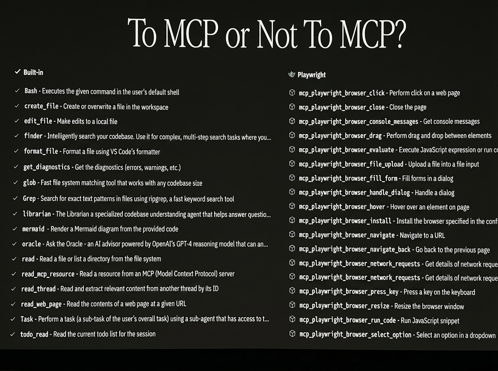

# 2025-11-21-14-25

## Talk
Beyang Liu (Amp Code) - Next-Gen AI Coding

## Session
[Beyang Liu - Amp Code](../2025-11-21/11-21-14-25-beyang-liu-amp-code.md)

## Literal Content
- Title: "To MCP or Not To MCP?"
- Two columns on black background:
  - Left: **Built-in** (checkmarks) - Lists tools like Bash, create_file, edit_file, finder, format_file, get_diagnostics, glob, Grep, librarian, mermaid, oracle, read, read_mcp_resource, read_thread, read_web_page, Task, todo_read
  - Right: **Playwright** (MCP icon) - Lists MCP Playwright tools like mcp_playwright_browser_click, close, console_messages, drag, evaluate, file_upload, fill_form, handle_dialog, hover, install, navigate, navigate_back, network_requests, press_key, resize, run_code, select_option

## Key Point
Amp uses a hybrid approach, combining built-in custom tools for core coding functionality (file operations, search, code understanding) with MCP (Model Context Protocol) for specific integrations like browser automation via Playwright.
