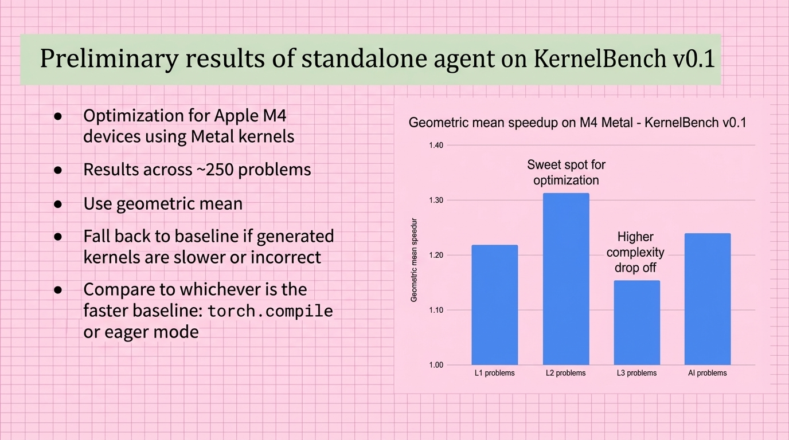

# 2025-11-21-14-45

## Talk
Natalie Serrino (Gimlet Labs) - AI-Generated Kernels

## Session
[Natalie Serrino - Gimlet Labs](../2025-11-21/11-21-14-45-natalie-serrino-gimlet-labs.md)

## Literal Content
- Title: "Preliminary results of standalone agent on KernelBench v0.1"
- Left side bullet points:
  - Optimization for Apple M4 devices using Metal kernels
  - Results across ~250 problems
  - Use geometric mean
  - Fall back to baseline if generated kernels are slower or incorrect
  - Compare to whichever is the faster baseline: torch.compile or eager mode
- Right side: Bar chart showing "Geometric mean speedup on M4 Metal - KernelBench v0.1"
- Four bars (L1, L2, L3, AI problems), with L2 showing highest speedup marked as "Sweet spot for optimization"
- L3 showing "Higher complexity drop off"

## Key Point
Demonstrates performance optimization results for AI agents on Apple M4 hardware, showing that medium complexity (L2) problems achieve the best speedup while highly complex problems see diminishing returns.
